---
format:
  revealjs:
    theme: [dark, custom.scss]
    slide-number: c/t
    progress: true
    controls: true
    controls-layout: bottom-right
    width: 1280
    height: 720
    margin: 0.08
    transition: fade
    transition-speed: fast
    embed-resources: false
    plotly-connected: true
    fig-responsive: false
jupyter: etda-pres
execute:
  echo: false
  warning: false
  message: false
---

```{python}
#| include: false
import plotly.graph_objects as go
from plotly.subplots import make_subplots
import pandas as pd
import numpy as np
import re

BG     = "#0A1628"
BG2    = "#0d2137"
CYAN   = "#00BCD4"
GOLD   = "#FFB300"
BLUE   = "#1565C0"
GRAY   = "#B0BEC5"
RED    = "#EF5350"
ORANGE = "#FFA726"
GREEN  = "#00E676"
WHITE  = "#FFFFFF"
PURPLE = "#7C4DFF"

def base_layout(height=400):
    return dict(
        paper_bgcolor=BG2, plot_bgcolor=BG2,
        font=dict(color=GRAY, family="Sarabun, sans-serif", size=12),
        height=height, margin=dict(l=20, r=20, t=40, b=20),
    )

AXIS_STYLE = dict(
    gridcolor="rgba(255,255,255,0.06)", tickfont=dict(color=GRAY),
    linecolor="rgba(255,255,255,0.08)", zerolinecolor="rgba(255,255,255,0.08)",
)
```

<!-- ═══ SLIDE 1: TITLE ═══ -->
## {background-color="#0A1628" .center}

```{=html}
<style>
/* ══ Core Animations ══ */
@keyframes shimmerTitle { 0%{background-position:-200% center;} 100%{background-position:200% center;} }
@keyframes orbit { from{transform:rotate(0deg) translateX(48px) rotate(0deg);} to{transform:rotate(360deg) translateX(48px) rotate(-360deg);} }
@keyframes hexPulse { 0%,100%{opacity:0.03;} 50%{opacity:0.1;} }

/* ══ Stars ══ */
@keyframes twinkle { 0%,100%{opacity:0.2;transform:scale(1);} 50%{opacity:1;transform:scale(1.4);} }
@keyframes twinkle2 { 0%,100%{opacity:0.5;transform:scale(1);} 50%{opacity:0.1;transform:scale(0.7);} }
@keyframes drift { 0%{transform:translateY(0) translateX(0);} 50%{transform:translateY(-8px) translateX(5px);} 100%{transform:translateY(0) translateX(0);} }

/* ══ Shooting Star ══ */
@keyframes shoot {
  0% { transform: translateX(-200px) translateY(200px) rotate(-45deg); opacity:0; }
  10% { opacity:1; }
  60% { opacity:1; }
  100% { transform: translateX(1600px) translateY(-400px) rotate(-45deg); opacity:0; }
}
@keyframes shoot2 {
  0% { transform: translateX(-100px) translateY(300px) rotate(-35deg); opacity:0; }
  15% { opacity:0.8; }
  65% { opacity:0.8; }
  100% { transform: translateX(1800px) translateY(-600px) rotate(-35deg); opacity:0; }
}

/* ══ Airplane ══ */
@keyframes flyPlane {
  0%   { left:-120px; top:80%; opacity:0; transform:rotate(-8deg) scale(0.8); }
  5%   { opacity:1; }
  40%  { left:45%; top:42%; transform:rotate(-14deg) scale(1.1); }
  90%  { opacity:1; }
  100% { left:110%; top:8%; opacity:0; transform:rotate(-20deg) scale(0.7); }
}
@keyframes trailFade {
  0%   { width:0; opacity:0; }
  20%  { opacity:0.8; }
  100% { width:200px; opacity:0; }
}

/* ══ Satellite ══ */
@keyframes satellite {
  0%   { left:110%; top:10%; opacity:0; transform:rotate(10deg); }
  5%   { opacity:1; }
  90%  { opacity:1; }
  100% { left:-10%; top:60%; opacity:0; transform:rotate(10deg); }
}
@keyframes satBlink { 0%,100%{opacity:1;} 50%{opacity:0.3;} }

/* ══ Neural Pulse ══ */
@keyframes neuralPulse {
  0%   { stroke-dashoffset: 200; opacity:0; }
  20%  { opacity:0.8; }
  100% { stroke-dashoffset: 0; opacity:0; }
}

/* ══ Planet Orbit Ring ══ */
@keyframes ringRotate { from{transform:rotate(0deg);} to{transform:rotate(360deg);} }
@keyframes ringRotateRev { from{transform:rotate(0deg);} to{transform:rotate(-360deg);} }

/* ══ Data Particles ══ */
@keyframes dataFloat {
  0%   { transform:translateY(0) translateX(0); opacity:0.7; }
  50%  { transform:translateY(-30px) translateX(15px); opacity:1; }
  100% { transform:translateY(-80px) translateX(-10px); opacity:0; }
}

/* ══ Radar Sweep ══ */
@keyframes radarSweep { from{transform:rotate(0deg);} to{transform:rotate(360deg);} }
@keyframes radarPing { 0%{transform:scale(0);opacity:0.8;} 100%{transform:scale(3);opacity:0;} }

/* ══ Scan Line ══ */
@keyframes scanLine { 0%{top:-2px;opacity:0.6;} 100%{top:100%;opacity:0;} }

/* ══ Title Animations ══ */
@keyframes fadeSlideUp { from{opacity:0;transform:translateY(30px);} to{opacity:1;transform:translateY(0);} }
@keyframes glowPulse {
  0%,100%{box-shadow:0 0 15px rgba(0,188,212,0.3), 0 0 30px rgba(0,188,212,0.1);}
  50%{box-shadow:0 0 30px rgba(0,188,212,0.7), 0 0 60px rgba(0,188,212,0.3);}
}

/* ══ Base Elements ══ */
.hex-grid {
  position:absolute;inset:0;z-index:0;pointer-events:none;
  background-image:url("data:image/svg+xml,%3Csvg xmlns='http://www.w3.org/2000/svg' width='56' height='100'%3E%3Cpath d='M28 0 L56 16 L56 50 L28 66 L0 50 L0 16 Z' fill='none' stroke='%2300BCD4' stroke-width='0.4' opacity='0.15'/%3E%3C/svg%3E");
  background-size:56px 100px; animation:hexPulse 4s ease-in-out infinite;
}
.highlight-text {
  background:linear-gradient(90deg,#00BCD4,#1E88E5,#7C4DFF,#00BCD4);
  background-size:300% auto; -webkit-background-clip:text; -webkit-text-fill-color:transparent;
  animation:shimmerTitle 4s linear infinite;
}
.orbit-el { position:absolute;top:50%;left:50%;width:0;height:0; }
.orbit-el::after { content:'';position:absolute;width:8px;height:8px;border-radius:50%;background:#00BCD4;top:-4px;left:-4px;box-shadow:0 0 8px #00BCD4; }

/* ══ Layer Elements ══ */
.scan-line {
  position:absolute;left:0;width:100%;height:2px;z-index:2;pointer-events:none;
  background:linear-gradient(90deg,transparent,rgba(0,188,212,0.6),transparent);
  animation:scanLine 5s linear infinite;
}
.plane-wrap {
  position:absolute;z-index:8;pointer-events:none;
  animation:flyPlane 7s ease-in-out 1s forwards;
}
.plane-trail {
  position:absolute;top:50%;right:100%;height:2px;
  background:linear-gradient(90deg,transparent,rgba(0,188,212,0.8),rgba(255,179,0,0.6));
  border-radius:2px;transform:translateY(-50%);
  animation:trailFade 7s ease-in-out 1s forwards;
}
.satellite-wrap {
  position:absolute;z-index:7;pointer-events:none;font-size:1.4em;
  animation:satellite 10s linear 3s infinite;
}
.sat-blink {
  display:inline-block;
  animation:satBlink 1.5s ease-in-out infinite;color:#FFB300;font-size:0.6em;
}
</style>

<!-- ════════════════════════════════
     LAYER 0: Hex Grid
════════════════════════════════ -->
<div class="hex-grid"></div>

<!-- ════════════════════════════════
     LAYER 1: Stars Field
════════════════════════════════ -->
<canvas id="star-canvas" style="position:absolute;inset:0;z-index:1;pointer-events:none;"></canvas>

<!-- ════════════════════════════════
     LAYER 2: Neural Network SVG
════════════════════════════════ -->
<svg id="neural-svg" style="position:absolute;inset:0;z-index:2;pointer-events:none;width:100%;height:100%;"></svg>

<!-- ════════════════════════════════
     LAYER 3: Planet + Orbit Rings
════════════════════════════════ -->
<div style="position:absolute;right:6%;top:8%;z-index:3;pointer-events:none;">
  <!-- Planet -->
  <div style="position:relative;width:80px;height:80px;">
    <div style="width:80px;height:80px;border-radius:50%;background:radial-gradient(circle at 35% 35%, #1E88E5, #0A1628);box-shadow:0 0 25px rgba(30,136,229,0.5), inset 0 0 15px rgba(0,0,0,0.5);"></div>
    <!-- Orbit Ring 1 -->
    <div style="position:absolute;top:50%;left:50%;transform:translate(-50%,-50%) rotate(60deg);width:120px;height:120px;border-radius:50%;border:1px solid rgba(0,188,212,0.4);animation:ringRotate 6s linear infinite;"></div>
    <!-- Orbit Dot Ring 1 -->
    <div style="position:absolute;top:50%;left:50%;transform:translate(-50%,-50%) rotate(60deg);width:120px;height:120px;animation:ringRotate 6s linear infinite;">
      <div style="position:absolute;top:-4px;left:50%;width:8px;height:8px;background:#00BCD4;border-radius:50%;box-shadow:0 0 8px #00BCD4;transform:translateX(-50%);"></div>
    </div>
    <!-- Orbit Ring 2 -->
    <div style="position:absolute;top:50%;left:50%;transform:translate(-50%,-50%) rotate(-30deg);width:160px;height:160px;border-radius:50%;border:1px solid rgba(124,77,255,0.3);animation:ringRotateRev 10s linear infinite;"></div>
    <!-- Orbit Dot Ring 2 -->
    <div style="position:absolute;top:50%;left:50%;transform:translate(-50%,-50%) rotate(-30deg);width:160px;height:160px;animation:ringRotateRev 10s linear infinite;">
      <div style="position:absolute;bottom:-5px;left:50%;width:10px;height:10px;background:#7C4DFF;border-radius:50%;box-shadow:0 0 10px #7C4DFF;transform:translateX(-50%);"></div>
    </div>
  </div>
</div>

<!-- ════════════════════════════════
     LAYER 4: Radar in Corner
════════════════════════════════ -->
<div style="position:absolute;left:3%;bottom:10%;z-index:3;pointer-events:none;width:90px;height:90px;">
  <svg width="90" height="90" viewBox="0 0 90 90">
    <!-- Radar circles -->
    <circle cx="45" cy="45" r="40" fill="none" stroke="rgba(0,188,212,0.15)" stroke-width="1"/>
    <circle cx="45" cy="45" r="28" fill="none" stroke="rgba(0,188,212,0.2)" stroke-width="1"/>
    <circle cx="45" cy="45" r="15" fill="none" stroke="rgba(0,188,212,0.3)" stroke-width="1"/>
    <line x1="45" y1="5" x2="45" y2="85" stroke="rgba(0,188,212,0.1)" stroke-width="0.5"/>
    <line x1="5" y1="45" x2="85" y2="45" stroke="rgba(0,188,212,0.1)" stroke-width="0.5"/>
    <!-- Sweep -->
    <g style="transform-origin:45px 45px;animation:radarSweep 3s linear infinite;">
      <line x1="45" y1="45" x2="45" y2="5" stroke="rgba(0,230,118,0.8)" stroke-width="1.5"/>
      <path d="M45,45 L45,5 A40,40 0 0,1 85,45 Z" fill="rgba(0,230,118,0.05)"/>
    </g>
    <!-- Ping dots -->
    <circle cx="62" cy="28" r="2" fill="#00E676" style="animation:radarPing 3s ease-out 0.5s infinite;"/>
    <circle cx="30" cy="55" r="2" fill="#00BCD4" style="animation:radarPing 3s ease-out 1.5s infinite;"/>
  </svg>
</div>

<!-- ════════════════════════════════
     LAYER 5: Scan Line
════════════════════════════════ -->
<div class="scan-line" style="animation-delay:0s;"></div>
<div class="scan-line" style="animation-delay:2.5s;"></div>

<!-- ════════════════════════════════
     LAYER 6: Satellite
════════════════════════════════ -->
<div class="satellite-wrap">
  🛸<span class="sat-blink">·</span>
</div>

<!-- ════════════════════════════════
     LAYER 7: Airplane + Trail
════════════════════════════════ -->
<div class="plane-wrap">
  <div class="plane-trail"></div>
  <span style="font-size:2.2em;filter:drop-shadow(0 0 8px rgba(255,179,0,0.8));">✈️</span>
</div>

<!-- ════════════════════════════════
     LAYER 8: Floating Data Bits
════════════════════════════════ -->
<div id="data-bits" style="position:absolute;inset:0;z-index:2;pointer-events:none;overflow:hidden;"></div>

<!-- ════════════════════════════════
     LAYER 9: AI Corner Label
════════════════════════════════ -->
<div style="position:absolute;right:2%;bottom:3%;z-index:4;pointer-events:none;font-family:monospace;font-size:0.4em;color:rgba(0,188,212,0.35);line-height:1.4;">
  AI_GOV_v2.5<br>DATA_LAYER: ACTIVE<br>NLP_ENGINE: ONLINE<br>POLICY_AUTO: ENABLED
</div>

<!-- ════════════════════════════════
     MAIN CONTENT (z-index 10)
════════════════════════════════ -->
<div style="position:relative;z-index:10;display:flex;flex-direction:column;align-items:center;justify-content:center;height:100%;text-align:center;gap:0.4em;">
  
  
  
  <div style="display:inline-block;background:linear-gradient(135deg,rgba(0,188,212,0.1),rgba(21,101,192,0.15));border:1px solid rgba(0,188,212,0.35);border-radius:20px;padding:0.3em 1.2em;font-size:0.5em;color:#00BCD4;letter-spacing:0.1em;text-transform:uppercase;font-weight:600;animation:fadeSlideUp 0.8s ease 0.4s both;">
    ทุนพัฒนาบุคลากรภาครัฐ (ทุน ก.พ.) ประจำปีงบประมาณ 2569
  </div>

  <div style="font-size:1.6em;font-weight:800;color:#FFFFFF;line-height:1.2;margin:0.2em 0;animation:fadeSlideUp 0.8s ease 0.6s both;">
    โครงการพัฒนาระบบ <span class="highlight-text">ธรรมาภิบาลข้อมูล</span><br>
    ด้วยปัญญาประดิษฐ์
  </div>

  <div style="font-size:0.6em;color:#FFB300;font-weight:600;letter-spacing:0.05em;animation:fadeSlideUp 0.8s ease 0.8s both;">
    ETDA DATA GOVERNANCE POLICY AUTOMATION
  </div>

  <div style="height:2px;width:40%;background:linear-gradient(90deg,transparent,#00BCD4,#7C4DFF,transparent);margin:0.5em auto;animation:fadeSlideUp 0.8s ease 0.9s both;"></div>

  <div style="display:flex;align-items:center;gap:1.2em;margin-top:0.2em;animation:fadeSlideUp 0.8s ease 1.1s both;">
    <div style="position:relative;width:85px;height:85px;">
      
      <div class="orbit-el" style="animation:orbit 3s linear infinite;"></div>
    </div>
    <div style="text-align:left;line-height:1.4;">
      <div style="font-size:0.8em;font-weight:700;color:#FFFFFF;">นางสาวธัญรดา โพธิ์พระรส</div>
      <div style="font-size:0.58em;color:#00BCD4;font-weight:500;">Data Scientist · ETDA</div>
      <div style="font-size:0.45em;color:#B0BEC5;margin-top:0.2em;">กลุ่มสาขาวิชาที่ 1: คอมพิวเตอร์ / เทคโนโลยีสารสนเทศ / ปัญญาประดิษฐ์ (AI) / Data Analytics</div>
    </div>
  </div>

</div>

<!-- ════════════════════════════════
     JAVASCRIPT: Stars + Neural + Data Bits
════════════════════════════════ -->
<script>
(function() {

/* ─── 1. Star Field ─── */
const canvas = document.getElementById('star-canvas');
if (canvas) {
  const ctx = canvas.getContext('2d');
  function resizeCanvas() {
    canvas.width = canvas.offsetWidth || 1280;
    canvas.height = canvas.offsetHeight || 720;
  }
  resizeCanvas();

  const stars = Array.from({length: 180}, () => ({
    x: Math.random() * canvas.width,
    y: Math.random() * canvas.height,
    r: Math.random() * 1.8 + 0.3,
    speed: Math.random() * 0.02 + 0.005,
    phase: Math.random() * Math.PI * 2,
    color: ['#FFFFFF','#00BCD4','#7C4DFF','#FFB300'][Math.floor(Math.random()*4)]
  }));

  function drawStars(t) {
    ctx.clearRect(0, 0, canvas.width, canvas.height);
    stars.forEach(s => {
      const alpha = 0.3 + 0.6 * Math.abs(Math.sin(s.phase + t * s.speed));
      ctx.beginPath();
      ctx.arc(s.x, s.y, s.r, 0, Math.PI * 2);
      ctx.fillStyle = s.color + Math.round(alpha * 255).toString(16).padStart(2,'0');
      ctx.fill();
    });
    requestAnimationFrame(drawStars);
  }
  requestAnimationFrame(drawStars);
}

/* ─── 2. Neural Network ─── */
const svg = document.getElementById('neural-svg');
if (svg) {
  const W = 1280, H = 720;
  const nodes = Array.from({length: 20}, () => ({
    x: Math.random() * W,
    y: Math.random() * H,
    vx: (Math.random() - 0.5) * 0.6,
    vy: (Math.random() - 0.5) * 0.6
  }));

  function updateNeural() {
    svg.innerHTML = '';
    // Move nodes
    nodes.forEach(n => {
      n.x += n.vx; n.y += n.vy;
      if (n.x < 0 || n.x > W) n.vx *= -1;
      if (n.y < 0 || n.y > H) n.vy *= -1;
    });
    // Draw connections
    for (let i = 0; i < nodes.length; i++) {
      for (let j = i + 1; j < nodes.length; j++) {
        const dx = nodes[i].x - nodes[j].x;
        const dy = nodes[i].y - nodes[j].y;
        const dist = Math.sqrt(dx*dx + dy*dy);
        if (dist < 200) {
          const alpha = (1 - dist/200) * 0.18;
          const line = document.createElementNS('http://www.w3.org/2000/svg','line');
          line.setAttribute('x1', nodes[i].x); line.setAttribute('y1', nodes[i].y);
          line.setAttribute('x2', nodes[j].x); line.setAttribute('y2', nodes[j].y);
          line.setAttribute('stroke', `rgba(0,188,212,${alpha})`);
          line.setAttribute('stroke-width', '0.8');
          svg.appendChild(line);
        }
      }
    }
    // Draw nodes
    nodes.forEach((n, i) => {
      const circle = document.createElementNS('http://www.w3.org/2000/svg','circle');
      circle.setAttribute('cx', n.x); circle.setAttribute('cy', n.y);
      circle.setAttribute('r', '2.5');
      circle.setAttribute('fill', i % 3 === 0 ? 'rgba(0,188,212,0.6)' : i % 3 === 1 ? 'rgba(124,77,255,0.5)' : 'rgba(255,179,0,0.4)');
      svg.appendChild(circle);
    });
    requestAnimationFrame(updateNeural);
  }
  updateNeural();
}

/* ─── 3. Floating Data Bits ─── */
const bitsContainer = document.getElementById('data-bits');
if (bitsContainer) {
  const symbols = ['01','10','AI','00','11','∑','π','λ','∇','⊕'];
  function spawnBit() {
    const bit = document.createElement('div');
    bit.textContent = symbols[Math.floor(Math.random() * symbols.length)];
    bit.style.cssText = `
      position: absolute;
      left: ${Math.random() * 95}%;
      bottom: ${Math.random() * 30}%;
      font-family: monospace;
      font-size: ${0.35 + Math.random() * 0.3}em;
      color: rgba(0,188,212,${0.15 + Math.random() * 0.3});
      pointer-events: none;
      animation: dataFloat ${3 + Math.random() * 4}s ease-in-out forwards;
    `;
    bitsContainer.appendChild(bit);
    setTimeout(() => bit.remove(), 7000);
  }
  setInterval(spawnBit, 600);
}

})();
</script>
```


<!-- ═══ SLIDE 2: WHO AM I ═══ -->
## 👤 Who am I? & Professional Journey {background-color="#0A1628"}

```{=html}
<style>
@keyframes pulseDot {
  0%{box-shadow:0 0 0 0 rgba(0,230,118,0.4);}
  70%{box-shadow:0 0 0 8px rgba(0,230,118,0);}
  100%{box-shadow:0 0 0 0 rgba(0,230,118,0);}
}
</style>
<div style="display:grid;grid-template-columns:1fr 1.8fr;gap:1.5em;font-family:'Inter','Sarabun',sans-serif;font-size:0.58em;height:100%;padding-top:0.5em;">
  <div style="display:flex;flex-direction:column;align-items:center;text-align:center;">
    <div style="margin-bottom:0.8em;">
      
    </div>
    <div style="font-size:1.4em;font-weight:800;color:#FFFFFF;">ธัญรดา โพธิ์พระรส</div>
    <div style="font-size:0.95em;color:#00BCD4;margin-bottom:0.5em;">Thanrada Popraros</div>
    <div style="font-size:0.85em;color:#B0BEC5;line-height:1.5;margin-bottom:1.2em;background:rgba(255,255,255,0.03);padding:0.5em 1.2em;border-radius:8px;">
      📧 thanggwa18888@gmail.com<br>📱 +66 099-797-8371
    </div>
    <div style="display:flex;flex-wrap:wrap;justify-content:center;gap:0.4em;padding:0 0.5em;">
      <span style="background:rgba(0,188,212,0.1);color:#00BCD4;border:1px solid rgba(0,188,212,0.4);padding:0.2em 0.6em;border-radius:12px;font-weight:600;font-size:0.78em;">Data Science</span>
      <span style="background:rgba(0,188,212,0.1);color:#00BCD4;border:1px solid rgba(0,188,212,0.4);padding:0.2em 0.6em;border-radius:12px;font-weight:600;font-size:0.78em;">Data Analytics</span>
      <span style="background:rgba(124,77,255,0.1);color:#7C4DFF;border:1px solid rgba(124,77,255,0.4);padding:0.2em 0.6em;border-radius:12px;font-weight:600;font-size:0.78em;">Artificial Intelligence</span>
      <span style="background:rgba(124,77,255,0.1);color:#7C4DFF;border:1px solid rgba(124,77,255,0.4);padding:0.2em 0.6em;border-radius:12px;font-weight:600;font-size:0.78em;">Machine Learning</span>
      <span style="background:rgba(124,77,255,0.1);color:#7C4DFF;border:1px solid rgba(124,77,255,0.4);padding:0.2em 0.6em;border-radius:12px;font-weight:600;font-size:0.78em;">NLP</span>
      <span style="background:rgba(124,77,255,0.1);color:#7C4DFF;border:1px solid rgba(124,77,255,0.4);padding:0.2em 0.6em;border-radius:12px;font-weight:600;font-size:0.78em;">LLM</span>
      <span style="background:rgba(255,179,0,0.1);color:#FFB300;border:1px solid rgba(255,179,0,0.4);padding:0.2em 0.6em;border-radius:12px;font-weight:600;font-size:0.78em;">Business Intelligence</span>
      <span style="background:rgba(0,230,118,0.1);color:#00E676;border:1px solid rgba(0,230,118,0.4);padding:0.2em 0.6em;border-radius:12px;font-weight:600;font-size:0.78em;">Forecasting</span>
      <span style="background:rgba(30,136,229,0.1);color:#1E88E5;border:1px solid rgba(30,136,229,0.4);padding:0.2em 0.6em;border-radius:12px;font-weight:600;font-size:0.78em;">Data Driven</span>
    </div>
  </div>

  <div style="padding-right:0.5em;">
    <div style="border-left:2px solid rgba(0,188,212,0.3);padding-left:1.5em;position:relative;">

      <div style="position:relative;margin-bottom:1em;">
        <div style="position:absolute;left:-1.95em;top:0.2em;width:12px;height:12px;background:#5C6BC0;border-radius:50%;border:3px solid #0A1628;"></div>
        <div style="font-weight:800;color:#5C6BC0;font-size:1.1em;margin-bottom:0.3em;">📚 Education & Internship</div>
        <div style="background:rgba(255,255,255,0.03);border:1px solid rgba(255,255,255,0.05);border-radius:8px;padding:0.5em 0.8em;display:flex;flex-direction:column;gap:0.4em;">
          <div style="display:grid;grid-template-columns:25px 1fr;align-items:start;">
            <div style="font-size:1.1em;">🏫</div>
            <div style="line-height:1.3;color:#C0CDD8;font-size:0.9em;"><strong style="color:#FFF;">High School</strong> — PCSHS Lopburi <span style="color:#78909C;">(Full Scholarship)</span></div>
          </div>
          <div style="width:100%;height:1px;background:rgba(255,255,255,0.05);"></div>
          <div style="display:grid;grid-template-columns:25px 1fr;align-items:start;">
            <div style="font-size:1.1em;">🎓</div>
            <div style="line-height:1.3;color:#C0CDD8;font-size:0.9em;"><strong style="color:#FFF;">BSc. Health Data Science</strong> — KMUTT × CRA<br><span style="color:#FFB300;">(Full Scholarship · 2nd Class Honors GPA 3.47)</span></div>
          </div>
          <div style="width:100%;height:1px;background:rgba(255,255,255,0.05);"></div>
          <div style="display:grid;grid-template-columns:25px 1fr;align-items:start;">
            <div style="font-size:1.1em;">🏥</div>
            <div style="line-height:1.3;color:#C0CDD8;font-size:0.9em;"><strong style="color:#FFF;">Data Analytics Intern</strong> — Siriraj Hospital<br><span style="color:#78909C;">(Biobank Dashboard)</span></div>
          </div>
        </div>
      </div>

      <div style="position:relative;margin-bottom:1em;">
        <div style="position:absolute;left:-1.95em;top:0.2em;width:12px;height:12px;background:#00BCD4;border-radius:50%;border:3px solid #0A1628;"></div>
        <div style="font-weight:800;color:#00BCD4;font-size:1.1em;margin-bottom:0.3em;">💼 Professional Experience</div>
        <div style="background:rgba(255,255,255,0.03);border:1px solid rgba(255,255,255,0.05);border-radius:8px;padding:0.5em 0.8em;display:flex;flex-direction:column;gap:0.4em;">
          <div style="display:grid;grid-template-columns:20px 1fr;align-items:start;">
            <div style="color:#00BCD4;">▪</div>
            <div style="line-height:1.3;color:#C0CDD8;font-size:0.9em;"><strong style="color:#FFF;">Data Research Management Officer</strong><br><span style="color:#78909C;">Chulabhorn Royal Academy (Aug 2022 – Sep 2023)</span></div>
          </div>
          <div style="width:100%;height:1px;background:rgba(255,255,255,0.05);"></div>
          <div style="display:grid;grid-template-columns:20px 1fr;align-items:start;">
            <div style="color:#00BCD4;">▪</div>
            <div style="line-height:1.3;color:#C0CDD8;font-size:0.9em;"><strong style="color:#FFF;">Technical Support Engineer</strong> (Part-time)<br><span style="color:#78909C;">BOTNOI GROUP (Apr 2023 – Mar 2024)</span></div>
          </div>
        </div>
      </div>

      <div style="position:relative;">
        <div style="position:absolute;left:-2em;top:1em;width:14px;height:14px;background:#00E676;border-radius:50%;border:3px solid #0A1628;animation:pulseDot 2s infinite;"></div>
        <div style="background:linear-gradient(135deg,rgba(0,230,118,0.1),rgba(10,22,40,0.9));border:1.5px solid #00E676;padding:1em 1.2em;border-radius:12px;box-shadow:0 5px 20px rgba(0,230,118,0.1);">
          <div style="display:flex;justify-content:space-between;align-items:center;margin-bottom:0.2em;">
            <div style="font-size:1.3em;font-weight:800;color:#FFFFFF;">Data Scientist</div>
            <div style="background:rgba(0,230,118,0.2);color:#00E676;font-size:0.75em;font-weight:700;padding:0.2em 0.8em;border-radius:20px;">Current Role</div>
          </div>
          <div style="font-size:0.95em;font-weight:700;color:#00BCD4;margin-bottom:0.5em;">Electronic Transactions Development Agency (ETDA)</div>
          <div style="font-size:0.85em;color:#C0CDD8;line-height:1.4;border-left:2px solid #00BCD4;padding-left:0.8em;">
            <strong>Data Service Department (DSD)</strong><br>Deploying NLP/AI solutions and data Analytics.
          </div>
        </div>
      </div>

    </div>
  </div>
</div>
```

<!-- ═══ SLIDE 3: INTERNSHIP & JOURNAL ═══ -->
## 🔬 Internship & Journal {background-color="#0A1628"}

```{=html}
<div style="display:grid;grid-template-columns:1fr 1fr;gap:0.8em;font-size:0.62em;height:88%;">
  <div style="display:flex;flex-direction:column;gap:0.4em;">
    <div style="background:rgba(124,77,255,0.1);border-left:3px solid #7C4DFF;border-radius:0 6px 6px 0;padding:0.45em 0.7em;line-height:1.5;">
      <strong style="color:#7C4DFF;font-size:1.05em;">🏥 Internship · โรงพยาบาลศิริราช</strong><br>
      <span style="color:#B0BEC5;">Biobank Storage Management Dashboard</span><br>
      <div style="margin-top:0.3em;color:#C0CDD8;"><span style="color:#EF5350;font-weight:700;">🔴 Pain Point:</span> คลัง Biobank ใกล้เต็มความจุ ไม่มีระบบติดตาม</div>
      <div style="margin-top:0.25em;color:#C0CDD8;"><span style="color:#00BCD4;font-weight:700;">🛠️ Solution:</span> Dashboard + Auto Report · Monitor Real-time · วางแผนอนาคต</div>
      <div style="margin-top:0.3em;">
        <span class="pill" style="font-size:0.85em;">Power BI</span>
        <span class="pill" style="font-size:0.85em;">Python</span>
        <span class="pill" style="font-size:0.85em;">SQL</span>
        <span class="pill" style="font-size:0.85em;">Auto Report</span>
      </div>
    </div>
    <div style="flex:1;border:1.5px solid rgba(124,77,255,0.4);border-radius:8px;overflow:hidden;box-shadow:0 0 12px rgba(124,77,255,0.2);min-height:0;">
      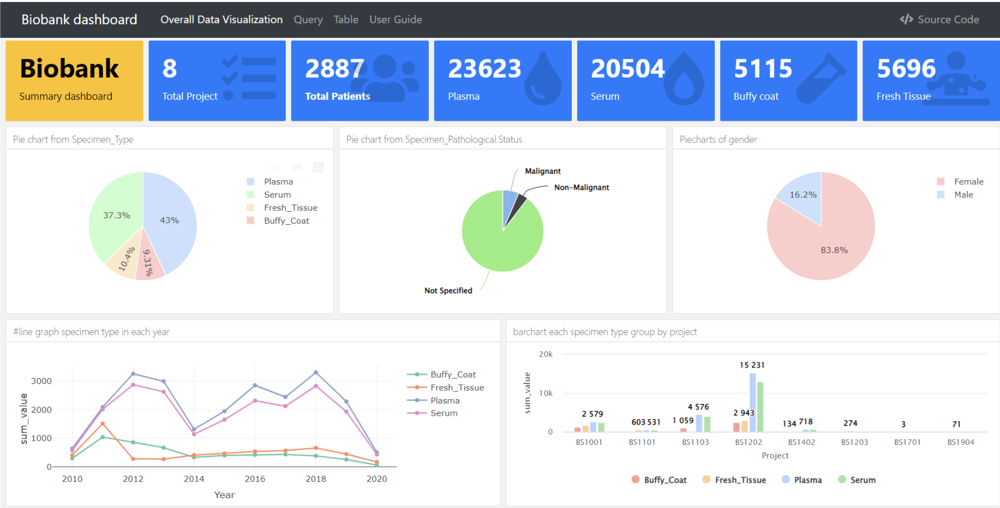
    </div>
  </div>
  <div style="display:flex;flex-direction:column;gap:0.4em;">
    <div style="background:rgba(255,179,0,0.08);border-left:3px solid #FFB300;border-radius:0 6px 6px 0;padding:0.45em 0.7em;line-height:1.5;">
      <strong style="color:#FFB300;font-size:1.05em;">📄 Journal</strong><br>
      <span style="color:#FFFFFF;font-weight:600;">"ABCD Feature Extraction for Melanoma Screening Using Image Processing: A Review"</span><br>
      <span style="color:#B0BEC5;">Chulabhorn Royal Academy · ต.ค. 2021</span><br>
      <div style="margin-top:0.3em;">
        <span class="pill" style="font-size:0.85em;">Image Processing</span>
        <span class="pill" style="font-size:0.85em;">ML</span>
        <span class="pill" style="font-size:0.85em;">Melanoma</span>
      </div>
    </div>
    <div style="flex:1;border:1.5px solid rgba(255,179,0,0.4);border-radius:8px;overflow:hidden;box-shadow:0 0 12px rgba(255,179,0,0.15);min-height:0;">
      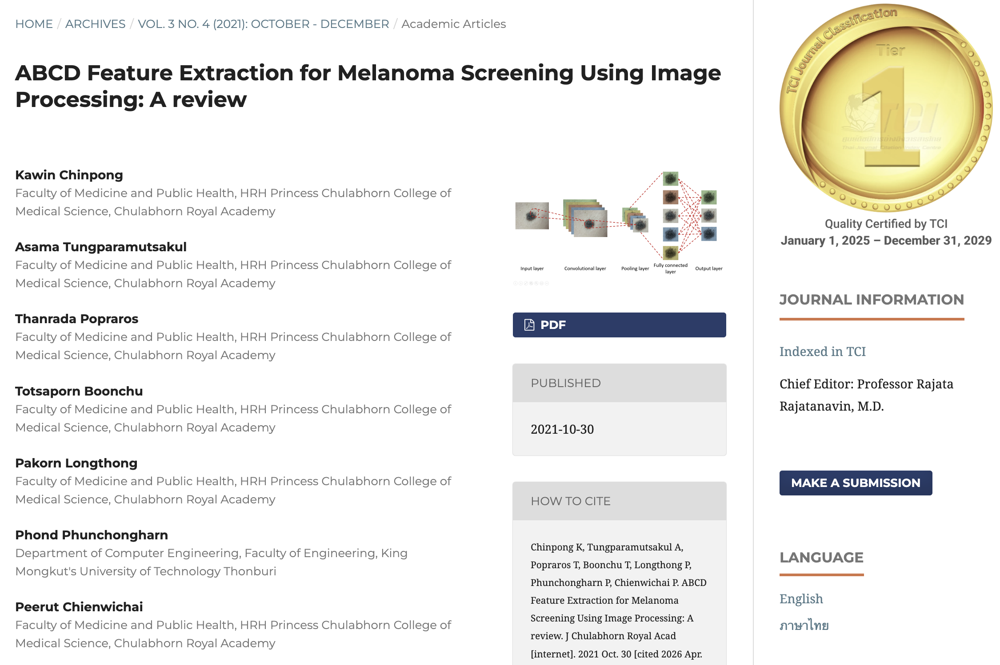
    </div>
  </div>
</div>
```

<!-- ═══ SLIDE 4: CRA PROJECTS ═══ -->
## 📊 ผลงาน — Chulabhorn Royal Academy {background-color="#0A1628"}

```{=html}
<div style="font-size:0.58em;color:#B0BEC5;margin-bottom:0.4em;display:flex;justify-content:space-between;align-items:center;">
  <span>Data Research Management Officer · ส.ค. 2022 – ก.ย. 2023</span>
  <span style="color:#00BCD4;">👆 คลิกที่โปรเจคด้านซ้ายเพื่อดูรายละเอียด</span>
</div>
<div style="display:grid;grid-template-columns:1fr 3fr;gap:0.6em;height:88%;">
  <div style="display:flex;flex-direction:column;gap:0.4em;font-size:0.58em;">
    <div id="menu-cra1" onclick="showCRA(1)" style="cursor:pointer;border-radius:8px;padding:0.6em 0.8em;border:1.5px solid #00BCD4;background:rgba(0,188,212,0.2);transition:all 0.2s;">
      <div style="color:#00BCD4;font-weight:700;font-size:1em;">💰 Financial Analysis</div>
      <div style="color:#78909C;font-size:0.85em;margin-top:0.15em;">Power BI · Finance</div>
    </div>
    <div id="menu-cra2" onclick="showCRA(2)" style="cursor:pointer;border-radius:8px;padding:0.6em 0.8em;border:1.5px solid rgba(255,255,255,0.1);background:rgba(255,255,255,0.03);transition:all 0.2s;">
      <div style="color:#00BCD4;font-weight:700;font-size:1em;">📈 Research Dashboard</div>
      <div style="color:#78909C;font-size:0.85em;margin-top:0.15em;">Power BI · KPI</div>
    </div>
    <div id="menu-cra3" onclick="showCRA(3)" style="cursor:pointer;border-radius:8px;padding:0.6em 0.8em;border:1.5px solid rgba(255,255,255,0.1);background:rgba(255,255,255,0.03);transition:all 0.2s;">
      <div style="color:#7C4DFF;font-weight:700;font-size:1em;">🧬 NGS Bioinformatics</div>
      <div style="color:#78909C;font-size:0.85em;margin-top:0.15em;">NGS · ML · Python</div>
    </div>
    <div id="menu-cra4" onclick="showCRA(4)" style="cursor:pointer;border-radius:8px;padding:0.6em 0.8em;border:1.5px solid rgba(255,255,255,0.1);background:rgba(255,255,255,0.03);transition:all 0.2s;">
      <div style="color:#FFB300;font-weight:700;font-size:1em;">⚙️ Power Platform</div>
      <div style="color:#78909C;font-size:0.85em;margin-top:0.15em;">Power Apps · Automate</div>
    </div>
  </div>

  <div style="position:relative;border:1px solid rgba(0,188,212,0.2);border-radius:12px;background:rgba(10,20,40,0.6);overflow:hidden;">
    <div id="panel-cra1" style="display:flex;flex-direction:column;height:100%;padding:1em;box-sizing:border-box;">
      <div style="display:flex;align-items:center;gap:0.6em;margin-bottom:0.5em;">
        <span style="font-size:1.2em;">💰</span>
        <div><div style="color:#00BCD4;font-weight:800;font-size:0.72em;">Financial Analysis Dashboard</div><div style="color:#78909C;font-size:0.58em;">Power BI · DAX · Financial Analytics</div></div>
        <div style="margin-left:auto;display:flex;gap:0.3em;">
          <span style="background:rgba(0,188,212,0.15);color:#00BCD4;border:1px solid rgba(0,188,212,0.4);padding:0.15em 0.5em;border-radius:4px;font-size:0.55em;font-weight:700;">Power BI</span>
          <span style="background:rgba(0,188,212,0.15);color:#00BCD4;border:1px solid rgba(0,188,212,0.4);padding:0.15em 0.5em;border-radius:4px;font-size:0.55em;font-weight:700;">DAX</span>
        </div>
      </div>
      <div style="color:#C0CDD8;font-size:0.6em;line-height:1.6;margin-bottom:0.6em;">ออกแบบและพัฒนา <strong>Power BI Dashboard</strong> สำหรับติดตามงบประมาณองค์กร ช่วยให้ผู้บริหารเห็นภาพการใช้จ่ายแบบ Real-time พร้อม Drill-down ระดับหน่วยงาน ลดเวลาจัดทำรายงานการเงินจาก 3 วัน เหลือ 1 ชั่วโมง</div>
      <div style="flex:1;border-radius:8px;overflow:hidden;border:1px solid rgba(0,188,212,0.2);min-height:0;background:#060e1e;display:flex;align-items:center;justify-content:center;">
        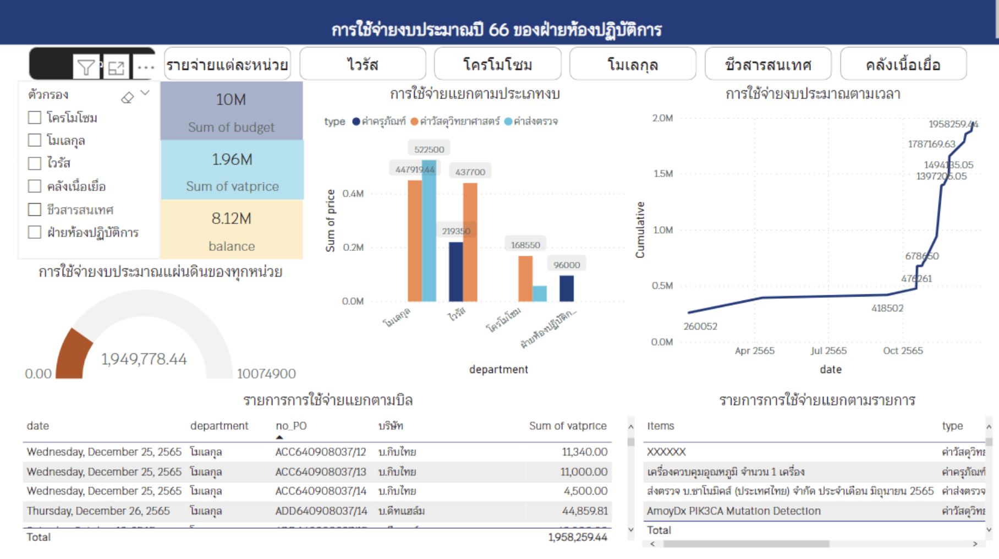
      </div>
    </div>
    <div id="panel-cra2" style="display:none;flex-direction:column;height:100%;padding:1em;box-sizing:border-box;">
      <div style="display:flex;align-items:center;gap:0.6em;margin-bottom:0.5em;">
        <span style="font-size:1.2em;">📈</span>
        <div><div style="color:#00BCD4;font-weight:800;font-size:0.72em;">Research Performance Dashboard</div><div style="color:#78909C;font-size:0.58em;">Power BI · KPI Tracking · Project Management</div></div>
        <div style="margin-left:auto;display:flex;gap:0.3em;">
          <span style="background:rgba(0,188,212,0.15);color:#00BCD4;border:1px solid rgba(0,188,212,0.4);padding:0.15em 0.5em;border-radius:4px;font-size:0.55em;font-weight:700;">Power BI</span>
          <span style="background:rgba(0,188,212,0.15);color:#00BCD4;border:1px solid rgba(0,188,212,0.4);padding:0.15em 0.5em;border-radius:4px;font-size:0.55em;font-weight:700;">KPI</span>
        </div>
      </div>
      <div style="color:#C0CDD8;font-size:0.6em;line-height:1.6;margin-bottom:0.6em;">สร้าง <strong>Interactive Dashboard</strong> ติดตามความก้าวหน้างานวิจัย ปรับปรุง Timeline โครงการ และสนับสนุนการจัดสรรทรัพยากรให้กับทีมวิจัยหลายโครงการพร้อมกัน รองรับ KPI กว่า 30 ตัวชี้วัด</div>
      <div style="flex:1;border-radius:8px;overflow:hidden;border:1px solid rgba(0,188,212,0.2);min-height:0;background:#060e1e;display:flex;align-items:center;justify-content:center;">
        
      </div>
    </div>
    <div id="panel-cra3" style="display:none;flex-direction:column;height:100%;padding:1em;box-sizing:border-box;">
      <div style="display:flex;align-items:center;gap:0.6em;margin-bottom:0.5em;">
        <span style="font-size:1.2em;">🧬</span>
        <div><div style="color:#7C4DFF;font-weight:800;font-size:0.72em;">Bioinformatics NGS Analysis</div><div style="color:#78909C;font-size:0.58em;">Next-Generation Sequencing · Machine Learning · Python</div></div>
        <div style="margin-left:auto;display:flex;gap:0.3em;">
          <span style="background:rgba(124,77,255,0.15);color:#7C4DFF;border:1px solid rgba(124,77,255,0.4);padding:0.15em 0.5em;border-radius:4px;font-size:0.55em;font-weight:700;">NGS</span>
          <span style="background:rgba(124,77,255,0.15);color:#7C4DFF;border:1px solid rgba(124,77,255,0.4);padding:0.15em 0.5em;border-radius:4px;font-size:0.55em;font-weight:700;">Python</span>
        </div>
      </div>
      <div style="color:#C0CDD8;font-size:0.6em;line-height:1.6;margin-bottom:0.6em;">สนับสนุน <strong>NGS Analysis</strong> สำหรับมะเร็งลำไส้ใหญ่ และทบทวนวรรณกรรม AMR Prediction ด้วย Machine Learning</div>
      <div style="flex:1;border-radius:8px;overflow:hidden;border:1px solid rgba(124,77,255,0.2);min-height:0;background:#060e1e;display:flex;align-items:center;justify-content:center;">
        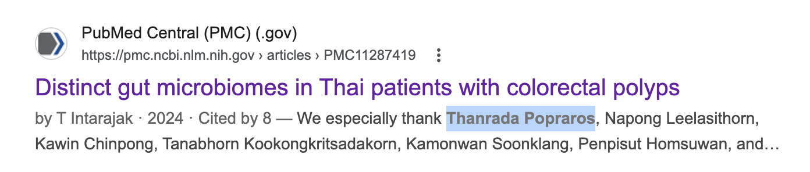
      </div>
    </div>
    <div id="panel-cra4" style="display:none;flex-direction:column;height:100%;padding:1em;box-sizing:border-box;">
      <div style="display:flex;align-items:center;gap:0.6em;margin-bottom:0.5em;">
        <span style="font-size:1.2em;">⚙️</span>
        <div><div style="color:#FFB300;font-weight:800;font-size:0.72em;">Power Platform Solutions</div><div style="color:#78909C;font-size:0.58em;">Power Apps · Power Automate · Low-code</div></div>
        <div style="margin-left:auto;display:flex;gap:0.3em;">
          <span style="background:rgba(255,179,0,0.15);color:#FFB300;border:1px solid rgba(255,179,0,0.4);padding:0.15em 0.5em;border-radius:4px;font-size:0.55em;font-weight:700;">Power Apps</span>
          <span style="background:rgba(255,179,0,0.15);color:#FFB300;border:1px solid rgba(255,179,0,0.4);padding:0.15em 0.5em;border-radius:4px;font-size:0.55em;font-weight:700;">Low-code</span>
        </div>
      </div>
      <div style="color:#C0CDD8;font-size:0.6em;line-height:1.6;margin-bottom:0.6em;">พัฒนา <strong>Low-code Solutions</strong> ด้วย Power Apps และ Power Automate ลดการทำงานซ้ำซ้อนกว่า 40%</div>
      <div style="flex:1;border-radius:8px;overflow:hidden;border:1px solid rgba(255,179,0,0.2);min-height:0;background:#060e1e;display:flex;align-items:center;justify-content:center;">
        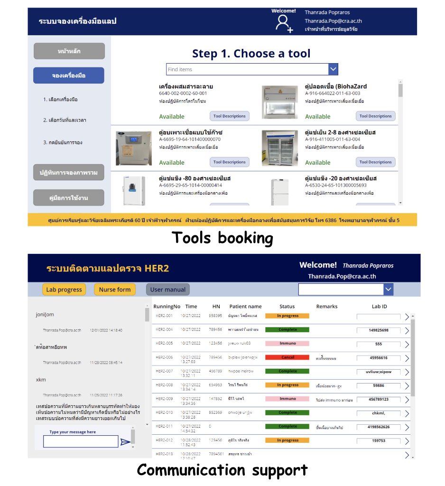
      </div>
    </div>
  </div>
</div>

<script>
const craColors={1:{border:'#00BCD4',bg:'rgba(0,188,212,0.15)'},2:{border:'#00BCD4',bg:'rgba(0,188,212,0.15)'},3:{border:'#7C4DFF',bg:'rgba(124,77,255,0.2)'},4:{border:'#FFB300',bg:'rgba(255,179,0,0.15)'}};
function showCRA(n){[1,2,3,4].forEach(i=>{const p=document.getElementById('panel-cra'+i);if(p)p.style.display='none';const m=document.getElementById('menu-cra'+i);if(m){m.style.border='1.5px solid rgba(255,255,255,0.1)';m.style.background='rgba(255,255,255,0.03)';}});const panel=document.getElementById('panel-cra'+n);if(panel)panel.style.display='flex';const menu=document.getElementById('menu-cra'+n);const c=craColors[n];if(menu&&c){menu.style.border='1.5px solid '+c.border;menu.style.background=c.bg;}}
document.addEventListener('DOMContentLoaded',function(){showCRA(1);});
</script>
```

<!-- ═══ SLIDE 5: ETDA PROJECTS ═══ -->
## {background-color="#0A1628"}

```{=html}
<div style="display:flex;align-items:center;gap:0.8em;margin-bottom:0.4em;">
  
  <div>
    <div style="font-size:0.8em;font-weight:800;color:#FFFFFF;">ผลงาน — ETDA</div>
    <div style="font-size:0.55em;color:#B0BEC5;">Data Scientist · ก.ย. 2023 – ปัจจุบัน</div>
  </div>
  <div style="margin-left:auto;display:flex;gap:0.5em;">
    <div id="tab-past" onclick="switchETDATab('past')" style="cursor:pointer;padding:0.35em 1em;border-radius:20px;font-size:0.62em;font-weight:700;border:1.5px solid #00BCD4;background:rgba(0,188,212,0.2);color:#00BCD4;transition:all 0.25s;">📁 ผลงานที่ผ่านมา (6)</div>
    <div id="tab-now" onclick="switchETDATab('now')" style="cursor:pointer;padding:0.35em 1em;border-radius:20px;font-size:0.62em;font-weight:700;border:1.5px solid rgba(255,255,255,0.15);background:rgba(255,255,255,0.04);color:#607080;transition:all 0.25s;">🔴 กำลังดำเนินการ (3)</div>
  </div>
</div>

<div id="etda-panel-past" style="display:grid;grid-template-columns:1fr 3fr;gap:0.6em;height:82%;">
  <div style="display:flex;flex-direction:column;gap:0.3em;font-size:0.55em;">
    <div id="emenu-p1" onclick="showETDA('p',1)" style="cursor:pointer;border-radius:8px;padding:0.5em 0.7em;border:1.5px solid #00BCD4;background:rgba(0,188,212,0.2);transition:all 0.2s;"><div style="color:#00BCD4;font-weight:700;font-size:1em;">🚨 1212 Complaint Analysis</div><div style="color:#78909C;font-size:0.85em;margin-top:0.1em;">Analytics · Forecasting</div></div>
    <div id="emenu-p2" onclick="showETDA('p',2)" style="cursor:pointer;border-radius:8px;padding:0.5em 0.7em;border:1.5px solid rgba(255,255,255,0.1);background:rgba(255,255,255,0.03);transition:all 0.2s;"><div style="color:#00BCD4;font-weight:700;font-size:1em;">🪪 ThaiD Dashboard</div><div style="color:#78909C;font-size:0.85em;margin-top:0.1em;">Digital ID · DID Team</div></div>
    <div id="emenu-p3" onclick="showETDA('p',3)" style="cursor:pointer;border-radius:8px;padding:0.5em 0.7em;border:1.5px solid rgba(255,255,255,0.1);background:rgba(255,255,255,0.03);transition:all 0.2s;"><div style="color:#7C4DFF;font-weight:700;font-size:1em;">🏢 IdP Mockup Dashboard</div><div style="color:#78909C;font-size:0.85em;margin-top:0.1em;">Identity Provider · Demo</div></div>
    <div id="emenu-p4" onclick="showETDA('p',4)" style="cursor:pointer;border-radius:8px;padding:0.5em 0.7em;border:1.5px solid rgba(255,255,255,0.1);background:rgba(255,255,255,0.03);transition:all 0.2s;"><div style="color:#FFB300;font-weight:700;font-size:1em;">🏠 PoC ที่พักผิดกฎหมาย</div><div style="color:#78909C;font-size:0.85em;margin-top:0.1em;">ML · OTA · Data Matching</div></div>
    <div id="emenu-p5" onclick="showETDA('p',5)" style="cursor:pointer;border-radius:8px;padding:0.5em 0.7em;border:1.5px solid rgba(255,255,255,0.1);background:rgba(255,255,255,0.03);transition:all 0.2s;"><div style="color:#00E676;font-weight:700;font-size:1em;">💬 App Review Sentiment</div><div style="color:#78909C;font-size:0.85em;margin-top:0.1em;">NLP · Policy Framework</div></div>
    <div id="emenu-p6" onclick="showETDA('p',6)" style="cursor:pointer;border-radius:8px;padding:0.5em 0.7em;border:1.5px solid rgba(255,255,255,0.1);background:rgba(255,255,255,0.03);transition:all 0.2s;"><div style="color:#EF5350;font-weight:700;font-size:1em;">📋 DPS Topic Analysis</div><div style="color:#78909C;font-size:0.85em;margin-top:0.1em;">LLM · Topic Modeling</div></div>
  </div>

  <div style="position:relative;border:1px solid rgba(0,188,212,0.2);border-radius:12px;background:rgba(10,20,40,0.6);overflow:hidden;">
    <div id="epanel-p1" style="display:flex;flex-direction:column;height:100%;padding:0.9em;box-sizing:border-box;">
      <div style="display:flex;align-items:center;gap:0.6em;margin-bottom:0.4em;"><span style="font-size:1.1em;">🚨</span><div style="flex:1;"><div style="color:#00BCD4;font-weight:800;font-size:0.68em;">1212 Call Center Complaint Analysis</div><div style="color:#78909C;font-size:0.55em;">Data Analytics · Python · Forecasting</div></div><div style="display:flex;gap:0.25em;"><span style="background:rgba(0,188,212,0.15);color:#00BCD4;border:1px solid rgba(0,188,212,0.4);padding:0.12em 0.4em;border-radius:4px;font-size:0.5em;font-weight:700;">Python</span><span style="background:rgba(0,188,212,0.15);color:#00BCD4;border:1px solid rgba(0,188,212,0.4);padding:0.12em 0.4em;border-radius:4px;font-size:0.5em;font-weight:700;">Forecasting</span></div></div>
      <div style="display:grid;grid-template-columns:1fr 1fr;gap:0.5em;margin-bottom:0.4em;font-size:0.55em;">
        <div style="background:rgba(0,188,212,0.07);border:1px solid rgba(0,188,212,0.2);border-radius:6px;padding:0.4em 0.6em;"><div style="color:#00BCD4;font-weight:700;margin-bottom:0.2em;">📊 วิเคราะห์เชิงลึก</div><div style="color:#C0CDD8;line-height:1.5;">จำนวน & มูลค่าความเสียหาย · Demographic · Pattern · Trend Analysis</div></div>
        <div style="background:rgba(0,230,118,0.07);border:1px solid rgba(0,230,118,0.2);border-radius:6px;padding:0.4em 0.6em;"><div style="color:#00E676;font-weight:700;margin-bottom:0.2em;">🤖 Forecasting Model</div><div style="color:#C0CDD8;line-height:1.5;">พัฒนาโมเดลพยากรณ์จำนวนเคสร้องเรียนในอนาคต</div></div>
      </div>
      <div style="flex:1;border-radius:8px;overflow:hidden;border:1px solid rgba(0,188,212,0.2);min-height:0;background:#060e1e;display:flex;align-items:center;justify-content:center;">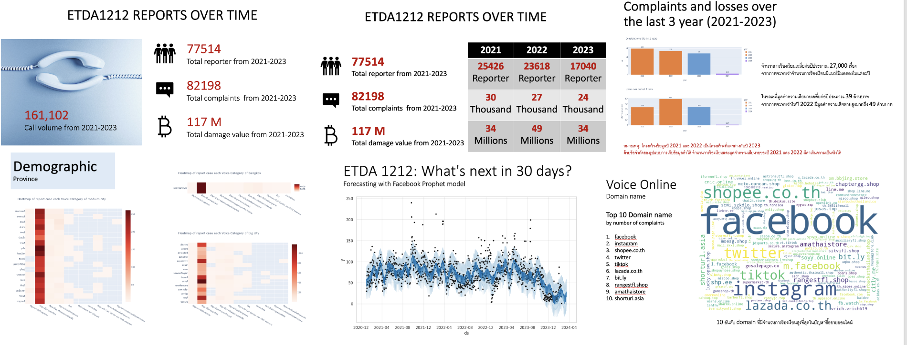</div>
    </div>
    <div id="epanel-p2" style="display:none;flex-direction:column;height:100%;padding:0.9em;box-sizing:border-box;">
      <div style="display:flex;align-items:center;gap:0.6em;margin-bottom:0.4em;"><span style="font-size:1.1em;">🪪</span><div style="flex:1;"><div style="color:#00BCD4;font-weight:800;font-size:0.68em;">ThaiD Dashboard</div><div style="color:#78909C;font-size:0.55em;">Digital ID · Power BI · DID Team</div></div></div>
      <div style="display:grid;grid-template-columns:1fr 1fr;gap:0.5em;margin-bottom:0.4em;font-size:0.55em;">
        <div style="background:rgba(0,188,212,0.07);border:1px solid rgba(0,188,212,0.2);border-radius:6px;padding:0.4em 0.6em;"><div style="color:#00BCD4;font-weight:700;margin-bottom:0.2em;">📈 วิเคราะห์</div><div style="color:#C0CDD8;line-height:1.5;">จำนวนธุรกรรมรายเดือน · App ที่เชื่อมต่อ ThaiD · Growth · Usage Pattern</div></div>
        <div style="background:rgba(124,77,255,0.07);border:1px solid rgba(124,77,255,0.2);border-radius:6px;padding:0.4em 0.6em;"><div style="color:#7C4DFF;font-weight:700;margin-bottom:0.2em;">🎯 วัตถุประสงค์</div><div style="color:#C0CDD8;line-height:1.5;">สนับสนุนทีม DID ติดตาม Ecosystem Digital ID ของประเทศไทย</div></div>
      </div>
      <div style="flex:1;border-radius:8px;overflow:hidden;border:1px solid rgba(0,188,212,0.2);min-height:0;background:#060e1e;display:flex;align-items:center;justify-content:center;">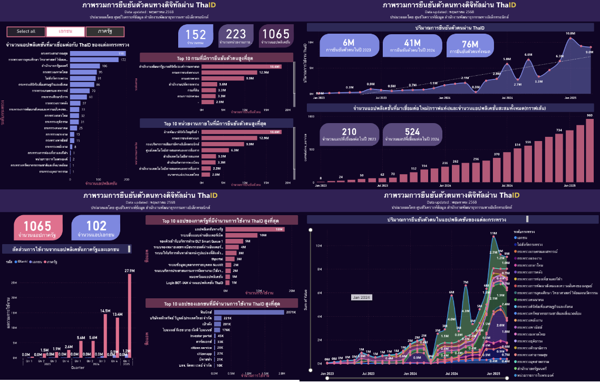</div>
    </div>
    <div id="epanel-p3" style="display:none;flex-direction:column;height:100%;padding:0.9em;box-sizing:border-box;">
      <div style="display:flex;align-items:center;gap:0.6em;margin-bottom:0.4em;"><span style="font-size:1.1em;">🏢</span><div style="flex:1;"><div style="color:#7C4DFF;font-weight:800;font-size:0.68em;">IdP Mockup Dashboard</div><div style="color:#78909C;font-size:0.55em;">Data Simulation · Dashboard · Private Sector</div></div></div>
      <div style="display:grid;grid-template-columns:1fr 1fr;gap:0.5em;margin-bottom:0.4em;font-size:0.55em;">
        <div style="background:rgba(124,77,255,0.07);border:1px solid rgba(124,77,255,0.2);border-radius:6px;padding:0.4em 0.6em;"><div style="color:#7C4DFF;font-weight:700;margin-bottom:0.2em;">🔍 วัตถุประสงค์</div><div style="color:#C0CDD8;line-height:1.5;">แสดงให้เห็นว่าข้อมูลที่ ETDA ขอรายงานประจำปีจะถูกนำไปใช้ประโยชน์ยังไง</div></div>
        <div style="background:rgba(0,188,212,0.07);border:1px solid rgba(0,188,212,0.2);border-radius:6px;padding:0.4em 0.6em;"><div style="color:#00BCD4;font-weight:700;margin-bottom:0.2em;">📊 Output</div><div style="color:#C0CDD8;line-height:1.5;">Dashboard Mockup สำหรับนำเสนอแก่ IdP ภาคเอกชน</div></div>
      </div>
      <div style="flex:1;border-radius:8px;overflow:hidden;border:1px solid rgba(124,77,255,0.2);min-height:0;background:#060e1e;display:flex;align-items:center;justify-content:center;">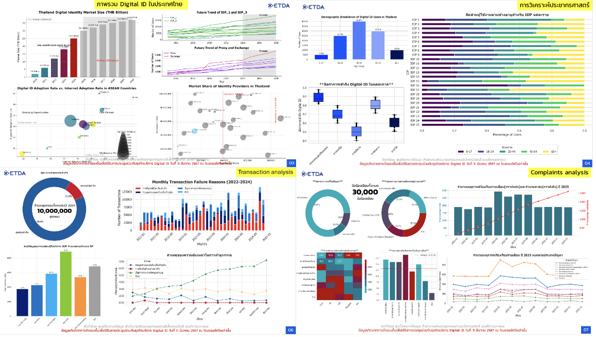</div>
    </div>
    <div id="epanel-p4" style="display:none;flex-direction:column;height:100%;padding:0.9em;box-sizing:border-box;">
      <div style="display:flex;align-items:center;gap:0.6em;margin-bottom:0.4em;"><span style="font-size:1.1em;">🏠</span><div style="flex:1;"><div style="color:#FFB300;font-weight:800;font-size:0.68em;">PoC ตรวจจับที่พักผิดกฎหมายบน OTA</div><div style="color:#78909C;font-size:0.55em;">ML · Booking.com · Agoda · Trip.com · กรมการปกครอง</div></div></div>
      <div style="display:grid;grid-template-columns:1fr 1fr 1fr;gap:0.4em;margin-bottom:0.4em;font-size:0.52em;">
        <div style="background:rgba(239,83,80,0.07);border:1px solid rgba(239,83,80,0.2);border-radius:6px;padding:0.35em 0.5em;"><div style="color:#EF5350;font-weight:700;margin-bottom:0.15em;">🔍 ยืนยันสถานะ</div><div style="color:#C0CDD8;line-height:1.45;">จับคู่กับทะเบียนโรงแรมรัฐ → ถูกกฎหมาย / สงสัย / ไม่สามารถยืนยัน</div></div>
        <div style="background:rgba(255,179,0,0.07);border:1px solid rgba(255,179,0,0.2);border-radius:6px;padding:0.35em 0.5em;"><div style="color:#FFB300;font-weight:700;margin-bottom:0.15em;">📊 วัดความเสี่ยง</div><div style="color:#C0CDD8;line-height:1.45;">% สงสัยผิดกฎหมาย แยกตาม Platform จังหวัด ช่วงเวลา</div></div>
        <div style="background:rgba(0,230,118,0.07);border:1px solid rgba(0,230,118,0.2);border-radius:6px;padding:0.35em 0.5em;"><div style="color:#00E676;font-weight:700;margin-bottom:0.15em;">📋 Notice & Action</div><div style="color:#C0CDD8;line-height:1.45;">วาง Threshold & SLA แจ้งเตือน/ถอดรายการ โปร่งใส</div></div>
      </div>
      <div style="flex:1;border-radius:8px;overflow:hidden;border:1px solid rgba(255,179,0,0.2);min-height:0;background:#060e1e;display:flex;align-items:center;justify-content:center;">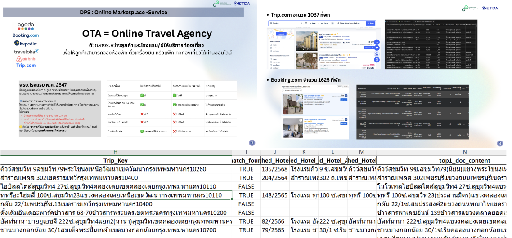</div>
    </div>
    <div id="epanel-p5" style="display:none;flex-direction:column;height:100%;padding:0.9em;box-sizing:border-box;">
      <div style="display:flex;align-items:center;gap:0.6em;margin-bottom:0.4em;"><span style="font-size:1.1em;">💬</span><div style="flex:1;"><div style="color:#00E676;font-weight:800;font-size:0.68em;">Sentiment-Driven Policy Insight Framework</div><div style="color:#78909C;font-size:0.55em;">NLP · Sentiment · Early Warning · Social Listening</div></div></div>
      <div style="display:grid;grid-template-columns:1fr 1fr;gap:0.4em;margin-bottom:0.4em;font-size:0.52em;">
        <div style="background:rgba(0,230,118,0.07);border:1px solid rgba(0,230,118,0.2);border-radius:6px;padding:0.35em 0.5em;"><div style="color:#00E676;font-weight:700;margin-bottom:0.15em;">🎯 วัตถุประสงค์</div><div style="color:#C0CDD8;line-height:1.45;">เครื่องมือเชิงนโยบาย ใช้รีวิวผู้ใช้เป็นฐานเฝ้าระวัง · Early Warning</div></div>
        <div style="background:rgba(0,188,212,0.07);border:1px solid rgba(0,188,212,0.2);border-radius:6px;padding:0.35em 0.5em;"><div style="color:#00BCD4;font-weight:700;margin-bottom:0.15em;">💡 Impact</div><div style="color:#C0CDD8;line-height:1.45;">Social Listening · เพิ่มความโปร่งใส · สมดุลคุ้มครองผู้บริโภค</div></div>
      </div>
      <div style="flex:1;border-radius:8px;overflow:hidden;border:1px solid rgba(0,230,118,0.2);min-height:0;background:#060e1e;display:flex;align-items:center;justify-content:center;">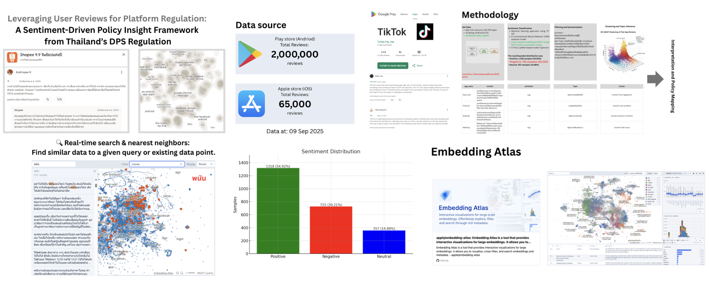</div>
    </div>
    <div id="epanel-p6" style="display:none;flex-direction:column;height:100%;padding:0.9em;box-sizing:border-box;">
      <div style="display:flex;align-items:center;gap:0.6em;margin-bottom:0.4em;"><span style="font-size:1.1em;">📋</span><div style="flex:1;"><div style="color:#EF5350;font-weight:800;font-size:0.68em;">DPS Complaint Topic Analysis · LLM Auto-Classification</div><div style="color:#78909C;font-size:0.55em;">LLM · Topic Modeling · NLP · DPS Policy</div></div></div>
      <div style="display:grid;grid-template-columns:1fr 1fr;gap:0.4em;margin-bottom:0.4em;font-size:0.52em;">
        <div style="background:rgba(239,83,80,0.07);border:1px solid rgba(239,83,80,0.2);border-radius:6px;padding:0.35em 0.5em;"><div style="color:#EF5350;font-weight:700;margin-bottom:0.15em;">📊 สิ่งที่วิเคราะห์</div><div style="color:#C0CDD8;line-height:1.45;">จำนวนร้องเรียน · ประสิทธิภาพจัดการ · จดแจ้ง vs ประจำปี</div></div>
        <div style="background:rgba(124,77,255,0.07);border:1px solid rgba(124,77,255,0.2);border-radius:6px;padding:0.35em 0.5em;"><div style="color:#7C4DFF;font-weight:700;margin-bottom:0.15em;">🤖 LLM Auto-Classification</div><div style="color:#C0CDD8;line-height:1.45;">จัดหมวดหมู่อัตโนมัติ · ผลวิเคราะห์ตามหมวดหมู่ที่ LLM ทำนาย</div></div>
      </div>
      <div style="flex:1;border-radius:8px;overflow:hidden;border:1px solid rgba(239,83,80,0.2);min-height:0;background:#060e1e;display:flex;align-items:center;justify-content:center;">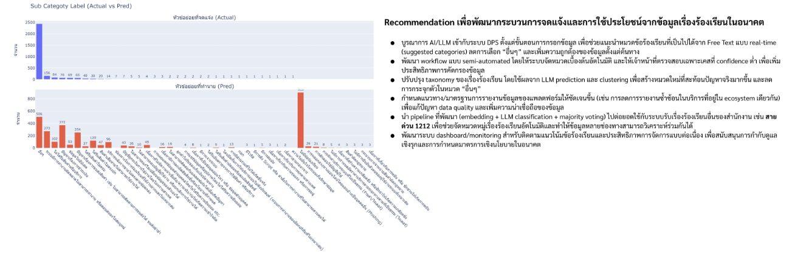</div>
    </div>
  </div>
</div>

<div id="etda-panel-now" style="display:none;grid-template-columns:1fr 3fr;gap:0.6em;height:82%;">
  <div style="display:flex;flex-direction:column;gap:0.3em;font-size:0.55em;">
    <div id="emenu-c1" onclick="showETDA('c',1)" style="cursor:pointer;border-radius:8px;padding:0.5em 0.7em;border:1.5px solid #00E676;background:rgba(0,230,118,0.2);transition:all 0.2s;"><div style="color:#00E676;font-weight:700;font-size:1em;">🎙️ Speech-to-Text · 1212</div><div style="color:#78909C;font-size:0.85em;margin-top:0.1em;">ASR · NLP · Auto-Flag</div><span style="background:#00E676;color:#0A1628;font-size:0.7em;font-weight:800;padding:0.1em 0.5em;border-radius:8px;margin-top:0.25em;display:inline-block;">LIVE</span></div>
    <div id="emenu-c2" onclick="showETDA('c',2)" style="cursor:pointer;border-radius:8px;padding:0.5em 0.7em;border:1.5px solid rgba(255,255,255,0.1);background:rgba(255,255,255,0.03);transition:all 0.2s;"><div style="color:#00BCD4;font-weight:700;font-size:1em;">📄 Auto Report Generation</div><div style="color:#78909C;font-size:0.85em;margin-top:0.1em;">LLM · Gen AI</div><span style="background:#00BCD4;color:#0A1628;font-size:0.7em;font-weight:800;padding:0.1em 0.5em;border-radius:8px;margin-top:0.25em;display:inline-block;">POC</span></div>
    <div id="emenu-c3" onclick="showETDA('c',3)" style="cursor:pointer;border-radius:8px;padding:0.5em 0.7em;border:1.5px solid rgba(255,255,255,0.1);background:rgba(255,255,255,0.03);transition:all 0.2s;"><div style="color:#FFB300;font-weight:700;font-size:1em;">🔍 Platform Trust Survey</div><div style="color:#78909C;font-size:0.85em;margin-top:0.1em;">Survey · Analytics · 2569</div></div>
  </div>
  <div style="position:relative;border:1px solid rgba(0,188,212,0.2);border-radius:12px;background:rgba(10,20,40,0.6);overflow:hidden;">
    <div id="epanel-c1" style="display:flex;flex-direction:column;height:100%;padding:0.9em;box-sizing:border-box;">
      <div style="display:flex;align-items:center;gap:0.6em;margin-bottom:0.4em;"><span style="font-size:1.1em;">🎙️</span><div style="flex:1;"><div style="color:#00E676;font-weight:800;font-size:0.68em;">Speech-to-Text · 1212 Call Center</div><div style="color:#78909C;font-size:0.55em;">ASR · Whisper · Python · Real-time · DPS Auto-Flag</div></div><span style="background:#00E676;color:#0A1628;padding:0.12em 0.4em;border-radius:4px;font-size:0.5em;font-weight:800;">LIVE</span></div>
      <div style="display:grid;grid-template-columns:1fr 1fr;gap:0.4em;margin-bottom:0.4em;font-size:0.52em;">
        <div style="background:rgba(0,230,118,0.07);border:1px solid rgba(0,230,118,0.2);border-radius:6px;padding:0.35em 0.5em;"><div style="color:#00E676;font-weight:700;margin-bottom:0.15em;">🎯 Core Function</div><div style="color:#C0CDD8;line-height:1.45;">แปลงไฟล์ .wav เป็น Text · ลดภาระ Manual · Transcription แม่นยำ</div></div>
        <div style="background:rgba(0,188,212,0.07);border:1px solid rgba(0,188,212,0.2);border-radius:6px;padding:0.35em 0.5em;"><div style="color:#00BCD4;font-weight:700;margin-bottom:0.15em;">🤖 Next Step</div><div style="color:#C0CDD8;line-height:1.45;">Auto-Flag ร้องเรียนที่เกี่ยวกับ Platform · Map หมวดหมู่ DPS</div></div>
      </div>
      <div style="flex:1;border-radius:8px;overflow:hidden;border:1px solid rgba(0,230,118,0.2);min-height:0;background:#060e1e;display:flex;align-items:center;justify-content:center;">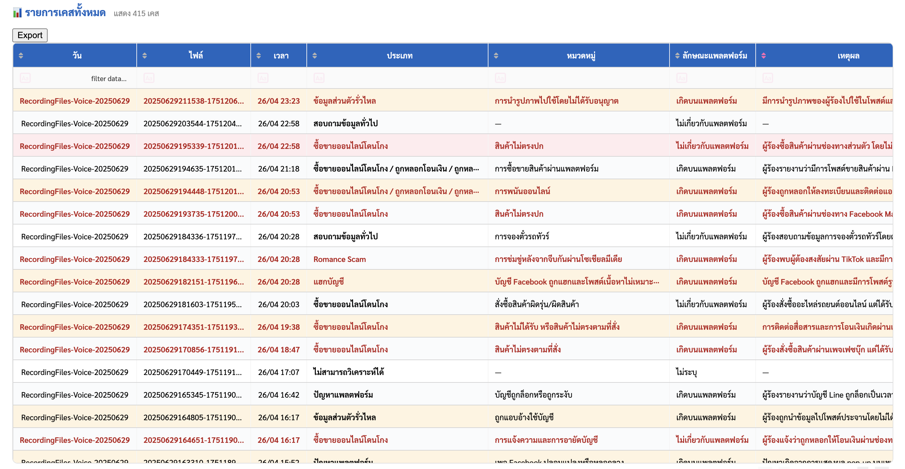</div>
    </div>
    <div id="epanel-c2" style="display:none;flex-direction:column;height:100%;padding:0.9em;box-sizing:border-box;">
      <div style="display:flex;align-items:center;gap:0.6em;margin-bottom:0.4em;"><span style="font-size:1.1em;">📄</span><div style="flex:1;"><div style="color:#00BCD4;font-weight:800;font-size:0.68em;">PoC Auto Report Generation</div><div style="color:#78909C;font-size:0.55em;">LLM · RAG · Python · Generative AI</div></div><span style="background:#00BCD4;color:#0A1628;padding:0.12em 0.4em;border-radius:4px;font-size:0.5em;font-weight:800;">POC</span></div>
      <div style="display:grid;grid-template-columns:1fr 1fr;gap:0.4em;margin-bottom:0.4em;font-size:0.52em;">
        <div style="background:rgba(0,188,212,0.07);border:1px solid rgba(0,188,212,0.2);border-radius:6px;padding:0.35em 0.5em;"><div style="color:#00BCD4;font-weight:700;margin-bottom:0.15em;">⚡ ลดเวลาจัดทำรายงาน</div><div style="color:#C0CDD8;line-height:1.45;">LLM วิเคราะห์ข้อมูลและสรุปผลอัตโนมัติ · Draft รายงานให้ทีมตรวจสอบ</div></div>
        <div style="background:rgba(124,77,255,0.07);border:1px solid rgba(124,77,255,0.2);border-radius:6px;padding:0.35em 0.5em;"><div style="color:#7C4DFF;font-weight:700;margin-bottom:0.15em;">🔗 เชื่อมกับ Dissertation</div><div style="color:#C0CDD8;line-height:1.45;">ต่อยอดสู่ AI Ethics Compliance Framework · Governance Automation</div></div>
      </div>
      <div style="flex:1;border-radius:8px;overflow:hidden;border:1px solid rgba(0,188,212,0.2);min-height:0;background:#060e1e;display:flex;align-items:center;justify-content:center;">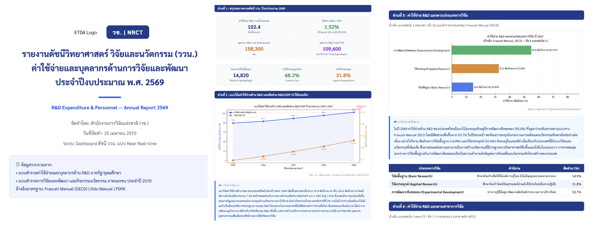</div>
    </div>
    <div id="epanel-c3" style="display:none;flex-direction:column;height:100%;padding:0.9em;box-sizing:border-box;">
      <div style="display:flex;align-items:center;gap:0.6em;margin-bottom:0.4em;"><span style="font-size:1.1em;">🔍</span><div style="flex:1;"><div style="color:#FFB300;font-weight:800;font-size:0.68em;">โครงการสำรวจความเชื่อมั่นการใช้งานแพลตฟอร์ม ประจำปี 2569</div><div style="color:#78909C;font-size:0.55em;">Survey Design · Statistical Analysis · Policy Research</div></div><span style="background:#FFB300;color:#0A1628;padding:0.12em 0.4em;border-radius:4px;font-size:0.5em;font-weight:800;">NEW</span></div>
      <div style="display:grid;grid-template-columns:1fr 1fr;gap:0.4em;margin-bottom:0.4em;font-size:0.52em;">
        <div style="background:rgba(255,179,0,0.07);border:1px solid rgba(255,179,0,0.2);border-radius:6px;padding:0.35em 0.5em;"><div style="color:#FFB300;font-weight:700;margin-bottom:0.15em;">📋 วัตถุประสงค์</div><div style="color:#C0CDD8;line-height:1.45;">สำรวจระดับความเชื่อมั่นของผู้ใช้งานแพลตฟอร์มในประเทศไทย</div></div>
        <div style="background:rgba(0,230,118,0.07);border:1px solid rgba(0,230,118,0.2);border-radius:6px;padding:0.35em 0.5em;"><div style="color:#00E676;font-weight:700;margin-bottom:0.15em;">📊 Output</div><div style="color:#C0CDD8;line-height:1.45;">Trust Index รายแพลตฟอร์ม · ข้อเสนอแนะปรับปรุงกฎระเบียบ</div></div>
      </div>
      <div style="flex:1;border-radius:8px;overflow:hidden;border:1px solid rgba(255,179,0,0.2);min-height:0;background:#060e1e;display:flex;align-items:center;justify-content:center;">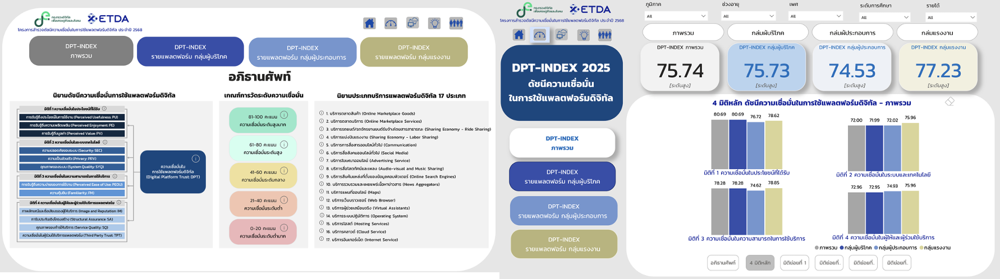</div>
    </div>
  </div>
</div>

<script>
const etdaPastColors={1:{border:'#00BCD4',bg:'rgba(0,188,212,0.2)'},2:{border:'#00BCD4',bg:'rgba(0,188,212,0.2)'},3:{border:'#7C4DFF',bg:'rgba(124,77,255,0.2)'},4:{border:'#FFB300',bg:'rgba(255,179,0,0.2)'},5:{border:'#00E676',bg:'rgba(0,230,118,0.2)'},6:{border:'#EF5350',bg:'rgba(239,83,80,0.2)'}};
const etdaNowColors={1:{border:'#00E676',bg:'rgba(0,230,118,0.2)'},2:{border:'#00BCD4',bg:'rgba(0,188,212,0.2)'},3:{border:'#FFB300',bg:'rgba(255,179,0,0.2)'}};
function showETDA(type,n){const maxP=type==='p'?6:3;for(let i=1;i<=maxP;i++){const p=document.getElementById('epanel-'+type+i);const m=document.getElementById('emenu-'+type+i);if(p)p.style.display='none';if(m){m.style.border='1.5px solid rgba(255,255,255,0.1)';m.style.background='rgba(255,255,255,0.03)';}}const panel=document.getElementById('epanel-'+type+n);if(panel)panel.style.display='flex';const menu=document.getElementById('emenu-'+type+n);const c=(type==='p'?etdaPastColors:etdaNowColors)[n];if(menu&&c){menu.style.border='1.5px solid '+c.border;menu.style.background=c.bg;}}
function switchETDATab(tab){const pp=document.getElementById('etda-panel-past');const pn=document.getElementById('etda-panel-now');const tp=document.getElementById('tab-past');const tn=document.getElementById('tab-now');const base='cursor:pointer;padding:0.35em 1em;border-radius:20px;font-size:0.62em;font-weight:700;transition:all 0.25s;';if(tab==='past'){pp.style.display='grid';pn.style.display='none';tp.style.cssText=base+'border:1.5px solid #00BCD4;background:rgba(0,188,212,0.2);color:#00BCD4;';tn.style.cssText=base+'border:1.5px solid rgba(255,255,255,0.15);background:rgba(255,255,255,0.04);color:#607080;';showETDA('p',1);}else{pp.style.display='none';pn.style.display='grid';tp.style.cssText=base+'border:1.5px solid rgba(255,255,255,0.15);background:rgba(255,255,255,0.04);color:#607080;';tn.style.cssText=base+'border:1.5px solid #00E676;background:rgba(0,230,118,0.2);color:#00E676;';showETDA('c',1);}}
document.addEventListener('DOMContentLoaded',function(){showETDA('p',1);});
</script>
```


<!-- ═══ SLIDE 6: ONE PAGE PROPOSAL ═══ -->
## 📋 ข้อเสนอโครงการ {background-color="#0A1628"}

```{=html}
<style>
.prop-tab{cursor:pointer;padding:0.3em 0.75em;border-radius:20px;font-size:0.62em;font-weight:700;transition:all 0.2s;border:1.5px solid;white-space:nowrap;}
.prop-tab.active{color:#0A1628;}
.prop-tab.inactive{background:rgba(255,255,255,0.03);border-color:rgba(255,255,255,0.1);color:#505870;}
@keyframes dp2{0%,100%{transform:scale(1);opacity:1;}50%{transform:scale(1.6);opacity:0.3;}}
@keyframes ab2{0%,100%{transform:translateY(0);}50%{transform:translateY(3px);}}
@keyframes sb2{0%{left:-100%;}100%{left:200%;}}
.p-row{display:flex;align-items:center;gap:0.4em;padding:0.22em 0.5em;border-radius:7px;overflow:hidden;flex-shrink:0;}
.p-title{font-weight:700;font-size:0.82em;overflow:hidden;text-overflow:ellipsis;white-space:nowrap;}
.p-sub{font-size:0.7em;color:#456070;line-height:1.3;}
</style>

<div style="font-family:'Inter','Sarabun',sans-serif;font-size:0.7em;
     width:100%;box-sizing:border-box;display:flex;flex-direction:column;gap:0.32em;">

  <!-- Header -->
  <div style="background:linear-gradient(135deg,rgba(0,188,212,0.1),rgba(124,77,255,0.07));
       border:1px solid rgba(0,188,212,0.2);border-radius:9px;
       padding:0.38em 0.8em;display:flex;justify-content:space-between;align-items:center;">
    <div>
      <div style="color:#00BCD4;font-weight:800;font-size:1em;">โครงการพัฒนาระบบธรรมาภิบาลข้อมูลองค์กรด้วยปัญญาประดิษฐ์</div>
      <div style="color:#506070;font-size:0.82em;margin-top:0.06em;">ETDA Data Governance Policy Automation · ทุน ก.พ. 2569 · กลุ่มสาขา 1</div>
    </div>
    <div style="text-align:right;flex-shrink:0;">
      <div style="color:#FFB300;font-weight:700;font-size:0.95em;">นางสาวธัญรดา โพธิ์พระรส</div>
      <div style="color:#505870;font-size:0.82em;">Data Scientist · ETDA</div>
    </div>
  </div>

  <!-- Tabs -->
  <div style="display:flex;gap:0.3em;">
    <div id="ptab-1" class="prop-tab active" onclick="showProp(1)"
         style="background:#1E88E5;border-color:#1E88E5;color:#0A1628;">📌 ที่มา</div>
    <div id="ptab-2" class="prop-tab inactive" onclick="showProp(2)">🎯 วัตถุประสงค์ & ประโยชน์</div>
    <div id="ptab-3" class="prop-tab inactive" onclick="showProp(3)">📦 Output · Outcome · ผลกระทบ</div>
  </div>

  <!-- ══ PANEL 1 ══ -->
  <div id="ppanel-1" style="display:flex;gap:0.45em;height:468px;overflow:hidden;">
    <div style="width:42%;display:flex;flex-direction:column;gap:0.25em;overflow:hidden;">
      <div style="display:grid;grid-template-columns:1fr 1fr;gap:0.25em;flex:0 0 auto;">
        <div style="border:1.5px solid rgba(30,136,229,0.3);border-radius:7px;overflow:hidden;background:#060e1e;">
          <div style="height:105px;overflow:hidden;">
            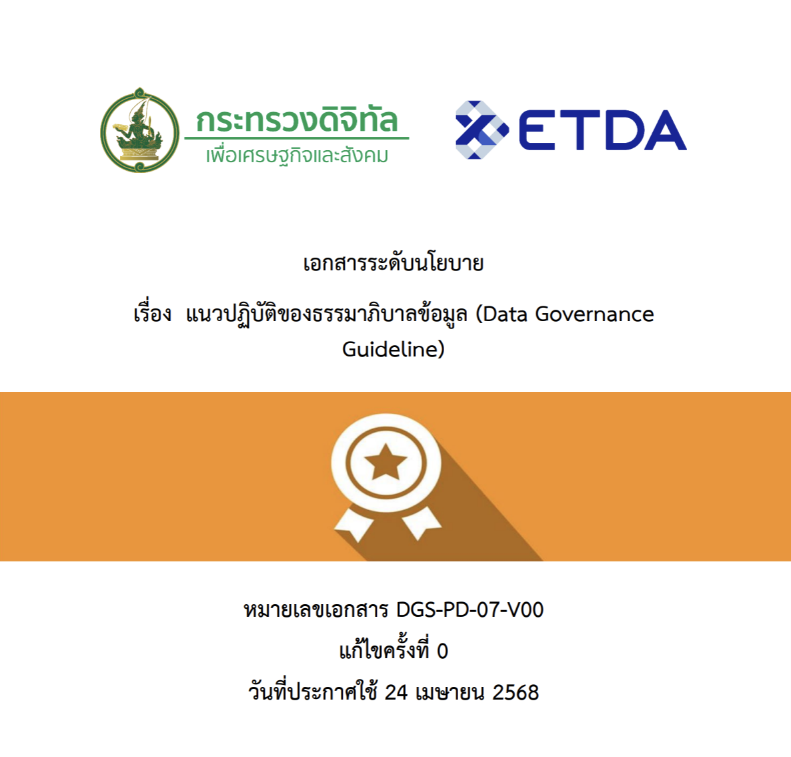
          </div>
          <div style="padding:0.16em 0.32em;border-top:1px solid rgba(30,136,229,0.2);">
            <div style="color:#1E88E5;font-weight:700;font-size:0.65em;">Data Governance Policy</div>
            <div style="font-size:0.55em;color:#FFA726;background:rgba(255,167,38,0.1);border-radius:3px;padding:0.04em 0.22em;display:inline-block;margin-top:0.06em;">⚠️ ยังไม่มีกลไก Enforce</div>
          </div>
        </div>
        <div style="border:1.5px solid rgba(124,77,255,0.3);border-radius:7px;overflow:hidden;background:#060e1e;">
          <div style="height:105px;overflow:hidden;">
            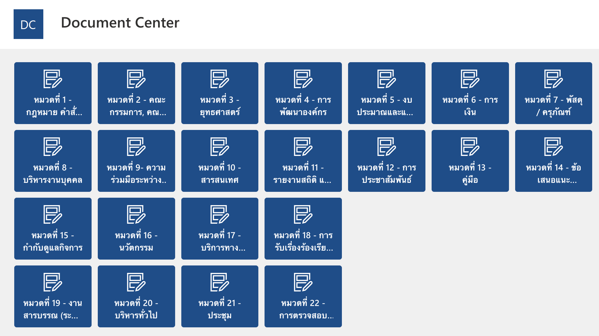
          </div>
          <div style="padding:0.16em 0.32em;border-top:1px solid rgba(124,77,255,0.2);">
            <div style="color:#7C4DFF;font-weight:700;font-size:0.65em;">Document Center (เดิม)</div>
            <div style="font-size:0.55em;color:#EF5350;background:rgba(239,83,80,0.1);border-radius:3px;padding:0.04em 0.22em;display:inline-block;margin-top:0.06em;">❌ ไม่มี Auto-Governance</div>
          </div>
        </div>
      </div>
      <div style="flex:1;background:rgba(6,14,30,0.7);border:1px solid rgba(0,188,212,0.12);
           border-radius:8px;padding:0.28em 0.38em;display:flex;flex-direction:column;gap:0.12em;overflow:hidden;">
        <div style="display:flex;justify-content:center;flex:0 0 auto;">
          <div style="background:rgba(255,179,0,0.09);border:1.5px solid rgba(255,179,0,0.4);
               border-radius:6px;padding:0.12em 0.55em;text-align:center;position:relative;">
            <div style="font-size:0.65em;font-weight:800;color:#FFB300;">📋 Data Governance Policy</div>
            <div style="font-size:0.54em;color:#607080;">กฎ · แนวปฏิบัติ · นโยบาย</div>
            <div style="position:absolute;top:-3px;right:-3px;width:6px;height:6px;background:#00E676;border-radius:50%;animation:dp2 1.5s infinite;"></div>
          </div>
        </div>
        <div style="text-align:center;font-size:0.62em;color:rgba(0,188,212,0.65);animation:ab2 1.8s ease-in-out infinite;flex:0 0 auto;">↓ แปลงเป็น AI Agents</div>
        <div style="display:grid;grid-template-columns:1fr 1fr;gap:0.1em;flex:1;overflow:hidden;">
          <div style="background:rgba(239,83,80,0.07);border:1px solid rgba(239,83,80,0.25);border-radius:5px;padding:0.12em 0.25em;position:relative;overflow:hidden;">
            <div style="position:absolute;top:0;left:-100%;width:50%;height:1px;background:linear-gradient(90deg,transparent,#EF5350,transparent);animation:sb2 2s linear infinite;"></div>
            <div style="display:flex;align-items:center;gap:0.12em;"><span style="font-size:0.75em;">⏳</span><span style="color:#EF5350;font-weight:700;font-size:0.58em;">Retention Agent</span></div>
            <div style="color:#607080;font-size:0.52em;">Archive / ทำลายอัตโนมัติ</div>
            <div id="r3-s" style="font-size:0.52em;color:#EF5350;font-weight:700;"></div>
          </div>
          <div style="background:rgba(0,188,212,0.07);border:1px solid rgba(0,188,212,0.25);border-radius:5px;padding:0.12em 0.25em;position:relative;overflow:hidden;">
            <div style="position:absolute;top:0;left:-100%;width:50%;height:1px;background:linear-gradient(90deg,transparent,#00BCD4,transparent);animation:sb2 2.3s linear 0.3s infinite;"></div>
            <div style="display:flex;align-items:center;gap:0.12em;"><span style="font-size:0.75em;">🔒</span><span style="color:#00BCD4;font-weight:700;font-size:0.58em;">Classification Agent</span></div>
            <div style="color:#607080;font-size:0.52em;">Public / Internal / Conf.</div>
            <div id="c3-s" style="font-size:0.52em;color:#00BCD4;font-weight:700;"></div>
          </div>
          <div style="background:rgba(0,230,118,0.06);border:1px solid rgba(0,230,118,0.22);border-radius:5px;padding:0.12em 0.25em;position:relative;overflow:hidden;">
            <div style="position:absolute;top:0;left:-100%;width:50%;height:1px;background:linear-gradient(90deg,transparent,#00E676,transparent);animation:sb2 2.8s linear 0.8s infinite;"></div>
            <div style="display:flex;align-items:center;gap:0.12em;"><span style="font-size:0.75em;">🤝</span><span style="color:#00E676;font-weight:700;font-size:0.58em;">Meeting Label Agent</span></div>
            <div style="color:#607080;font-size:0.52em;">เอกสารประชุม / Board</div>
            <div id="m3-s" style="font-size:0.52em;color:#00E676;font-weight:700;"></div>
          </div>
          <div style="background:rgba(255,179,0,0.06);border:1px solid rgba(255,179,0,0.22);border-radius:5px;padding:0.12em 0.25em;position:relative;overflow:hidden;">
            <div style="position:absolute;top:0;left:-100%;width:50%;height:1px;background:linear-gradient(90deg,transparent,#FFB300,transparent);animation:sb2 2.1s linear 1.2s infinite;"></div>
            <div style="display:flex;align-items:center;gap:0.12em;"><span style="font-size:0.75em;">💰</span><span style="color:#FFB300;font-weight:700;font-size:0.58em;">Finance Label Agent</span></div>
            <div style="color:#607080;font-size:0.52em;">งบประมาณ / ใบสำคัญ</div>
            <div id="f3-s" style="font-size:0.52em;color:#FFB300;font-weight:700;"></div>
          </div>
          <div style="grid-column:1/-1;background:rgba(124,77,255,0.06);border:1px solid rgba(124,77,255,0.22);border-radius:5px;padding:0.1em 0.25em;position:relative;overflow:hidden;">
            <div style="position:absolute;top:0;left:-100%;width:50%;height:1px;background:linear-gradient(90deg,transparent,#7C4DFF,transparent);animation:sb2 1.9s linear 1.6s infinite;"></div>
            <div style="display:flex;align-items:center;gap:0.12em;">
              <span style="font-size:0.75em;">👥</span><span style="color:#7C4DFF;font-weight:700;font-size:0.58em;">HR Label Agent</span>
              <div id="h3-s" style="margin-left:auto;font-size:0.52em;color:#7C4DFF;font-weight:700;"></div>
            </div>
            <div style="color:#607080;font-size:0.52em;">เอกสาร HR · สัญญาจ้าง + PII</div>
          </div>
        </div>
      </div>
    </div>
    <div style="flex:1;display:flex;flex-direction:column;gap:0.2em;overflow:hidden;min-width:0;">
      <div style="font-size:0.65em;font-weight:700;color:rgba(0,188,212,0.8);flex:0 0 auto;">👨‍💼 พนักงาน ETDA Upload ไฟล์ → AI Agents จัดการอัตโนมัติ</div>
      <div style="flex:1;background:rgba(4,10,24,0.95);border:1px solid rgba(0,188,212,0.12);border-radius:9px;overflow:hidden;position:relative;">
        <canvas id="cv-main" style="position:absolute;inset:0;width:100%;height:100%;"></canvas>
      </div>
    </div>
  </div>

  <!-- ══ PANEL 2 ══ -->
  <div id="ppanel-2" style="display:none;">
    <div style="display:grid;grid-template-columns:1fr 1fr;gap:0.5em;">

      <!-- วัตถุประสงค์ -->
      <div>
        <div style="display:flex;align-items:center;gap:0.4em;margin-bottom:0.22em;padding-bottom:0.16em;border-bottom:1px solid rgba(0,188,212,0.18);">
          <div style="width:26px;height:26px;min-width:26px;background:linear-gradient(135deg,#00BCD4,#0288D1);border-radius:7px;display:flex;align-items:center;justify-content:center;font-size:0.9em;box-shadow:0 2px 8px rgba(0,188,212,0.4);">🎯</div>
          <div>
            <div style="color:#00BCD4;font-weight:800;font-size:0.9em;">วัตถุประสงค์หลัก</div>
            <div style="color:rgba(0,188,212,0.5);font-size:0.58em;font-weight:600;letter-spacing:0.04em;">OBJECTIVES</div>
          </div>
        </div>
        <div style="display:flex;flex-direction:column;gap:0.12em;">
          <div class="p-row" style="background:rgba(0,188,212,0.05);border-left:2px solid rgba(0,188,212,0.4);">
            <span style="width:16px;height:16px;min-width:16px;background:rgba(0,188,212,0.2);border-radius:4px;display:flex;align-items:center;justify-content:center;font-size:0.6em;color:#00BCD4;font-weight:800;">1</span>
            <span style="font-size:0.78em;color:#A0B4C8;line-height:1.35;">พัฒนา <strong style="color:#00BCD4;">Automation</strong> แปลงนโยบายให้บังคับใช้ได้จริงโดยอัตโนมัติ</span>
          </div>
          <div class="p-row" style="background:rgba(0,188,212,0.05);border-left:2px solid rgba(0,188,212,0.4);">
            <span style="width:16px;height:16px;min-width:16px;background:rgba(0,188,212,0.2);border-radius:4px;display:flex;align-items:center;justify-content:center;font-size:0.6em;color:#00BCD4;font-weight:800;">2</span>
            <span style="font-size:0.78em;color:#A0B4C8;line-height:1.35;">ยกระดับ <strong style="color:#00BCD4;">Policy Enforcement</strong> ให้สม่ำเสมอ ลด Manual Process</span>
          </div>
          <div class="p-row" style="background:rgba(0,188,212,0.05);border-left:2px solid rgba(0,188,212,0.4);">
            <span style="width:16px;height:16px;min-width:16px;background:rgba(0,188,212,0.2);border-radius:4px;display:flex;align-items:center;justify-content:center;font-size:0.6em;color:#00BCD4;font-weight:800;">3</span>
            <span style="font-size:0.78em;color:#A0B4C8;line-height:1.35;">พัฒนา <strong style="color:#00BCD4;">AI Auto-Classification</strong> จำแนกชั้นความลับ + ประเภท + Retention</span>
          </div>
          <div class="p-row" style="background:rgba(0,188,212,0.05);border-left:2px solid rgba(0,188,212,0.4);">
            <span style="width:16px;height:16px;min-width:16px;background:rgba(0,188,212,0.2);border-radius:4px;display:flex;align-items:center;justify-content:center;font-size:0.6em;color:#00BCD4;font-weight:800;">4</span>
            <span style="font-size:0.78em;color:#A0B4C8;line-height:1.35;">สร้าง <strong style="color:#00BCD4;">Data Catalog</strong> กลาง แสดง Compliance Status Real-time</span>
          </div>
          <div class="p-row" style="background:rgba(0,188,212,0.05);border-left:2px solid rgba(0,188,212,0.4);">
            <span style="width:16px;height:16px;min-width:16px;background:rgba(0,188,212,0.2);border-radius:4px;display:flex;align-items:center;justify-content:center;font-size:0.6em;color:#00BCD4;font-weight:800;">5</span>
            <span style="font-size:0.78em;color:#A0B4C8;line-height:1.35;">วางรากฐานสู่ <strong style="color:#00BCD4;">Data-Driven Organization</strong> ที่ยั่งยืน</span>
          </div>
        </div>
      </div>

      <!-- ประโยชน์ -->
      <div>
        <div style="display:flex;align-items:center;gap:0.4em;margin-bottom:0.22em;padding-bottom:0.16em;border-bottom:1px solid rgba(0,230,118,0.18);">
          <div style="width:26px;height:26px;min-width:26px;background:linear-gradient(135deg,#00E676,#00C853);border-radius:7px;display:flex;align-items:center;justify-content:center;font-size:0.9em;box-shadow:0 2px 8px rgba(0,230,118,0.35);">💡</div>
          <div>
            <div style="color:#00E676;font-weight:800;font-size:0.9em;">ประโยชน์ที่คาดว่าจะได้รับ</div>
            <div style="color:rgba(0,230,118,0.5);font-size:0.58em;font-weight:600;letter-spacing:0.04em;">EXPECTED BENEFITS</div>
          </div>
        </div>
        <div style="display:flex;flex-direction:column;gap:0.12em;">
          <div class="p-row" style="background:rgba(0,188,212,0.05);border-left:2px solid rgba(0,188,212,0.38);">
            <span style="font-size:1.1em;flex-shrink:0;">⚙️</span>
            <div style="min-width:0;">
              <div class="p-title" style="color:#00BCD4;">นโยบายถูกบังคับใช้จริงครอบคลุม</div>
              <div class="p-sub">Automation จำแนก ทบทวน จัดการ Lifecycle ไม่ต้องพึ่ง Manual</div>
            </div>
          </div>
          <div class="p-row" style="background:rgba(0,230,118,0.05);border-left:2px solid rgba(0,230,118,0.38);">
            <span style="font-size:1.1em;flex-shrink:0;">✅</span>
            <div style="min-width:0;">
              <div class="p-title" style="color:#00E676;">คุณภาพและความพร้อมใช้งานเพิ่มขึ้น</div>
              <div class="p-sub">ติด Label อัตโนมัติ ระบุผู้รับผิดชอบ ลดข้อมูลซ้ำซ้อน</div>
            </div>
          </div>
          <div class="p-row" style="background:rgba(124,77,255,0.05);border-left:2px solid rgba(124,77,255,0.38);">
            <span style="font-size:1.1em;flex-shrink:0;">🗂️</span>
            <div style="min-width:0;">
              <div class="p-title" style="color:#9B72FF;">ค้นหาและเข้าถึงข้อมูลได้มีประสิทธิภาพ</div>
              <div class="p-sub">Data Catalog แสดงภาพรวม รู้แหล่งจัดเก็บ เชื่อมโยงผู้รับผิดชอบ</div>
            </div>
          </div>
          <div class="p-row" style="background:rgba(255,179,0,0.05);border-left:2px solid rgba(255,179,0,0.38);">
            <span style="font-size:1.1em;flex-shrink:0;">🚀</span>
            <div style="min-width:0;">
              <div class="p-title" style="color:#FFB300;">พร้อมสู่ Data-Driven Organization</div>
              <div class="p-sub">รองรับ Analytics, Knowledge Mgmt และ AI-enhanced Capabilities</div>
            </div>
          </div>
          <div class="p-row" style="background:rgba(239,83,80,0.05);border-left:2px solid rgba(239,83,80,0.38);">
            <span style="font-size:1.1em;flex-shrink:0;">🔒</span>
            <div style="min-width:0;">
              <div class="p-title" style="color:#EF8080;">ลดความเสี่ยง PDPA & Data Leak</div>
              <div class="p-sub">Privacy-by-Design ฝังใน Architecture ตั้งแต่ต้น</div>
            </div>
          </div>
        </div>
      </div>
    </div>
  </div>

  <!-- ══ PANEL 3 ══ -->
  <div id="ppanel-3" style="display:none;">
    <div style="display:grid;grid-template-columns:1fr 1fr 1fr;gap:0.45em;">

      <!-- Output -->
      <div>
        <div style="display:flex;align-items:center;gap:0.38em;margin-bottom:0.2em;padding-bottom:0.15em;border-bottom:1px solid rgba(124,77,255,0.2);">
          <div style="width:24px;height:24px;min-width:24px;background:linear-gradient(135deg,#7C4DFF,#5E35B1);border-radius:6px;display:flex;align-items:center;justify-content:center;font-size:0.85em;box-shadow:0 2px 6px rgba(124,77,255,0.4);">📦</div>
          <div>
            <div style="color:#B39DFF;font-weight:800;font-size:0.88em;">Output</div>
            <div style="color:rgba(124,77,255,0.55);font-size:0.58em;font-weight:600;">ผลผลิต · 4 รายการ</div>
          </div>
        </div>
        <div style="display:flex;flex-direction:column;gap:0.12em;">
          <div class="p-row" style="background:rgba(124,77,255,0.06);border-left:2px solid rgba(124,77,255,0.38);">
            <span style="font-size:1.05em;flex-shrink:0;">📊</span>
            <div style="min-width:0;">
              <div class="p-title" style="color:#B39DFF;">Current State Assessment</div>
              <div class="p-sub">Metadata Analysis วัด Gap ปัจจุบัน vs นโยบาย</div>
            </div>
          </div>
          <div class="p-row" style="background:rgba(124,77,255,0.06);border-left:2px solid rgba(124,77,255,0.38);">
            <span style="font-size:1.05em;flex-shrink:0;">🏷️</span>
            <div style="min-width:0;">
              <div class="p-title" style="color:#B39DFF;">AI Auto-Classification & Labelling</div>
              <div class="p-sub">Public / Internal / Conf. + ประเภท + Retention</div>
            </div>
          </div>
          <div class="p-row" style="background:rgba(124,77,255,0.06);border-left:2px solid rgba(124,77,255,0.38);">
            <span style="font-size:1.05em;flex-shrink:0;">⏳</span>
            <div style="min-width:0;">
              <div class="p-title" style="color:#B39DFF;">Automated Lifecycle Workflow</div>
              <div class="p-sub">ทบทวนตามรอบ แจ้งเตือน Archive อัตโนมัติ</div>
            </div>
          </div>
          <div class="p-row" style="background:rgba(124,77,255,0.06);border-left:2px solid rgba(124,77,255,0.38);">
            <span style="font-size:1.05em;flex-shrink:0;">🗂️</span>
            <div style="min-width:0;">
              <div class="p-title" style="color:#B39DFF;">Data Catalog / Gov. Dashboard</div>
              <div class="p-sub">Compliance Real-time รู้แหล่ง รู้ผู้รับผิดชอบ</div>
            </div>
          </div>
        </div>
      </div>

      <!-- Outcome -->
      <div>
        <div style="display:flex;align-items:center;gap:0.38em;margin-bottom:0.2em;padding-bottom:0.15em;border-bottom:1px solid rgba(0,230,118,0.2);">
          <div style="width:24px;height:24px;min-width:24px;background:linear-gradient(135deg,#00E676,#00C853);border-radius:6px;display:flex;align-items:center;justify-content:center;font-size:0.85em;box-shadow:0 2px 6px rgba(0,230,118,0.35);">🌱</div>
          <div>
            <div style="color:#00E676;font-weight:800;font-size:0.88em;">Outcome</div>
            <div style="color:rgba(0,230,118,0.55);font-size:0.58em;font-weight:600;">ผลลัพธ์ · 3 มิติ</div>
          </div>
        </div>
        <div style="display:flex;flex-direction:column;gap:0.12em;">
          <div class="p-row" style="background:rgba(0,230,118,0.05);border-left:2px solid rgba(0,230,118,0.32);">
            <span style="font-size:1.05em;flex-shrink:0;">🏛️</span>
            <div style="min-width:0;">
              <div class="p-title" style="color:#00E676;">Improved Data Governance</div>
              <div class="p-sub">กำกับชัดเจน ลด Silo บทบาท Owner / Steward ชัด</div>
            </div>
          </div>
          <div class="p-row" style="background:rgba(0,230,118,0.05);border-left:2px solid rgba(0,230,118,0.32);">
            <span style="font-size:1.05em;flex-shrink:0;">✨</span>
            <div style="min-width:0;">
              <div class="p-title" style="color:#00E676;">Better Data Quality & Usability</div>
              <div class="p-sub">ลดซ้ำซ้อน ลดไม่มีหมวดหมู่ ค้นหาสะดวก</div>
            </div>
          </div>
          <div class="p-row" style="background:rgba(0,230,118,0.05);border-left:2px solid rgba(0,230,118,0.32);">
            <span style="font-size:1.05em;flex-shrink:0;">🤖</span>
            <div style="min-width:0;">
              <div class="p-title" style="color:#00E676;">Future AI Readiness</div>
              <div class="p-sub">รองรับ Analytics, Knowledge Mgmt และ AI Capabilities</div>
            </div>
          </div>
          <div class="p-row" style="background:rgba(0,230,118,0.03);border-left:2px solid rgba(0,230,118,0.18);">
            <span style="font-size:1.05em;flex-shrink:0;">🔐</span>
            <div style="min-width:0;">
              <div class="p-title" style="color:rgba(0,230,118,0.65);">PDPA Compliant by Design</div>
              <div class="p-sub">Privacy-by-Design ฝังใน Architecture ตั้งแต่ต้น</div>
            </div>
          </div>
        </div>
      </div>

      <!-- ผลกระทบ + Stakeholders -->
      <div>
        <div style="display:flex;align-items:center;gap:0.38em;margin-bottom:0.2em;padding-bottom:0.15em;border-bottom:1px solid rgba(255,167,38,0.18);">
          <div style="width:24px;height:24px;min-width:24px;background:linear-gradient(135deg,#FFA726,#F57C00);border-radius:6px;display:flex;align-items:center;justify-content:center;font-size:0.85em;box-shadow:0 2px 6px rgba(255,167,38,0.35);">⚡</div>
          <div style="color:#FFA726;font-weight:800;font-size:0.88em;">ผลกระทบ <span style="color:rgba(255,167,38,0.5);font-size:0.85em;font-weight:400;">· Impact</span></div>
        </div>
        <div style="display:flex;flex-direction:column;gap:0.12em;margin-bottom:0.2em;">
          <div class="p-row" style="background:rgba(255,167,38,0.06);border-left:2px solid rgba(255,167,38,0.32);">
            <span style="font-size:1.05em;flex-shrink:0;">🏢</span>
            <div style="min-width:0;">
              <div class="p-title" style="color:#FFA726;">Internal Management</div>
              <div class="p-sub">นโยบายถูก Enforce จริงในวงกว้าง</div>
            </div>
          </div>
          <div class="p-row" style="background:rgba(255,167,38,0.06);border-left:2px solid rgba(255,167,38,0.32);">
            <span style="font-size:1.05em;flex-shrink:0;">📈</span>
            <div style="min-width:0;">
              <div class="p-title" style="color:#FFA726;">Operational Efficiency</div>
              <div class="p-sub">ลดเวลาค้นหา ลดต้นทุนแฝง</div>
            </div>
          </div>
        </div>

        <!-- Divider -->
        <div style="display:flex;align-items:center;gap:0.22em;margin-bottom:0.15em;">
          <div style="flex:1;height:1px;background:rgba(239,83,80,0.2);"></div>
          <span style="color:#EF5350;font-size:0.6em;font-weight:700;white-space:nowrap;">👥 ผู้ได้รับประโยชน์</span>
          <div style="flex:1;height:1px;background:rgba(239,83,80,0.2);"></div>
        </div>

        <div style="display:flex;flex-direction:column;gap:0.12em;">
          <div class="p-row" style="background:rgba(239,83,80,0.06);border-left:2px solid rgba(239,83,80,0.3);">
            <span style="font-size:1.05em;flex-shrink:0;">👨‍💼</span>
            <div style="min-width:0;">
              <div class="p-title" style="color:#EF9090;">ทีม Data Governance</div>
              <div class="p-sub">Automation Tools + Compliance Dashboard</div>
            </div>
          </div>
          <div class="p-row" style="background:rgba(239,83,80,0.06);border-left:2px solid rgba(239,83,80,0.3);">
            <span style="font-size:1.05em;flex-shrink:0;">🏢</span>
            <div style="min-width:0;">
              <div class="p-title" style="color:#EF9090;">หน่วยงานภายใน</div>
              <div class="p-sub">ข้อมูลเป็นระเบียบ ค้นหาง่าย เพิ่ม Efficiency</div>
            </div>
          </div>
          <div class="p-row" style="background:rgba(239,83,80,0.06);border-left:2px solid rgba(239,83,80,0.3);">
            <span style="font-size:1.05em;flex-shrink:0;">🗝️</span>
            <div style="min-width:0;">
              <div class="p-title" style="color:#EF9090;">Data Owner / Steward / Admin</div>
              <div class="p-sub">เครื่องมือ Lifecycle + Quality Tracking</div>
            </div>
          </div>
        </div>
      </div>

    </div>
  </div>

</div>

<script>
(function(){
  const m={'r3-s':['🗑️ ทำลาย 3 ไฟล์','📦 Archive 12','⏳ ตรวจ 1,240'],'c3-s':['🔴 Conf:156','🟡 Internal:892','🔵 Public:234'],'m3-s':['🤝 Meeting:45','📝 วาระ:12'],'f3-s':['💰 Finance:89','📊 Budget:34'],'h3-s':['👥 HR:67','⚠️ PII:12']};
  let ix={};Object.keys(m).forEach(k=>ix[k]=0);
  setInterval(()=>{Object.keys(m).forEach(k=>{const el=document.getElementById(k);if(el){el.textContent=m[k][ix[k]%m[k].length];ix[k]++;}});},2200);
})();

(function(){
  const cv=document.getElementById('cv-main');if(!cv)return;
  const ctx=cv.getContext('2d');let W,H,t=0;
  function rsz(){W=cv.offsetWidth||600;H=cv.offsetHeight||320;cv.width=W;cv.height=H;}rsz();
  const pC=['#00BCD4','#7C4DFF','#00E676','#FFB300','#1E88E5','#EF5350','#FFA726','#26C6DA','#E91E63','#AB47BC','#4CAF50','#FF7043'];
  const depts=['DSD','DAC','DID','1212','IT','Legal','HR','Policy','Finance','Research','Sec','Admin'];
  const ft=[{em:'📋',col:'#00E676',tag:'Meeting'},{em:'💰',col:'#FFB300',tag:'Finance'},{em:'👥',col:'#7C4DFF',tag:'HR Doc'},{em:'🔒',col:'#EF5350',tag:'Conf.'},{em:'📄',col:'#00BCD4',tag:'Policy'}];
  const ag=[{label:'Retention',em:'⏳',col:'#EF5350',rx:0.80,ry:0.12},{label:'Classification',em:'🔒',col:'#00BCD4',rx:0.96,ry:0.35},{label:'Meeting Label',em:'🤝',col:'#00E676',rx:0.76,ry:0.57},{label:'Finance Label',em:'💰',col:'#FFB300',rx:0.94,ry:0.75},{label:'HR Label',em:'👥',col:'#7C4DFF',rx:0.79,ry:0.92}];
  const persons=depts.map((d,i)=>({dept:d,col:pC[i],rx:0.03+(i%4)*0.085,ry:0.16+Math.floor(i/4)*0.30,phase:i*0.65,timer:Math.floor(Math.random()*55)+15}));
  let pk=[],tg=[];
  const ap=def=>({x:def.rx*W,y:def.ry*H});
  const od=()=>({x:W*0.52,y:H*0.50});
  const lerp=(a,b,u)=>a+(b-a)*Math.min(Math.max(u,0),1);
  const ease=x=>x<0.5?2*x*x:-1+(4-2*x)*x;
  function spawnPkt(pi){const p=persons[pi],o=od();pk.push({srcPI:pi,stage:'to-cloud',prog:0,x:p.rx*W,y:p.ry*H,sx:p.rx*W,sy:p.ry*H,ftIdx:Math.floor(Math.random()*ft.length),agIdx:Math.floor(Math.random()*ag.length),alpha:1,speed:0.013+Math.random()*0.008});}
  function drawPerson(x,y,col,dept){ctx.save();ctx.strokeStyle=col;ctx.lineWidth=1.4;ctx.beginPath();ctx.arc(x,y,6.5,0,Math.PI*2);ctx.fillStyle=col+'25';ctx.fill();ctx.stroke();ctx.beginPath();ctx.moveTo(x,y+6.5);ctx.lineTo(x,y+18);ctx.stroke();ctx.beginPath();ctx.moveTo(x-6,y+11);ctx.lineTo(x+6,y+11);ctx.stroke();ctx.beginPath();ctx.moveTo(x,y+18);ctx.lineTo(x-5,y+27);ctx.moveTo(x,y+18);ctx.lineTo(x+5,y+27);ctx.stroke();ctx.fillStyle=col;ctx.font=`bold ${Math.max(6,W*0.015)}px Inter,sans-serif`;ctx.textAlign='center';ctx.fillText(dept,x,y+37);ctx.restore();}
  function drawCloud(x,y){ctx.save();const r=18+Math.sin(t*0.08)*2;const g=ctx.createRadialGradient(x,y,0,x,y,r*2.2);g.addColorStop(0,'rgba(0,188,212,0.15)');g.addColorStop(1,'rgba(0,188,212,0)');ctx.beginPath();ctx.arc(x,y,r*2.2,0,Math.PI*2);ctx.fillStyle=g;ctx.fill();ctx.shadowColor='#00BCD4';ctx.shadowBlur=10;ctx.beginPath();ctx.arc(x-8,y+4,10,0,Math.PI*2);ctx.arc(x+8,y+4,10,0,Math.PI*2);ctx.arc(x,y-3,12,0,Math.PI*2);ctx.fillStyle='rgba(0,188,212,0.12)';ctx.strokeStyle='#00BCD4';ctx.lineWidth=1.6;ctx.fill();ctx.stroke();ctx.fillStyle='#00BCD4';ctx.font=`bold ${Math.max(7,W*0.018)}px Inter,sans-serif`;ctx.textAlign='center';ctx.textBaseline='middle';ctx.fillText('OneDrive',x,y+21);ctx.restore();}
  function drawAgent(def,active){const{x,y}=ap(def),r=21;ctx.save();if(active){ctx.shadowColor=def.col;ctx.shadowBlur=16;}ctx.beginPath();ctx.arc(x,y,r,0,Math.PI*2);ctx.fillStyle=def.col+'1a';ctx.strokeStyle=def.col;ctx.lineWidth=active?2.3:1.5;ctx.fill();ctx.stroke();if(active){ctx.beginPath();ctx.arc(x,y,r+4,-Math.PI/2,-Math.PI/2+(t%48)*(Math.PI*2/48));ctx.strokeStyle=def.col+'88';ctx.lineWidth=1.8;ctx.stroke();}ctx.font=`${Math.max(12,W*0.03)}px serif`;ctx.textAlign='center';ctx.textBaseline='middle';ctx.fillText(def.em,x,y);ctx.fillStyle=def.col;ctx.font=`bold ${Math.max(6,W*0.015)}px Inter,sans-serif`;ctx.textBaseline='alphabetic';ctx.fillText(def.label,x,y+r+12);ctx.restore();}
  function drawPkt(p){const f=ft[p.ftIdx];ctx.save();ctx.globalAlpha=p.alpha;ctx.shadowColor=f.col;ctx.shadowBlur=6;ctx.fillStyle=f.col+'1a';ctx.strokeStyle=f.col;ctx.lineWidth=1.1;ctx.beginPath();ctx.roundRect(p.x-7,p.y-8,14,18,3);ctx.fill();ctx.stroke();ctx.font=`${Math.max(8,W*0.02)}px serif`;ctx.textAlign='center';ctx.textBaseline='middle';ctx.fillText(f.em,p.x,p.y);ctx.restore();}
  function drawTag(tg){const f=ft[tg.ftIdx];ctx.save();ctx.globalAlpha=tg.alpha;ctx.fillStyle=f.col+'1a';ctx.strokeStyle=f.col;ctx.lineWidth=0.9;ctx.beginPath();ctx.roundRect(tg.x-22,tg.y-6,44,13,6);ctx.fill();ctx.stroke();ctx.fillStyle=f.col;ctx.font=`bold ${Math.max(5,W*0.012)}px Inter,sans-serif`;ctx.textAlign='center';ctx.textBaseline='middle';ctx.fillText(f.tag,tg.x,tg.y);ctx.restore();}
  function frame(){
    rsz();ctx.clearRect(0,0,W,H);ctx.fillStyle='#040a18';ctx.fillRect(0,0,W,H);
    ctx.font=`${Math.max(7,W*0.014)}px Inter,sans-serif`;ctx.fillStyle='rgba(255,255,255,0.06)';
    ctx.textAlign='left';ctx.fillText('👨‍💼 พนักงาน',4,12);ctx.textAlign='center';ctx.fillText('☁️ OneDrive',W*0.52,12);ctx.textAlign='right';ctx.fillText('🤖 AI Agents',W-4,12);
    ctx.strokeStyle='rgba(0,188,212,0.06)';ctx.lineWidth=1;ctx.setLineDash([3,7]);
    [W*0.37,W*0.64].forEach(vx=>{ctx.beginPath();ctx.moveTo(vx,17);ctx.lineTo(vx,H-6);ctx.stroke();});ctx.setLineDash([]);
    const o=od();
    ag.forEach(def=>{const a=ap(def);ctx.beginPath();ctx.moveTo(o.x+17,o.y);ctx.lineTo(a.x-23,a.y);ctx.strokeStyle=def.col+'12';ctx.lineWidth=0.7;ctx.setLineDash([3,8]);ctx.stroke();ctx.setLineDash([]);});
    persons.forEach((p,i)=>{const y2=p.ry*H+Math.sin(t*0.04+p.phase)*2.5;p._cx=p.rx*W;p._cy=y2;p.timer--;if(p.timer<=0){spawnPkt(i);p.timer=40+Math.floor(Math.random()*60);}drawPerson(p._cx,y2,p.col,p.dept);});
    drawCloud(o.x,o.y);
    ag.forEach((def,i)=>{const active=pk.some(p=>p.stage==='to-agent'&&p.agIdx===i&&p.prog>0.4);drawAgent(def,active);});
    pk=pk.filter(p=>p.alpha>0.02);
    pk.forEach(p=>{
      if(p.stage==='to-cloud'){p.prog+=p.speed;const px=persons[p.srcPI];const sx=px._cx||px.rx*W;const sy=px._cy||px.ry*H;p.x=lerp(sx,o.x,ease(p.prog));p.y=lerp(sy,o.y,ease(p.prog));if(p.prog>=1){p.prog=0;p.stage='to-agent';p.sx=o.x;p.sy=o.y;}}
      else{p.prog+=p.speed*0.82;const a=ap(ag[p.agIdx]);p.x=lerp(p.sx,a.x,ease(p.prog));p.y=lerp(p.sy,a.y,ease(p.prog));if(p.prog>=1){tg.push({x:a.x,y:a.y-24,ftIdx:p.ftIdx,alpha:1,vy:-0.5});p.alpha=0;}}
      drawPkt(p);
    });
    tg=tg.filter(t=>t.alpha>0.02);
    tg.forEach(t=>{t.y+=t.vy;t.vy*=0.97;t.alpha-=0.007;drawTag(t);});
    t++;requestAnimationFrame(frame);
  }
  frame();
})();

const propColors={1:{bg:'#1E88E5',bc:'#1E88E5',tc:'#0A1628'},2:{bg:'#00BCD4',bc:'#00BCD4',tc:'#0A1628'},3:{bg:'#7C4DFF',bc:'#7C4DFF',tc:'#FFF'}};
const propLabels={1:'📌 ที่มา',2:'🎯 วัตถุประสงค์ & ประโยชน์',3:'📦 Output · Outcome · ผลกระทบ'};
function showProp(n){
  ['ppanel-1','ppanel-2','ppanel-3'].forEach((id,i)=>{
    const p=document.getElementById(id);const tab=document.getElementById('ptab-'+(i+1));
    if(p)p.style.display='none';
    if(tab){tab.className='prop-tab inactive';tab.style.cssText='';tab.textContent=propLabels[i+1];}
  });
  const panel=document.getElementById('ppanel-'+n);
  if(panel)panel.style.display=(n===1)?'flex':'block';
  const tab=document.getElementById('ptab-'+n);const c=propColors[n];
  if(tab&&c){tab.className='prop-tab active';tab.style.background=c.bg;tab.style.borderColor=c.bc;tab.style.color=c.tc;tab.textContent=propLabels[n];}
}
document.addEventListener('DOMContentLoaded',()=>showProp(1));
</script>
```


<!-- ═══ SLIDE 7: DATA LIFECYCLE ═══ -->
## 🔄 ปัญหา: Data Lifecycle ที่ไม่สมบูรณ์ {background-color="#0A1628"}

```{=html}
<style>
@keyframes pulseActive { 0%,100%{filter:drop-shadow(0 0 10px rgba(239,83,80,1));} 50%{filter:drop-shadow(0 0 24px rgba(239,83,80,1));} }
@keyframes pulseOrange { 0%,100%{filter:drop-shadow(0 0 10px rgba(255,167,38,1));} 50%{filter:drop-shadow(0 0 24px rgba(255,167,38,1));} }
@keyframes pulseCenterLC { 0%,100%{filter:drop-shadow(0 0 6px rgba(0,188,212,0.5));} 50%{filter:drop-shadow(0 0 16px rgba(0,188,212,0.8));} }
@keyframes arrowFlowLC { 0%{stroke-dashoffset:60;} 100%{stroke-dashoffset:0;} }
@keyframes arrowGhostLC { 0%,100%{opacity:0.5;} 50%{opacity:0.7;} }
@keyframes drawLineLC { to{stroke-dashoffset:0;} }
@keyframes dataGrowLC { from{opacity:0;transform:translateY(5px);} to{opacity:1;transform:translateY(0);} }
@keyframes badgePulseLC { 0%,100%{opacity:1;} 50%{opacity:0.5;} }
</style>

<div style="display:grid;grid-template-columns:1fr 1.6fr;gap:1em;height:92%;font-family:'Inter','Sarabun',sans-serif;font-size:0.58em;">

  <!-- LEFT: Lifecycle Wheel -->
  <div style="display:flex;flex-direction:column;gap:0.4em;">
    <div style="font-weight:800;color:#EF5350;font-size:1.1em;text-align:center;">⚠️ สถานะปัจจุบัน: Lifecycle ที่ไม่สมบูรณ์</div>
    <div style="flex:1;position:relative;background:linear-gradient(160deg,rgba(15,25,50,0.9),rgba(8,15,35,0.95));border:1px solid rgba(0,188,212,0.15);border-radius:16px;display:flex;align-items:center;justify-content:center;overflow:hidden;">
      <div style="position:absolute;inset:0;opacity:0.025;background-image:linear-gradient(rgba(0,188,212,1) 1px,transparent 1px),linear-gradient(90deg,rgba(0,188,212,1) 1px,transparent 1px);background-size:30px 30px;pointer-events:none;"></div>

      <svg viewBox="0 0 420 400" width="98%" height="98%" style="max-height:345px;overflow:visible;">
        <defs>
          <marker id="a-red-lc" markerWidth="10" markerHeight="10" refX="8" refY="3.5" orient="auto"><path d="M0,0 L0,7 L10,3.5 z" fill="#EF5350"/></marker>
          <marker id="a-orange-lc" markerWidth="10" markerHeight="10" refX="8" refY="3.5" orient="auto"><path d="M0,0 L0,7 L10,3.5 z" fill="#FFA726"/></marker>
          <marker id="a-gray-lc" markerWidth="10" markerHeight="10" refX="8" refY="3.5" orient="auto"><path d="M0,0 L0,7 L10,3.5 z" fill="rgba(160,165,180,0.7)"/></marker>
          <filter id="glow-red-lc"><feGaussianBlur stdDeviation="5" result="blur"/><feMerge><feMergeNode in="blur"/><feMergeNode in="SourceGraphic"/></feMerge></filter>
          <filter id="glow-orange-lc"><feGaussianBlur stdDeviation="5" result="blur"/><feMerge><feMergeNode in="blur"/><feMergeNode in="SourceGraphic"/></feMerge></filter>
          <filter id="glow-cyan-lc"><feGaussianBlur stdDeviation="3" result="blur"/><feMerge><feMergeNode in="blur"/><feMergeNode in="SourceGraphic"/></feMerge></filter>
          <radialGradient id="g-red-lc" cx="38%" cy="35%"><stop offset="0%" stop-color="#FF6B6B"/><stop offset="100%" stop-color="#C62828"/></radialGradient>
          <radialGradient id="g-orange-lc" cx="38%" cy="35%"><stop offset="0%" stop-color="#FFCC02"/><stop offset="100%" stop-color="#E65100"/></radialGradient>
          <radialGradient id="g-center-lc" cx="38%" cy="35%"><stop offset="0%" stop-color="#006064"/><stop offset="100%" stop-color="#001a1f"/></radialGradient>
          <radialGradient id="g-gray-lc" cx="38%" cy="35%"><stop offset="0%" stop-color="#4a4f5e"/><stop offset="100%" stop-color="#1e2230"/></radialGradient>
        </defs>

        <!-- Ghost arrows -->
        <path d="M 342 195 Q 338 282 272 318" fill="none" stroke="rgba(160,165,180,0.6)" stroke-width="2.5" stroke-dasharray="7,5" marker-end="url(#a-gray-lc)" style="animation:arrowGhostLC 2.5s ease-in-out infinite;"/>
        <path d="M 208 330 Q 150 345 105 300" fill="none" stroke="rgba(160,165,180,0.6)" stroke-width="2.5" stroke-dasharray="7,5" marker-end="url(#a-gray-lc)" style="animation:arrowGhostLC 2.5s ease-in-out 0.5s infinite;"/>
        <path d="M 75 235 Q 58 168 90 118" fill="none" stroke="rgba(160,165,180,0.6)" stroke-width="2.5" stroke-dasharray="7,5" marker-end="url(#a-gray-lc)" style="animation:arrowGhostLC 2.5s ease-in-out 1s infinite;"/>
        <path d="M 125 80 Q 166 44 210 56" fill="none" stroke="rgba(160,165,180,0.6)" stroke-width="2.5" stroke-dasharray="7,5" marker-end="url(#a-gray-lc)" style="animation:arrowGhostLC 2.5s ease-in-out 1.5s infinite;"/>

        <!-- Active arrows -->
        <path d="M 252 70 Q 318 80 332 148" fill="none" stroke="#EF5350" stroke-width="3.5" stroke-dasharray="10,5" marker-end="url(#a-red-lc)" style="animation:arrowFlowLC 1.5s linear infinite;"/>
        <path d="M 320 175 Q 295 155 272 142 Q 252 132 250 110" fill="none" stroke="#FFA726" stroke-width="3" stroke-dasharray="8,5" marker-end="url(#a-orange-lc)" style="animation:arrowFlowLC 1.5s linear 0.75s infinite;"/>

        <!-- Center -->
        <g style="animation:pulseCenterLC 3.5s ease-in-out infinite;" filter="url(#glow-cyan-lc)">
          <circle cx="200" cy="198" r="68" fill="url(#g-center-lc)" stroke="#00BCD4" stroke-width="2.5"/>
        </g>
        <circle cx="200" cy="198" r="78" fill="none" stroke="rgba(0,188,212,0.1)" stroke-width="1.5" stroke-dasharray="4,6"/>
        <text x="200" y="190" text-anchor="middle" fill="#00BCD4" font-size="17" font-weight="800">Data</text>
        <text x="200" y="210" text-anchor="middle" fill="#00BCD4" font-size="17" font-weight="800">Lifecycle</text>
        <text x="200" y="242" text-anchor="middle" fill="#FFA726" font-size="9" font-weight="700">🔁 วนซ้ำไม่มีที่สิ้นสุด</text>
        <text x="200" y="256" text-anchor="middle" fill="rgba(176,190,197,0.6)" font-size="8">ข้อมูลโตขึ้นเรื่อยๆ</text>

        <!-- Node 1: Creation ACTIVE -->
        <g style="animation:pulseActive 1.8s ease-in-out infinite;" filter="url(#glow-red-lc)"><circle cx="210" cy="60" r="52" fill="url(#g-red-lc)"/></g>
        <circle cx="210" cy="60" r="52" fill="url(#g-red-lc)" stroke="rgba(255,150,150,0.3)" stroke-width="1.5"/>
        <text x="210" y="46" text-anchor="middle" font-size="20">✏️</text>
        <text x="210" y="66" text-anchor="middle" fill="#FFF" font-size="13" font-weight="800">Creation</text>
        <text x="210" y="79" text-anchor="middle" fill="rgba(255,255,255,0.85)" font-size="10">สร้างข้อมูล</text>
        <rect x="176" y="100" width="68" height="15" rx="7.5" fill="#B71C1C"/>
        <circle cx="183" cy="107.5" r="3" fill="#00E676" style="animation:badgePulseLC 1.2s infinite;"/>
        <text x="200" y="112" text-anchor="middle" fill="#FFF" font-size="8" font-weight="800">ACTIVE</text>

        <!-- Node 2: Storage ACTIVE -->
        <g style="animation:pulseOrange 1.8s ease-in-out 0.4s infinite;" filter="url(#glow-orange-lc)"><circle cx="332" cy="172" r="50" fill="url(#g-orange-lc)"/></g>
        <circle cx="332" cy="172" r="50" fill="url(#g-orange-lc)" stroke="rgba(255,220,80,0.3)" stroke-width="1.5"/>
        <text x="332" y="158" text-anchor="middle" font-size="20">💾</text>
        <text x="332" y="177" text-anchor="middle" fill="#FFF" font-size="13" font-weight="800">Storage</text>
        <text x="332" y="190" text-anchor="middle" fill="rgba(255,255,255,0.85)" font-size="10">จัดเก็บ</text>
        <rect x="298" y="210" width="68" height="15" rx="7.5" fill="#BF360C"/>
        <circle cx="305" cy="217.5" r="3" fill="#00E676" style="animation:badgePulseLC 1.2s ease-in-out 0.3s infinite;"/>
        <text x="322" y="222" text-anchor="middle" fill="#FFF" font-size="8" font-weight="800">ACTIVE</text>

        <!-- Node 3: Review GRAY -->
        <circle cx="272" cy="325" r="46" fill="url(#g-gray-lc)" stroke="rgba(160,165,185,0.5)" stroke-width="2"/>
        <text x="272" y="311" text-anchor="middle" fill="rgba(220,225,240,0.85)" font-size="10" font-weight="700">Review,</text>
        <text x="272" y="325" text-anchor="middle" fill="rgba(220,225,240,0.85)" font-size="10" font-weight="700">Reporting</text>
        <text x="272" y="338" text-anchor="middle" fill="rgba(220,225,240,0.85)" font-size="10" font-weight="700">and Use</text>
        <text x="272" y="356" text-anchor="middle" fill="rgba(239,83,80,0.85)" font-size="9" font-weight="700">❌ ยังไม่มี</text>

        <!-- Node 4: Retention GRAY -->
        <circle cx="95" cy="295" r="46" fill="url(#g-gray-lc)" stroke="rgba(160,165,185,0.5)" stroke-width="2"/>
        <text x="95" y="282" text-anchor="middle" fill="rgba(220,225,240,0.85)" font-size="10" font-weight="700">Retention</text>
        <text x="95" y="296" text-anchor="middle" fill="rgba(220,225,240,0.85)" font-size="10" font-weight="700">and</text>
        <text x="95" y="310" text-anchor="middle" fill="rgba(220,225,240,0.85)" font-size="10" font-weight="700">Retrieval</text>
        <text x="95" y="328" text-anchor="middle" fill="rgba(239,83,80,0.85)" font-size="9" font-weight="700">❌ ยังไม่มี</text>

        <!-- Node 5: Destruction GRAY -->
        <circle cx="68" cy="175" r="46" fill="url(#g-gray-lc)" stroke="rgba(160,165,185,0.5)" stroke-width="2"/>
        <text x="68" y="168" text-anchor="middle" fill="rgba(220,225,240,0.85)" font-size="10" font-weight="700">Destruction</text>
        <text x="68" y="183" text-anchor="middle" fill="rgba(220,225,240,0.85)" font-size="10" font-weight="700">ลบทำลาย</text>
        <text x="68" y="200" text-anchor="middle" fill="rgba(239,83,80,0.85)" font-size="9" font-weight="700">❌ ยังไม่มี</text>
      </svg>
    </div>

    <div style="display:flex;gap:1em;font-size:0.8em;justify-content:center;">
      <span style="display:flex;align-items:center;gap:0.3em;color:#B0BEC5;"><span style="width:10px;height:10px;border-radius:50%;background:#EF5350;display:inline-block;"></span>กำลังใช้งาน</span>
      <span style="display:flex;align-items:center;gap:0.3em;color:#B0BEC5;"><span style="width:10px;height:10px;border-radius:50%;background:#3a3f50;border:1px solid rgba(160,165,185,0.5);display:inline-block;"></span>ยังไม่มีกระบวนการ</span>
    </div>
    <div style="display:grid;grid-template-columns:1fr 1fr;gap:0.5em;">
      <div style="background:rgba(239,83,80,0.1);border:1px solid rgba(239,83,80,0.35);border-radius:8px;padding:0.5em;text-align:center;">
        <div style="font-size:1.8em;font-weight:800;color:#EF5350;line-height:1.1;">77%</div>
        <div style="color:#B0BEC5;font-size:0.9em;">ไฟล์ไม่ถูกใช้ > 2 ปี</div>
      </div>
      <div style="background:rgba(255,167,38,0.1);border:1px solid rgba(255,167,38,0.35);border-radius:8px;padding:0.5em;text-align:center;">
        <div style="font-size:1.8em;font-weight:800;color:#FFA726;line-height:1.1;">436K</div>
        <div style="color:#B0BEC5;font-size:0.9em;">ไฟล์ซ้ำซ้อน</div>
      </div>
    </div>
  </div>

  <!-- RIGHT: Animated Growth Chart -->
  <div style="display:flex;flex-direction:column;gap:0.4em;">
    <div style="font-weight:800;color:#00BCD4;font-size:1.1em;text-align:center;">📈 OneDrive Storage Growth — Cumulative Files & Forecast to 2030</div>
    <div style="color:#78909C;font-size:0.8em;text-align:center;margin-top:-0.2em;">Based on 10 OneDrive accounts · 2016–2026 Actual · 2026–2030 Forecast (Prophet, 90% CI)</div>

    <div style="flex:1;background:linear-gradient(160deg,rgba(13,33,55,0.9),rgba(8,18,38,0.95));border:1px solid rgba(0,188,212,0.15);border-radius:12px;padding:0.7em 0.9em;display:flex;flex-direction:column;gap:0.35em;">
      <div style="display:flex;gap:1em;flex-wrap:wrap;font-size:0.76em;">
        <span><span style="color:#1E88E5;font-weight:700;">——</span> <span style="color:#B0BEC5;">Actual Files</span></span>
        <span><span style="color:#1E88E5;opacity:0.7;">- -</span> <span style="color:#B0BEC5;">Forecast Files (90% CI)</span></span>
        <span><span style="color:#EF5350;font-weight:700;">——</span> <span style="color:#B0BEC5;">Actual Size (GB)</span></span>
        <span><span style="color:#EF5350;opacity:0.7;">- -</span> <span style="color:#B0BEC5;">Forecast Size (90% CI)</span></span>
        <span style="margin-left:auto;color:#78909C;">← Actual | Forecast →</span>
      </div>

      <div style="flex:1;position:relative;">
        <div style="position:absolute;left:0;top:0;bottom:22px;width:55px;display:flex;flex-direction:column;justify-content:space-between;font-size:0.67em;color:#1E88E5;text-align:right;padding-right:5px;">
          <div>2,000K</div><div>1,500K</div><div>1,000K</div><div>500K</div><div>0</div>
        </div>
        <div style="position:absolute;right:0;top:0;bottom:22px;width:52px;display:flex;flex-direction:column;justify-content:space-between;font-size:0.67em;color:#EF5350;text-align:left;padding-left:5px;">
          <div>14,000</div><div>10,500</div><div>7,000</div><div>3,500</div><div>0</div>
        </div>

        <div style="position:absolute;left:58px;right:56px;top:0;bottom:22px;overflow:hidden;">
          <div style="position:absolute;inset:0;pointer-events:none;">
            <div style="border-top:1px solid rgba(255,255,255,0.05);position:absolute;width:100%;top:0%"></div>
            <div style="border-top:1px solid rgba(255,255,255,0.05);position:absolute;width:100%;top:25%"></div>
            <div style="border-top:1px solid rgba(255,255,255,0.05);position:absolute;width:100%;top:50%"></div>
            <div style="border-top:1px solid rgba(255,255,255,0.05);position:absolute;width:100%;top:75%"></div>
            <div style="border-top:1px solid rgba(255,255,255,0.05);position:absolute;width:100%;top:99.5%"></div>
          </div>
          <div style="position:absolute;left:71%;top:0;bottom:0;border-left:2px dashed rgba(255,255,255,0.25);pointer-events:none;z-index:1;"></div>
          <div style="position:absolute;left:72%;top:3px;font-size:0.67em;color:#78909C;z-index:2;">2026 Forecast →</div>
          <div style="position:absolute;left:71%;right:0;top:0;bottom:0;background:rgba(30,136,229,0.06);pointer-events:none;"></div>
          <div style="position:absolute;left:71%;right:0;top:0;bottom:0;background:rgba(239,83,80,0.04);pointer-events:none;"></div>

          <svg width="100%" height="100%" viewBox="0 0 560 210" preserveAspectRatio="none" style="position:absolute;inset:0;overflow:visible;">
            <polyline fill="none" stroke="#1E88E5" stroke-width="2.8" stroke-linecap="round" stroke-linejoin="round"
              points="0,208 40,206 80,202 120,194 160,184 200,170 240,152 280,134 320,120 360,111 400,100"
              style="stroke-dasharray:1500;stroke-dashoffset:1500;animation:drawLineLC 1.2s ease-out 0.1s forwards;"/>
            <polyline fill="none" stroke="#1E88E5" stroke-width="2.2" stroke-dasharray="10,5" opacity="0.8"
              points="400,100 440,85 480,68 520,52 560,37"
              style="stroke-dasharray:600;stroke-dashoffset:600;animation:drawLineLC 0.8s ease-out 1.4s forwards;"/>
            <polyline fill="none" stroke="#EF5350" stroke-width="2.8" stroke-linecap="round" stroke-linejoin="round"
              points="0,209 40,208 80,206 120,203 160,197 200,189 240,179 280,167 320,156 360,147 400,139"
              style="stroke-dasharray:1500;stroke-dashoffset:1500;animation:drawLineLC 1.2s ease-out 0.2s forwards;"/>
            <polyline fill="none" stroke="#EF5350" stroke-width="2.2" stroke-dasharray="10,5" opacity="0.8"
              points="400,139 440,118 480,93 520,69 560,41"
              style="stroke-dasharray:600;stroke-dashoffset:600;animation:drawLineLC 0.8s ease-out 1.5s forwards;"/>
            <polygon fill="rgba(30,136,229,0.1)" points="400,100 440,72 480,52 520,34 560,18 560,56 520,70 480,84 440,98 400,110" style="animation:dataGrowLC 0.3s ease 2s both;"/>
            <polygon fill="rgba(239,83,80,0.08)" points="400,139 440,108 480,80 520,55 560,28 560,54 520,83 480,106 440,128 400,149" style="animation:dataGrowLC 0.3s ease 2.1s both;"/>
            <g style="animation:dataGrowLC 0.4s ease 2.3s both;">
              <rect x="394" y="10" width="158" height="30" rx="5" fill="rgba(8,18,40,0.92)" stroke="rgba(30,136,229,0.7)" stroke-width="1.2"/>
              <text x="473" y="22" text-anchor="middle" fill="#1E88E5" font-size="9.5" font-weight="800">1,435,750 files (2030)</text>
              <text x="473" y="34" text-anchor="middle" fill="rgba(176,190,197,0.8)" font-size="7.5">Forecast · 90% CI</text>
            </g>
            <g style="animation:dataGrowLC 0.4s ease 2.5s both;">
              <rect x="394" y="44" width="158" height="30" rx="5" fill="rgba(8,18,40,0.92)" stroke="rgba(239,83,80,0.7)" stroke-width="1.2"/>
              <text x="473" y="56" text-anchor="middle" fill="#EF5350" font-size="9.5" font-weight="800">8,726 GB ≈ 8.5 TB (2030)</text>
              <text x="473" y="68" text-anchor="middle" fill="rgba(176,190,197,0.8)" font-size="7.5">Forecast · 90% CI</text>
            </g>
          </svg>
        </div>

        <div style="position:absolute;left:58px;right:56px;bottom:0;display:flex;justify-content:space-between;font-size:0.68em;color:#78909C;">
          <div>2016</div><div>2018</div><div>2020</div><div>2022</div><div>2024</div><div>2026</div><div>2028</div><div>2030</div>
        </div>
      </div>

      <div style="display:grid;grid-template-columns:1fr 1fr 1fr;gap:0.4em;font-size:0.82em;">
        <div style="background:rgba(30,136,229,0.08);border:1px solid rgba(30,136,229,0.3);border-radius:7px;padding:0.4em 0.5em;text-align:center;">
          <div style="color:#1E88E5;font-weight:800;font-size:1.2em;">950K+</div>
          <div style="color:#78909C;">ไฟล์ปัจจุบัน (2026)</div>
        </div>
        <div style="background:rgba(239,83,80,0.08);border:1px solid rgba(239,83,80,0.3);border-radius:7px;padding:0.4em 0.5em;text-align:center;">
          <div style="color:#EF5350;font-weight:800;font-size:1.2em;">4.74 TB</div>
          <div style="color:#78909C;">พื้นที่ใช้งานปัจจุบัน</div>
        </div>
        <div style="background:rgba(124,77,255,0.08);border:1px solid rgba(124,77,255,0.3);border-radius:7px;padding:0.4em 0.5em;text-align:center;">
          <div style="color:#7C4DFF;font-weight:800;font-size:1.2em;">~8.5 TB</div>
          <div style="color:#78909C;">คาดการณ์ปี 2030</div>
        </div>
      </div>
    </div>
    <div style="background:rgba(0,0,0,0.25);border:1px solid rgba(255,255,255,0.05);border-radius:6px;padding:0.28em 0.8em;font-size:0.7em;color:#607080;text-align:center;">
      Source: Microsoft Graph API · Extracted: 12 Apr 2026 · n = 951,904 files · Based on 10 OneDrive accounts · Confidential — Internal Use Only
    </div>
  </div>
</div>
```

<!-- ═══ SLIDE 8: POC RESULTS ═══ -->
## 📊 หลักฐานจาก PoC — สถานะข้อมูลปัจจุบัน {background-color="#0A1628"}

```{=html}
<div style="font-size:0.58em;color:#B0BEC5;text-align:center;margin-bottom:0.3em;">
  Metadata Analysis · 950,000+ records · 4.74 TB · Privacy-by-Design · Microsoft Graph API
</div>

<div style="display:grid;grid-template-columns:1fr 1fr 1fr 1fr;gap:0.4em;font-size:0.58em;margin-bottom:0.4em;">
  <div style="background:rgba(0,188,212,0.1);border:1px solid rgba(0,188,212,0.4);border-radius:8px;padding:0.4em 0.6em;text-align:center;">
    <div style="font-size:1.7em;font-weight:800;color:#00BCD4;">950K+</div><div style="color:#B0BEC5;">ไฟล์ทั้งหมด</div>
  </div>
  <div style="background:rgba(239,83,80,0.1);border:1px solid rgba(239,83,80,0.4);border-radius:8px;padding:0.4em 0.6em;text-align:center;">
    <div style="font-size:1.7em;font-weight:800;color:#EF5350;">77%</div><div style="color:#B0BEC5;">ไม่ได้ใช้ > 2 ปี</div>
  </div>
  <div style="background:rgba(255,167,38,0.1);border:1px solid rgba(255,167,38,0.4);border-radius:8px;padding:0.4em 0.6em;text-align:center;">
    <div style="font-size:1.7em;font-weight:800;color:#FFA726;">436K</div><div style="color:#B0BEC5;">ไฟล์ซ้ำซ้อน</div>
  </div>
  <div style="background:rgba(0,230,118,0.1);border:1px solid rgba(0,230,118,0.4);border-radius:8px;padding:0.4em 0.6em;text-align:center;">
    <div style="font-size:1.7em;font-weight:800;color:#00E676;">4.74 TB</div><div style="color:#B0BEC5;">พื้นที่จัดเก็บ</div>
  </div>
</div>

<div style="display:grid;grid-template-columns:1.8fr 1fr;gap:0.6em;height:400px;">
  <div style="border:1.5px solid rgba(0,188,212,0.35);border-radius:10px;overflow:hidden;height:400px;background:#FFFFFF;position:relative;">
    <div style="position:absolute;top:0;width:100%;z-index:99;background:rgba(10,22,40,0.97);padding:0.3em 0.7em;border-bottom:1px solid rgba(0,188,212,0.2);font-size:0.58em;display:flex;gap:0.5em;align-items:center;box-sizing:border-box;">
      <span style="color:#00BCD4;">🌳</span><span style="color:#FFFFFF;font-weight:600;">Data Lineage · onedrive10@etda.or.th</span><span style="margin-left:auto;color:#78909C;margin-right:1em;">DAC-Drive</span>
    </div>
    <iframe src="onedrive10_at_etda_or_th_tree.html" style="width:100%;height:100%;border:none;padding-top:35px;box-sizing:border-box;background:#FFFFFF;"></iframe>
  </div>

  <div style="display:flex;flex-direction:column;gap:0.4em;font-size:0.6em;">
    <div style="font-weight:700;color:#FFB300;margin-bottom:0.1em;">🔍 สิ่งที่พบจาก PoC</div>
    <div style="background:rgba(239,83,80,0.09);border-left:3px solid #EF5350;border-radius:0 6px 6px 0;padding:0.4em 0.6em;line-height:1.55;color:#C0CDD8;">
      <strong style="color:#EF5350;">⚠️ ขาด Classification</strong><br>ข้อมูลหลายประเภทถูกจัดเก็บปะปนกัน ไม่มีการกำหนดชั้นความลับ
    </div>
    <div style="background:rgba(255,167,38,0.09);border-left:3px solid #FFA726;border-radius:0 6px 6px 0;padding:0.4em 0.6em;line-height:1.55;color:#C0CDD8;">
      <strong style="color:#FFA726;">⚠️ ขาด Lifecycle Management</strong><br>ไฟล์เก่าสะสมโดยไม่มีกระบวนการทบทวนหรือ Archive
    </div>
    <div style="background:rgba(124,77,255,0.09);border-left:3px solid #7C4DFF;border-radius:0 6px 6px 0;padding:0.4em 0.6em;line-height:1.55;color:#C0CDD8;">
      <strong style="color:#7C4DFF;">⚠️ Sensitive Data ปะปน</strong><br>พบไฟล์ .ppk, Credential ปะปนกับเอกสารทั่วไป ขาด Access Control
    </div>
    <div style="background:rgba(0,230,118,0.09);border-left:3px solid #00E676;border-radius:0 6px 6px 0;padding:0.4em 0.6em;line-height:1.55;color:#C0CDD8;">
      <strong style="color:#00E676;">✅ โอกาส</strong><br>Policy Automation จะแก้ทุกประเด็นนี้ได้โดยอัตโนมัติ
    </div>
    <div style="margin-top:auto;background:rgba(0,188,212,0.07);border:1px solid rgba(0,188,212,0.25);border-radius:6px;padding:0.4em 0.6em;font-size:0.85em;color:#B0BEC5;">
      🔒 <strong style="color:#00BCD4;">Privacy-by-Design</strong><br>ดึงเฉพาะ Metadata · ไม่เข้าถึง Content
    </div>
  </div>
</div>
```

<!-- ═══ SLIDE 9: MOCK UP ═══ -->
## 🖥️ Mock Up — สิ่งที่จะสร้างให้ ETDA {background-color="#0A1628"}

```{=html}
<div id="mu-wrap" style="font-family:'Inter','Sarabun',sans-serif;font-size:0.62em;">

<div style="display:grid;grid-template-columns:1fr 1fr 1fr 1fr;gap:0.6em;margin-bottom:0.8em;">
  <div id="btn-mock-1" onclick="changeMockup(1)" style="cursor:pointer;border-radius:8px;padding:0.6em;text-align:center;border:2px solid #7C4DFF;background:rgba(124,77,255,0.2);transition:0.3s;">
    <div style="font-size:1.4em;margin-bottom:0.1em;">🏷️</div>
    <strong style="color:#7C4DFF;font-size:1.1em;">1. AI Auto-Labelling</strong>
    <div style="color:#8899aa;font-size:0.85em;margin-top:0.2em;">วิเคราะห์และติดป้ายอัจฉริยะ</div>
  </div>
  <div id="btn-mock-2" onclick="changeMockup(2)" style="cursor:pointer;border-radius:8px;padding:0.6em;text-align:center;border:2px solid transparent;background:rgba(255,255,255,0.05);transition:0.3s;">
    <div style="font-size:1.4em;margin-bottom:0.1em;">⏳</div>
    <strong style="color:#1E88E5;font-size:1.1em;">2. Lifecycle Policy</strong>
    <div style="color:#8899aa;font-size:0.85em;margin-top:0.2em;">กฎจัดการวงจรชีวิตอัตโนมัติ</div>
  </div>
  <div id="btn-mock-3" onclick="changeMockup(3)" style="cursor:pointer;border-radius:8px;padding:0.6em;text-align:center;border:2px solid transparent;background:rgba(255,255,255,0.05);transition:0.3s;">
    <div style="font-size:1.4em;margin-bottom:0.1em;">📋</div>
    <strong style="color:#00BCD4;font-size:1.1em;">3. Data Catalog</strong>
    <div style="color:#8899aa;font-size:0.85em;margin-top:0.2em;">ค้นหาและบริหารจัดการ</div>
  </div>
  <div id="btn-mock-4" onclick="changeMockup(4)" style="cursor:pointer;border-radius:8px;padding:0.6em;text-align:center;border:2px solid transparent;background:rgba(255,255,255,0.05);transition:0.3s;">
    <div style="font-size:1.4em;margin-bottom:0.1em;">📊</div>
    <strong style="color:#00E676;font-size:1.1em;">4. Gov. Dashboard</strong>
    <div style="color:#8899aa;font-size:0.85em;margin-top:0.2em;">ติดตามผลสำหรับผู้บริหาร</div>
  </div>
</div>

<div style="border:1px solid rgba(0,188,212,0.25);border-radius:12px;background:#0A142E;height:420px;position:relative;box-shadow:0 10px 30px rgba(0,0,0,0.5);">

  <!-- PANEL 1: LABELLING -->
  <div id="panel-mock-1" style="display:block;padding:1.2em;height:100%;box-sizing:border-box;">
    <div style="display:flex;justify-content:space-between;align-items:center;margin-bottom:1em;">
      <div style="font-size:1.2em;font-weight:700;color:#FFF;">🏷️ AI Auto-Labelling Engine <span style="font-size:0.7em;font-weight:normal;color:#8899aa;margin-left:1em;">(จำแนกชั้นความลับ & วิเคราะห์หมวดหมู่เนื้อหา)</span></div>
      <span style="background:rgba(0,230,118,0.2);border:1px solid #00E676;color:#00E676;padding:0.2em 0.8em;border-radius:20px;font-weight:700;font-size:0.85em;">● LIVE SCANNING</span>
    </div>
    <div style="display:grid;grid-template-columns:1.6fr 1fr;gap:1.5em;height:85%;">
      <div style="background:#060e1e;border:1px solid rgba(124,77,255,0.3);border-radius:8px;padding:1em;display:flex;flex-direction:column;">
        <div style="color:#7C4DFF;font-weight:700;margin-bottom:0.6em;font-size:0.95em;">📂 ไฟล์ล่าสุดที่ระบบสแกนพบและวิเคราะห์อัตโนมัติ</div>
        <div style="font-size:0.82em;color:#607080;margin-bottom:0.4em;display:grid;grid-template-columns:2fr 1.2fr 1.2fr;gap:0.3em;padding:0 0.2em;"><div>Filename</div><div>Sensitivity</div><div>Domain</div></div>
        <div style="flex:1;font-size:0.9em;display:flex;flex-direction:column;gap:0.5em;">
          <div style="background:rgba(239,83,80,0.05);padding:0.5em;border-radius:6px;display:grid;grid-template-columns:2fr 1.2fr 1.2fr;align-items:center;">
            <div style="color:#E0E0E0;overflow:hidden;text-overflow:ellipsis;white-space:nowrap;">📊 Budget_Q4_2025.xlsx</div>
            <div><span style="background:rgba(239,83,80,0.2);color:#EF5350;border:1px solid #EF5350;padding:0.15em 0.5em;border-radius:4px;font-size:0.85em;">🔴 ลับมาก</span></div>
            <div><span style="background:rgba(255,255,255,0.08);color:#B0BEC5;padding:0.15em 0.5em;border-radius:4px;font-size:0.85em;">💰 Finance</span></div>
          </div>
          <div style="padding:0.5em;border-radius:6px;display:grid;grid-template-columns:2fr 1.2fr 1.2fr;align-items:center;">
            <div style="color:#E0E0E0;overflow:hidden;text-overflow:ellipsis;white-space:nowrap;">📄 ETDA_Guideline_V2.pdf</div>
            <div><span style="background:rgba(0,188,212,0.2);color:#00BCD4;border:1px solid #00BCD4;padding:0.15em 0.5em;border-radius:4px;font-size:0.85em;">🔵 ทั่วไป</span></div>
            <div><span style="background:rgba(255,255,255,0.08);color:#B0BEC5;padding:0.15em 0.5em;border-radius:4px;font-size:0.85em;">⚖️ Policy</span></div>
          </div>
          <div style="background:rgba(239,83,80,0.05);padding:0.5em;border-radius:6px;display:grid;grid-template-columns:2fr 1.2fr 1.2fr;align-items:center;">
            <div style="color:#E0E0E0;overflow:hidden;text-overflow:ellipsis;white-space:nowrap;">📋 Staff_Directory_2025.csv</div>
            <div><span style="background:rgba(239,83,80,0.2);color:#EF5350;border:1px solid #EF5350;padding:0.15em 0.5em;border-radius:4px;font-size:0.85em;">🔴 ลับมาก</span></div>
            <div style="display:flex;gap:0.3em;"><span style="background:rgba(255,255,255,0.08);color:#B0BEC5;padding:0.15em 0.4em;border-radius:4px;font-size:0.85em;">👥 HR</span><span style="background:rgba(255,179,0,0.2);color:#FFB300;border:1px solid #FFB300;padding:0.15em 0.4em;border-radius:4px;font-size:0.85em;">⚠️ PII</span></div>
          </div>
          <div style="background:rgba(239,83,80,0.05);padding:0.5em;border-radius:6px;display:grid;grid-template-columns:2fr 1.2fr 1.2fr;align-items:center;">
            <div style="color:#E0E0E0;overflow:hidden;text-overflow:ellipsis;white-space:nowrap;">📊 1212_Complaint_Q1.csv</div>
            <div><span style="background:rgba(239,83,80,0.2);color:#EF5350;border:1px solid #EF5350;padding:0.15em 0.5em;border-radius:4px;font-size:0.85em;">🔴 ลับมาก</span></div>
            <div style="display:flex;gap:0.3em;"><span style="background:rgba(255,255,255,0.08);color:#B0BEC5;padding:0.15em 0.4em;border-radius:4px;font-size:0.85em;">💬 1212</span><span style="background:rgba(255,179,0,0.2);color:#FFB300;border:1px solid #FFB300;padding:0.15em 0.4em;border-radius:4px;font-size:0.85em;">⚠️ PII</span></div>
          </div>
        </div>
      </div>
      <div style="display:flex;flex-direction:column;gap:0.8em;">
        <div style="background:#060e1e;border:1px solid rgba(255,255,255,0.1);padding:0.9em;border-radius:8px;">
          <div style="color:#FFF;margin-bottom:0.5em;font-weight:700;font-size:0.95em;">🛡️ Sensitivity Distribution</div>
          <div style="display:flex;flex-direction:column;gap:0.4em;font-size:0.85em;">
            <div><div style="display:flex;justify-content:space-between;color:#EF5350;margin-bottom:0.15em;"><span>🔴 ลับมาก</span><span>15%</span></div><div style="background:#1a2a40;border-radius:3px;height:7px;"><div style="width:15%;height:100%;background:#EF5350;border-radius:3px;"></div></div></div>
            <div><div style="display:flex;justify-content:space-between;color:#FFA726;margin-bottom:0.15em;"><span>🟡 ภายใน</span><span>52%</span></div><div style="background:#1a2a40;border-radius:3px;height:7px;"><div style="width:52%;height:100%;background:#FFA726;border-radius:3px;"></div></div></div>
            <div><div style="display:flex;justify-content:space-between;color:#00BCD4;margin-bottom:0.15em;"><span>🔵 ทั่วไป</span><span>33%</span></div><div style="background:#1a2a40;border-radius:3px;height:7px;"><div style="width:33%;height:100%;background:#00BCD4;border-radius:3px;"></div></div></div>
          </div>
        </div>
        <div style="background:#060e1e;border:1px solid rgba(255,255,255,0.1);padding:0.9em;border-radius:8px;">
          <div style="color:#FFF;margin-bottom:0.6em;font-weight:700;font-size:0.95em;">🏷️ Data Domains Detected</div>
          <div style="display:flex;flex-wrap:wrap;gap:0.4em;font-size:0.82em;">
            <span style="background:rgba(0,188,212,0.1);color:#00BCD4;padding:0.2em 0.5em;border-radius:4px;">💰 Finance 24%</span>
            <span style="background:rgba(0,188,212,0.1);color:#00BCD4;padding:0.2em 0.5em;border-radius:4px;">⚖️ Policy 18%</span>
            <span style="background:rgba(0,188,212,0.1);color:#00BCD4;padding:0.2em 0.5em;border-radius:4px;">👥 HR 15%</span>
            <span style="background:rgba(0,188,212,0.1);color:#00BCD4;padding:0.2em 0.5em;border-radius:4px;">🤝 Meeting 20%</span>
            <span style="background:rgba(255,179,0,0.15);color:#FFB300;padding:0.2em 0.5em;border-radius:4px;">⚠️ PII</span>
          </div>
        </div>
        <div style="background:rgba(0,230,118,0.07);border:1px solid rgba(0,230,118,0.3);padding:0.9em;border-radius:8px;text-align:center;flex:1;display:flex;flex-direction:column;justify-content:center;">
          <div style="font-size:2.5em;font-weight:800;color:#00E676;line-height:1;">94.2%</div>
          <div style="color:#FFF;font-size:0.85em;margin-top:0.3em;">NLP Accuracy</div>
          <div style="color:#78909C;font-size:0.78em;">Thai Language Model</div>
        </div>
      </div>
    </div>
  </div>

  <!-- PANEL 2: RETENTION -->
  <div id="panel-mock-2" style="display:none;padding:1.2em;height:100%;box-sizing:border-box;">
    <div style="display:flex;justify-content:space-between;align-items:center;margin-bottom:0.8em;">
      <div style="font-size:1.2em;font-weight:700;color:#FFF;">⏳ Automated Retention Engine</div>
      <span style="background:#1E88E5;color:#FFF;padding:0.3em 1em;border-radius:4px;font-size:0.85em;font-weight:700;">+ สร้างเงื่อนไขใหม่</span>
    </div>
    <div style="color:#B0BEC5;margin-bottom:0.6em;font-size:0.88em;">เมื่อระบบพบเงื่อนไข <strong style="color:#1E88E5;">(IF)</strong> จะดำเนินการอัตโนมัติ <strong style="color:#00E676;">(THEN)</strong></div>
    <div style="background:#060e1e;border:1px solid #1a2a40;border-radius:8px;overflow:hidden;margin-bottom:0.6em;">
      <table style="width:100%;border-collapse:collapse;font-size:0.85em;">
        <tr style="background:rgba(30,136,229,0.12);color:#00BCD4;">
          <th style="padding:0.6em 0.8em;text-align:left;border-bottom:1px solid #1a2a40;width:36%;">IF: เงื่อนไขที่ตรวจพบ</th>
          <th style="padding:0.6em 0.8em;text-align:left;border-bottom:1px solid #1a2a40;width:36%;">THEN: ดำเนินการ</th>
          <th style="padding:0.6em 0.8em;text-align:center;border-bottom:1px solid #1a2a40;width:12%;">Status</th>
          <th style="padding:0.6em 0.8em;text-align:right;border-bottom:1px solid #1a2a40;">ไฟล์</th>
        </tr>
        <tr style="border-bottom:1px solid rgba(255,255,255,0.04);background:rgba(239,83,80,0.04);">
          <td style="padding:0.55em 0.8em;"><span style="color:#EF5350;">🔴 Confidential</span> <span style="color:#78909C;">AND อายุ</span> <span style="color:#FFB300;">> 7 ปี</span></td>
          <td style="padding:0.55em 0.8em;color:#FFB300;">📦 Archive + Notify CISO</td>
          <td style="padding:0.55em 0.8em;text-align:center;color:#00E676;font-weight:700;">● Active</td>
          <td style="padding:0.55em 0.8em;text-align:right;color:#E0E0E0;">45,230</td>
        </tr>
        <tr style="border-bottom:1px solid rgba(255,255,255,0.04);">
          <td style="padding:0.55em 0.8em;"><span style="color:#FFA726;">🟡 Internal</span> <span style="color:#78909C;">AND อายุ</span> <span style="color:#FFB300;">> 3 ปี</span></td>
          <td style="padding:0.55em 0.8em;color:#FFB300;">📦 Archive Storage</td>
          <td style="padding:0.55em 0.8em;text-align:center;color:#00E676;font-weight:700;">● Active</td>
          <td style="padding:0.55em 0.8em;text-align:right;color:#E0E0E0;">312,500</td>
        </tr>
        <tr style="border-bottom:1px solid rgba(255,255,255,0.04);background:rgba(0,188,212,0.03);">
          <td style="padding:0.55em 0.8em;"><span style="color:#00BCD4;">🔵 Public</span> <span style="color:#78909C;">AND อายุ</span> <span style="color:#FFB300;">> 5 ปี</span></td>
          <td style="padding:0.55em 0.8em;color:#EF5350;">🗑️ Hard Delete + Audit Log</td>
          <td style="padding:0.55em 0.8em;text-align:center;color:#00E676;font-weight:700;">● Active</td>
          <td style="padding:0.55em 0.8em;text-align:right;color:#E0E0E0;">180,000</td>
        </tr>
        <tr style="background:rgba(124,77,255,0.04);">
          <td style="padding:0.55em 0.8em;"><span style="color:#7C4DFF;">⚠️ PII + No Encrypt</span></td>
          <td style="padding:0.55em 0.8em;color:#EF5350;">🔒 Force Encrypt + Alert</td>
          <td style="padding:0.55em 0.8em;text-align:center;color:#00E676;font-weight:700;">● Active</td>
          <td style="padding:0.55em 0.8em;text-align:right;color:#EF5350;">124 🚨</td>
        </tr>
      </table>
    </div>
    <div style="background:#060e1e;border:1px solid #1a2a40;border-radius:6px;padding:0.5em 0.8em;">
      <div style="color:#B0BEC5;font-size:0.82em;margin-bottom:0.3em;">📅 Action ที่จะเกิดขึ้นใน 30 วันข้างหน้า</div>
      <div style="display:flex;gap:0.3em;height:22px;">
        <div style="flex:2;background:#EF5350;border-radius:3px;display:flex;align-items:center;justify-content:center;font-size:0.75em;color:#FFF;">Archive 3,240 ไฟล์</div>
        <div style="flex:1;background:#FFA726;border-radius:3px;display:flex;align-items:center;justify-content:center;font-size:0.75em;color:#0A1628;">Review 1,120</div>
        <div style="flex:1;background:#EF5350;border-radius:3px;display:flex;align-items:center;justify-content:center;font-size:0.75em;color:#FFF;">Delete 890</div>
        <div style="flex:4;background:#1565C0;border-radius:3px;display:flex;align-items:center;justify-content:center;font-size:0.75em;color:#FFF;">ไม่ต้อง Action 8,240 ไฟล์</div>
      </div>
    </div>
  </div>

  <!-- PANEL 3: CATALOG -->
  <div id="panel-mock-3" style="display:none;padding:1.2em;height:100%;box-sizing:border-box;flex-direction:column;">
    <div style="display:flex;justify-content:space-between;margin-bottom:0.8em;align-items:center;">
      <div style="font-size:1.2em;font-weight:700;color:#FFF;">📋 ETDA Data Catalog</div>
      <div style="display:flex;gap:0.5em;">
        <input type="text" placeholder="🔍 ค้นหา: 1212, Digital ID, นโยบาย..." style="width:280px;padding:0.4em 0.9em;border-radius:20px;border:1px solid rgba(0,188,212,0.4);background:#060e1e;color:#FFF;outline:none;font-size:0.85em;">
        <select style="background:#060e1e;border:1px solid rgba(0,188,212,0.3);border-radius:6px;color:#C0CDD8;padding:0.3em;font-size:0.82em;"><option>ทุกหมวด</option><option>🔴 Confidential</option><option>🟡 Internal</option><option>🔵 Public</option></select>
      </div>
    </div>
    <div style="display:grid;grid-template-columns:1fr 1fr 1fr 1fr;gap:0.4em;margin-bottom:0.6em;font-size:0.82em;">
      <div style="background:#060e1e;border:1px solid rgba(0,188,212,0.2);border-radius:6px;padding:0.4em;text-align:center;"><span style="font-size:1.4em;font-weight:800;color:#00BCD4;">950K</span><br><span style="color:#78909C;">ไฟล์ทั้งหมด</span></div>
      <div style="background:#060e1e;border:1px solid rgba(0,230,118,0.2);border-radius:6px;padding:0.4em;text-align:center;"><span style="font-size:1.4em;font-weight:800;color:#00E676;">68%</span><br><span style="color:#78909C;">Labelled</span></div>
      <div style="background:#060e1e;border:1px solid rgba(255,167,38,0.2);border-radius:6px;padding:0.4em;text-align:center;"><span style="font-size:1.4em;font-weight:800;color:#FFA726;">42</span><br><span style="color:#78909C;">Data Owners</span></div>
      <div style="background:#060e1e;border:1px solid rgba(124,77,255,0.2);border-radius:6px;padding:0.4em;text-align:center;"><span style="font-size:1.4em;font-weight:800;color:#7C4DFF;">8</span><br><span style="color:#78909C;">หน่วยงาน</span></div>
    </div>
    <div style="background:#060e1e;border:1px solid #1a2a40;border-radius:8px;overflow:hidden;flex:1;">
      <table style="width:100%;border-collapse:collapse;font-size:0.82em;">
        <tr style="background:rgba(255,255,255,0.04);color:#78909C;">
          <th style="padding:0.5em 0.7em;text-align:left;border-bottom:1px solid #1a2a40;">Asset Name</th>
          <th style="padding:0.5em 0.7em;border-bottom:1px solid #1a2a40;">Label</th>
          <th style="padding:0.5em 0.7em;text-align:left;border-bottom:1px solid #1a2a40;">Tags</th>
          <th style="padding:0.5em 0.7em;border-bottom:1px solid #1a2a40;">Owner</th>
          <th style="padding:0.5em 0.7em;border-bottom:1px solid #1a2a40;">Last Access</th>
          <th style="padding:0.5em 0.7em;border-bottom:1px solid #1a2a40;">Status</th>
        </tr>
        <tr style="border-bottom:1px solid rgba(255,255,255,0.04);background:rgba(239,83,80,0.04);">
          <td style="padding:0.5em 0.7em;color:#FFF;font-weight:600;">📊 1212_Complaint_DB_2025.csv</td>
          <td style="padding:0.5em 0.7em;text-align:center;"><span style="color:#EF5350;background:rgba(239,83,80,0.15);padding:0.1em 0.4em;border-radius:3px;">🔴</span></td>
          <td style="padding:0.5em 0.7em;"><span style="background:rgba(255,179,0,0.15);color:#FFB300;padding:0.1em 0.3em;border-radius:3px;font-size:0.88em;">⚠️PII</span></td>
          <td style="padding:0.5em 0.7em;color:#00BCD4;">ฝ่ายร้องเรียน</td>
          <td style="padding:0.5em 0.7em;color:#00E676;">วันนี้</td>
          <td style="padding:0.5em 0.7em;color:#00E676;">✅ Active</td>
        </tr>
        <tr style="border-bottom:1px solid rgba(255,255,255,0.04);">
          <td style="padding:0.5em 0.7em;color:#FFF;font-weight:600;">📄 ETDA_Strategic_Plan_66-70.pdf</td>
          <td style="padding:0.5em 0.7em;text-align:center;"><span style="color:#00BCD4;background:rgba(0,188,212,0.15);padding:0.1em 0.4em;border-radius:3px;">🔵</span></td>
          <td style="padding:0.5em 0.7em;"><span style="background:rgba(255,255,255,0.06);color:#B0BEC5;padding:0.1em 0.3em;border-radius:3px;font-size:0.88em;">🎯 Strategy</span></td>
          <td style="padding:0.5em 0.7em;color:#00BCD4;">นโยบายและแผน</td>
          <td style="padding:0.5em 0.7em;color:#00E676;">3 วันที่แล้ว</td>
          <td style="padding:0.5em 0.7em;color:#00E676;">✅ Active</td>
        </tr>
        <tr style="border-bottom:1px solid rgba(255,255,255,0.04);background:rgba(255,167,38,0.03);">
          <td style="padding:0.5em 0.7em;color:#FFF;font-weight:600;">📁 Digital_ID_Usage_Logs_Q1/</td>
          <td style="padding:0.5em 0.7em;text-align:center;"><span style="color:#FFA726;background:rgba(255,167,38,0.15);padding:0.1em 0.4em;border-radius:3px;">🟡</span></td>
          <td style="padding:0.5em 0.7em;"><span style="background:rgba(255,255,255,0.06);color:#B0BEC5;padding:0.1em 0.3em;border-radius:3px;font-size:0.88em;">🪪 DigID</span></td>
          <td style="padding:0.5em 0.7em;color:#00BCD4;">DAC Team</td>
          <td style="padding:0.5em 0.7em;color:#FFA726;">2 เดือนที่แล้ว</td>
          <td style="padding:0.5em 0.7em;color:#FFA726;">⚠️ Archive Soon</td>
        </tr>
        <tr>
          <td style="padding:0.5em 0.7em;color:#FFF;font-weight:600;">📁 Server_Config_Backup/</td>
          <td style="padding:0.5em 0.7em;text-align:center;"><span style="color:#78909C;background:rgba(255,255,255,0.07);padding:0.1em 0.4em;border-radius:3px;">⚪</span></td>
          <td style="padding:0.5em 0.7em;"><span style="background:rgba(239,83,80,0.15);color:#EF5350;padding:0.1em 0.3em;border-radius:3px;font-size:0.88em;">🔑 Credential?</span></td>
          <td style="padding:0.5em 0.7em;color:#EF5350;">— ไม่ระบุ</td>
          <td style="padding:0.5em 0.7em;color:#EF5350;">3 ปีที่แล้ว</td>
          <td style="padding:0.5em 0.7em;color:#EF5350;">❌ No Policy</td>
        </tr>
      </table>
    </div>
  </div>

  <!-- PANEL 4: DASHBOARD -->
  <div id="panel-mock-4" style="display:none;padding:1.2em;height:100%;box-sizing:border-box;flex-direction:column;gap:0.8em;">
    <div style="font-size:1.2em;font-weight:700;color:#FFF;">📊 Executive Compliance & Risk Dashboard</div>
    <div style="display:grid;grid-template-columns:1fr 1fr 1fr 1fr;gap:0.7em;">
      <div style="background:rgba(0,230,118,0.1);border:1px solid #00E676;padding:0.9em;border-radius:8px;text-align:center;"><div style="font-size:2em;font-weight:800;color:#00E676;line-height:1;">85%</div><div style="color:#FFF;font-size:0.82em;margin-top:0.3em;">Compliance Score</div><div style="color:#00E676;font-size:0.75em;">▲ +12%</div></div>
      <div style="background:rgba(239,83,80,0.1);border:1px solid #EF5350;padding:0.9em;border-radius:8px;text-align:center;"><div style="font-size:2em;font-weight:800;color:#EF5350;line-height:1;">124</div><div style="color:#FFF;font-size:0.82em;margin-top:0.3em;">PII Exposure Risks</div><div style="color:#FFA726;font-size:0.75em;">ต้องดำเนินการ</div></div>
      <div style="background:rgba(124,77,255,0.1);border:1px solid #7C4DFF;padding:0.9em;border-radius:8px;text-align:center;"><div style="font-size:2em;font-weight:800;color:#7C4DFF;line-height:1;">1.8 TB</div><div style="color:#FFF;font-size:0.82em;margin-top:0.3em;">Storage Reclaimed</div><div style="color:#7C4DFF;font-size:0.75em;">ลด Cost 20%</div></div>
      <div style="background:rgba(0,188,212,0.1);border:1px solid #00BCD4;padding:0.9em;border-radius:8px;text-align:center;"><div style="font-size:2em;font-weight:800;color:#00BCD4;line-height:1;">94%</div><div style="color:#FFF;font-size:0.82em;margin-top:0.3em;">AI Label Coverage</div><div style="color:#00BCD4;font-size:0.75em;">890K ไฟล์</div></div>
    </div>
    <div style="display:grid;grid-template-columns:1.3fr 1fr;gap:0.7em;flex:1;">
      <div style="background:#060e1e;border:1px solid #1a2a40;border-radius:8px;padding:0.8em;">
        <div style="color:#B0BEC5;font-weight:700;font-size:0.88em;margin-bottom:0.5em;">🏢 Compliance by Department</div>
        <div style="display:flex;flex-direction:column;gap:0.45em;font-size:0.82em;">
          <div><div style="display:flex;justify-content:space-between;color:#C0CDD8;margin-bottom:0.12em;"><span>DAC (Data Services)</span><span style="color:#00E676;">92%</span></div><div style="background:#1a2a40;border-radius:3px;height:7px;"><div style="width:92%;height:100%;background:#00E676;border-radius:3px;"></div></div></div>
          <div><div style="display:flex;justify-content:space-between;color:#C0CDD8;margin-bottom:0.12em;"><span>Legal</span><span style="color:#00BCD4;">85%</span></div><div style="background:#1a2a40;border-radius:3px;height:7px;"><div style="width:85%;height:100%;background:#00BCD4;border-radius:3px;"></div></div></div>
          <div><div style="display:flex;justify-content:space-between;color:#C0CDD8;margin-bottom:0.12em;"><span>IT & Security</span><span style="color:#FFA726;">71%</span></div><div style="background:#1a2a40;border-radius:3px;height:7px;"><div style="width:71%;height:100%;background:#FFA726;border-radius:3px;"></div></div></div>
          <div><div style="display:flex;justify-content:space-between;color:#C0CDD8;margin-bottom:0.12em;"><span>Research & Stats</span><span style="color:#FFA726;">63%</span></div><div style="background:#1a2a40;border-radius:3px;height:7px;"><div style="width:63%;height:100%;background:#FFA726;border-radius:3px;"></div></div></div>
          <div><div style="display:flex;justify-content:space-between;color:#C0CDD8;margin-bottom:0.12em;"><span>1212 Call Center</span><span style="color:#EF5350;">45%</span></div><div style="background:#1a2a40;border-radius:3px;height:7px;"><div style="width:45%;height:100%;background:#EF5350;border-radius:3px;"></div></div></div>
        </div>
      </div>
      <div style="background:#060e1e;border:1px solid #1a2a40;border-radius:8px;padding:0.8em;">
        <div style="color:#B0BEC5;font-weight:700;font-size:0.88em;margin-bottom:0.5em;">🤖 Automation Activity Log</div>
        <div style="display:flex;flex-direction:column;gap:0.3em;font-size:0.80em;">
          <div style="padding:0.3em 0;border-bottom:1px solid #1a2a40;color:#00BCD4;">🤖 Auto-labelled 342 ไฟล์ใหม่</div>
          <div style="padding:0.3em 0;border-bottom:1px solid #1a2a40;color:#FFA726;">📦 Archived 156 ไฟล์ครบ Retention</div>
          <div style="padding:0.3em 0;border-bottom:1px solid #1a2a40;color:#00E676;">✅ Dedup ลบ 89 ไฟล์ (-2.3 GB)</div>
          <div style="padding:0.3em 0;border-bottom:1px solid #1a2a40;color:#EF5350;">⚠️ PII 12 ไฟล์ไม่มี Encrypt</div>
          <div style="padding:0.3em 0;color:#7C4DFF;">🔒 Force Encrypt .ppk 8 ไฟล์</div>
        </div>
      </div>
    </div>
  </div>

</div>
</div>

<script>
function resetPanels(){['1','2','3','4'].forEach(i=>{document.getElementById('panel-mock-'+i).style.display='none';});}
function changeMockup(index){
  resetPanels();
  const colors={1:'#7C4DFF',2:'#1E88E5',3:'#00BCD4',4:'#00E676'};
  const rgbs={1:'124,77,255',2:'30,136,229',3:'0,188,212',4:'0,230,118'};
  for(let i=1;i<=4;i++){document.getElementById('btn-mock-'+i).style.border='2px solid transparent';document.getElementById('btn-mock-'+i).style.background='rgba(255,255,255,0.05)';}
  let p=document.getElementById('panel-mock-'+index);
  p.style.display=(index===3||index===4)?'flex':'block';
  document.getElementById('btn-mock-'+index).style.border='2px solid '+colors[index];
  document.getElementById('btn-mock-'+index).style.background='rgba('+rgbs[index]+',0.2)';
}
document.addEventListener('DOMContentLoaded',function(){resetPanels();changeMockup(1);});
</script>
```

<!-- ═══ SLIDE 10: IMPLEMENTATION PLAN ═══ -->
## 📅 แผนการดำเนินงาน (Implementation Plan) {background-color="#0A1628"}

```{=html}
<style>
.ipl-table { width:100%; border-collapse:collapse; table-layout:fixed; font-family:'Inter','Sarabun',sans-serif; }
.ipl-table th { padding:0.45em 0.5em; font-size:0.58em; font-weight:700; text-align:left; border-bottom:2px solid rgba(0,188,212,0.4); background:rgba(0,188,212,0.12); color:#00BCD4; }
.ipl-table td { padding:0.45em 0.6em; font-size:0.52em; vertical-align:top; border-bottom:1px solid rgba(255,255,255,0.05); line-height:1.45; color:#C0CDD8; }
.ipl-table tr:last-child td { border-bottom:none; }
.ipl-table tr:nth-child(even) td { background:rgba(255,255,255,0.015); }
.phase-badge { display:inline-block; font-weight:800; font-size:1em; margin-bottom:0.3em; }
.tech-pill { display:inline-block; background:rgba(0,188,212,0.1); color:#00BCD4; border:1px solid rgba(0,188,212,0.3); padding:0.08em 0.4em; border-radius:10px; margin:0.1em 0.1em 0; font-size:0.9em; white-space:nowrap; }
</style>

<div style="font-family:'Inter','Sarabun',sans-serif;height:92%;display:flex;flex-direction:column;gap:0.4em;">

  <div style="text-align:center;font-size:0.6em;color:#B0BEC5;">
    <strong style="color:#FFB300;">Roadmap 12 เดือน</strong>
    <span style="color:#78909C;margin-left:0.6em;">· หลังสำเร็จการศึกษา MSc Applied AI · University of Warwick</span>
  </div>

  <div style="background:rgba(13,33,55,0.5);border:1px solid rgba(255,255,255,0.08);border-radius:10px;overflow:hidden;flex:1;">
    <table class="ipl-table">

      <!-- Header -->
      <tr>
        <th style="width:10%;">ระยะเวลา</th>
        <th style="width:34%;">กิจกรรมหลัก</th>
        <th style="width:32%;">ผลลัพธ์ที่คาดหวัง</th>
        <th style="width:24%;">เทคโนโลยี / แนวทาง</th>
      </tr>

      <!-- Phase 1 -->
      <tr>
        <td>
          <div style="color:#1E88E5;font-weight:800;font-size:1.1em;">M1–2</div>
          <div style="color:#1E88E5;font-size:0.9em;font-weight:600;">Phase 1</div>
        </td>
        <td>
          <div class="phase-badge" style="color:#1E88E5;">🔍 Discovery & Profiling</div><br>
          • สำรวจและรวบรวมข้อมูลพื้นฐานจากแหล่งจัดเก็บข้อมูลในขอบเขตโครงการ<br>
          • วิเคราะห์โครงสร้าง ปริมาณ และลักษณะการใช้งานข้อมูลในภาพรวม<br>
          • จัดทำ Dashboard สะท้อนสถานะข้อมูลปัจจุบัน
        </td>
        <td>เข้าใจภาพรวมการจัดเก็บข้อมูลองค์กร เห็นโครงสร้าง แหล่งจัดเก็บ ปริมาณ และประเด็นที่ควรปรับปรุง</td>
        <td>
          <span class="tech-pill">Metadata Analysis</span>
          <span class="tech-pill">Data Profiling</span>
          <span class="tech-pill">Graph API</span>
          <span class="tech-pill">Dashboard</span>
        </td>
      </tr>

      <!-- Phase 2 -->
      <tr>
        <td>
          <div style="color:#FFA726;font-weight:800;font-size:1.1em;">M3–4</div>
          <div style="color:#FFA726;font-size:0.9em;font-weight:600;">Phase 2</div>
        </td>
        <td>
          <div class="phase-badge" style="color:#FFA726;">🧹 Data Cleanup</div><br>
          • ลบไฟล์ซ้ำด้วย SHA-256 Hash-based Deduplication<br>
          • นำร่องย้ายไฟล์เก่า (Archive) ตามเกณฑ์นโยบายที่กำหนด
        </td>
        <td>ลดไฟล์ขยะและไฟล์ซ้ำซ้อนได้อย่างมีนัยสำคัญ พร้อมได้ Policy การจัดการไฟล์ที่ชัดเจน</td>
        <td>
          <span class="tech-pill">SHA-256 Hash</span>
          <span class="tech-pill">ETL Pipeline</span>
          <span class="tech-pill">Archive Policy</span>
        </td>
      </tr>

      <!-- Phase 3 -->
      <tr>
        <td>
          <div style="color:#7C4DFF;font-weight:800;font-size:1.1em;">M5–10</div>
          <div style="color:#7C4DFF;font-size:0.9em;font-weight:600;">Phase 3</div>
        </td>
        <td>
          <div class="phase-badge" style="color:#7C4DFF;">🤖 AI Classification & Labelling</div><br>
          • ทำ Data Classification กำหนดชั้นความลับ (Public / Internal / Confidential)<br>
          • สกัดข้อความและจัดหมวดหมู่เอกสารด้วย NLP<br>
          • ติดป้ายกำกับ (Label) อัตโนมัติผ่าน Microsoft Graph API
        </td>
        <td>ข้อมูลมีการจัดหมวดหมู่และติดป้ายกำกับอย่างเป็นระบบ ช่วยเพิ่มความพร้อมในการกำกับดูแล การค้นหา และการนำข้อมูลไปใช้ประโยชน์</td>
        <td>
          <span class="tech-pill">NLP / LLM</span>
          <span class="tech-pill">Classification</span>
          <span class="tech-pill">Metadata Tagging</span>
          <span class="tech-pill">Sensitivity Label</span>
        </td>
      </tr>

      <!-- Phase 4 -->
      <tr>
        <td>
          <div style="color:#00E676;font-weight:800;font-size:1.1em;">M11–12</div>
          <div style="color:#00E676;font-size:0.9em;font-weight:600;">Phase 4</div>
        </td>
        <td>
          <div class="phase-badge" style="color:#00E676;">📋 Data Catalog & Lifecycle</div><br>
          • จัดทำทะเบียนข้อมูลกลาง (Data Catalog / Data Map)<br>
          • พัฒนาแนวทาง Data Lifecycle (เก็บรักษา ทบทวน Archive ลบ)<br>
          • สรุปผลและจัดทำแนวทางต่อยอดระดับองค์กร
        </td>
        <td>องค์กรมี Data Catalog เห็นภาพรวมข้อมูลได้ง่าย พร้อมมีแนวทาง Lifecycle Management ที่สามารถนำไปใช้และต่อยอดได้จริง</td>
        <td>
          <span class="tech-pill">Data Catalog</span>
          <span class="tech-pill">Data Map</span>
          <span class="tech-pill">Lifecycle Mgmt</span>
          <span class="tech-pill">Gov. Workflow</span>
        </td>
      </tr>

    </table>
  </div>

  <!-- Footer -->
  <div style="display:grid;grid-template-columns:1fr 1fr 1fr 1fr;gap:0.4em;font-size:0.58em;">
    <div style="background:rgba(255,255,255,0.04);border:1px solid rgba(255,255,255,0.08);padding:0.35em 0.6em;border-radius:20px;text-align:center;color:#00BCD4;font-weight:700;">⚙️ Microsoft Graph API</div>
    <div style="background:rgba(255,255,255,0.04);border:1px solid rgba(255,255,255,0.08);padding:0.35em 0.6em;border-radius:20px;text-align:center;color:#7C4DFF;font-weight:700;">🧠 Python NLP & LLMs</div>
    <div style="background:rgba(255,255,255,0.04);border:1px solid rgba(255,255,255,0.08);padding:0.35em 0.6em;border-radius:20px;text-align:center;color:#FFB300;font-weight:700;">📊 Power BI / Dashboard</div>
    <div style="background:rgba(0,230,118,0.08);border:1px solid rgba(0,230,118,0.3);padding:0.35em 0.6em;border-radius:20px;text-align:center;color:#00E676;font-weight:700;">💰 Zero New Budget</div>
  </div>


</div>
```

<!-- ═══ SLIDE 13: MOTIVATION ═══ -->
## 💡 Motivation: Empowering the Future through AI {background-color="#0A1628"}

```{=html}
<div class="two-col" style="font-family:'Inter','Sarabun',sans-serif;height:100%;font-size:0.58em;align-items:start;">

  <!-- LEFT: Why pursue -->
  <div style="display:flex;flex-direction:column;justify-content:flex-start;">
    <div style="font-size:0.9em;font-weight:800;color:#00BCD4;margin-bottom:0.6em;text-transform:uppercase;letter-spacing:1px;">
      🚀 Why Pursue a Master's Degree?
    </div>
    <div style="display:flex;flex-direction:column;gap:0.5em;">

      <div style="background:rgba(255,255,255,0.03);border:1px solid rgba(0,188,212,0.3);border-radius:8px;padding:0.5em 0.8em;border-left:3px solid #00BCD4;">
        <strong style="color:#FFF;font-size:1.05em;">1. Deep-rooted Passion for Data & AI</strong><br>
        <span style="color:#C0CDD8;line-height:1.4;display:inline-block;margin-top:0.2em;font-size:0.85em;">
          หลงใหลในการวิเคราะห์ข้อมูล และเชื่อมั่นว่า AI คือกุญแจสำคัญที่จะพลิกโฉมและเพิ่มขีดความสามารถขององค์กร
        </span>
      </div>

      <div style="background:rgba(255,255,255,0.03);border:1px solid rgba(0,230,118,0.3);border-radius:8px;padding:0.5em 0.8em;border-left:3px solid #00E676;">
        <strong style="color:#FFF;font-size:1.05em;">2. Driving Impact through Data</strong><br>
        <span style="color:#C0CDD8;line-height:1.4;display:inline-block;margin-top:0.2em;font-size:0.85em;">
          มีความสุขเสมอเมื่อได้เห็น "ข้อมูลดิบ" ถูกแปลงเป็น "คุณค่า (Value)" ที่นำไปใช้แก้ปัญหาและสร้างประโยชน์ได้จริง
        </span>
      </div>

      <div style="background:rgba(255,255,255,0.03);border:1px solid rgba(124,77,255,0.3);border-radius:8px;padding:0.5em 0.8em;border-left:3px solid #7C4DFF;">
        <strong style="color:#FFF;font-size:1.05em;">3. Global Communication & Standards</strong><br>
        <span style="color:#C0CDD8;line-height:1.4;display:inline-block;margin-top:0.2em;font-size:0.85em;">
          ยกระดับทักษะภาษาอังกฤษสู่สากล เพื่อศึกษา Best Practices จากทั่วโลกและนำเทคโนโลยีใหม่ๆ กลับมาพัฒนาประเทศ
        </span>
      </div>

      <div style="background:rgba(255,255,255,0.03);border:1px solid rgba(239,83,80,0.3);border-radius:8px;padding:0.5em 0.8em;border-left:3px solid #EF5350;">
        <strong style="color:#FFF;font-size:1.05em;">4. Bridging Tech & Public Policy</strong><br>
        <span style="color:#C0CDD8;line-height:1.4;display:inline-block;margin-top:0.2em;font-size:0.85em;">
          อุดช่องว่างระหว่างคนทำ Tech กับคนทำ Policy เพื่อเปลี่ยน "นโยบายบนกระดาษ" ให้เป็น "ระบบ Automation" ที่จับต้องได้
        </span>
      </div>

    </div>
  </div>

  <!-- RIGHT: Why Warwick -->
  <div style="display:flex;flex-direction:column;justify-content:flex-start;">
    <div class="gold-box" style="padding:0.6em 1em;border-radius:8px;margin:0;">
      <div style="font-size:1.05em;color:#FFB300;font-weight:800;margin-bottom:0.1em;">🏛️ Why University of Warwick?</div>
      <div style="color:#FFF;font-size:0.85em;">MSc Applied Artificial Intelligence (WMG)</div>
    </div>
    <div style="margin-top:0.6em;background:rgba(13,33,55,0.6);border-radius:12px;padding:1.2em;border:1px solid rgba(255,179,0,0.2);">

      <div class="timeline-item" style="margin-bottom:0.8em;padding-top:0;">
        <strong style="font-size:1.05em;color:#FFF;">World-Class Academic Excellence</strong><br>
        <span style="font-size:0.85em;color:#B0BEC5;display:inline-block;margin-top:0.2em;line-height:1.4;">
          อยู่ใน <strong>QS Top 100</strong> และ <strong>Russell Group</strong> ผ่านหลักเกณฑ์การรับทุนของ ก.พ. อย่างสมบูรณ์แบบ
        </span>
      </div>

      <div class="timeline-item" style="margin-bottom:0.8em;">
        <strong style="font-size:1.05em;color:#FFF;">Industry-Focused & Applied Curriculum</strong><br>
        <span style="font-size:0.85em;color:#B0BEC5;display:inline-block;margin-top:0.2em;line-height:1.4;">
          หลักสูตรของ <strong>WMG</strong> ไม่เน้นแค่ทฤษฎี แต่เน้นการนำ AI ไปแก้ปัญหาในบริบทอุตสาหกรรมจริง
        </span>
      </div>

      <div class="timeline-item">
        <strong style="font-size:1.05em;color:#FFF;">Strategic Dissertation (ETDA Impact)</strong><br>
        <span style="font-size:0.85em;color:#B0BEC5;display:inline-block;margin-top:0.2em;line-height:1.4;">
          วิชาวิจัย (60 Credits) เปิดโอกาสให้นำปัญหาขององค์กรไปทำ Thesis ทำให้สร้าง <strong>Governance Automation</strong> กลับมาใช้ที่ ETDA ได้ทันที
        </span>
      </div>

    </div>
  </div>

</div>
```

<!-- ═══ APPENDIX: UNIVERSITY APPLICATIONS ═══ -->
## 📋 Appendix: University Applications Status {background-color="#0A1628"}

```{=html}
<div style="font-family:'Inter','Sarabun',sans-serif;font-size:0.56em;">

  <div style="font-size:0.85em;color:#B0BEC5;margin-bottom:0.8em;text-align:center;">
    กลุ่มสาขาวิชาที่ 1 · คอมพิวเตอร์ / เทคโนโลยีสารสนเทศ / ปัญญาประดิษฐ์ (AI) / Data Analytics
    <span style="color:#78909C;margin-left:0.5em;">·</span>
    <span style="color:#00BCD4;margin-left:0.5em;">Times Higher Education (THE) UK University Rankings 2026</span>
  </div>

  <table style="width:100%;border-collapse:collapse;font-size:0.95em;">
    <tr style="background:rgba(0,188,212,0.15);border-bottom:2px solid rgba(0,188,212,0.4);">
      <th style="padding:0.55em 0.6em;text-align:center;color:#00BCD4;width:4%;">#</th>
      <th style="padding:0.55em 0.6em;text-align:left;color:#00BCD4;width:21%;">มหาวิทยาลัย</th>
      <th style="padding:0.55em 0.4em;text-align:center;color:#00BCD4;width:8%;">THE UK 2026</th>
      <th style="padding:0.55em 0.4em;text-align:center;color:#00BCD4;width:8%;">THE World</th>
      <th style="padding:0.55em 0.6em;text-align:left;color:#00BCD4;width:24%;">ชื่อสาขา</th>
      <th style="padding:0.55em 0.6em;text-align:center;color:#00BCD4;width:16%;">สถานะ</th>
      <th style="padding:0.55em 0.6em;text-align:left;color:#00BCD4;">หมายเหตุ</th>
    </tr>

    <!-- Edinburgh -->
    <tr style="border-bottom:1px solid rgba(255,255,255,0.06);background:rgba(255,255,255,0.01);">
      <td style="padding:0.6em;text-align:center;color:#78909C;">1</td>
      <td style="padding:0.6em;"><div style="font-weight:700;color:#FFFFFF;">University of Edinburgh</div><div style="font-size:0.85em;color:#78909C;">Edinburgh, Scotland</div></td>
      <td style="padding:0.6em;text-align:center;"><div style="background:rgba(0,230,118,0.2);color:#00E676;border:1px solid rgba(0,230,118,0.6);padding:0.2em 0.5em;border-radius:4px;font-weight:800;display:inline-block;">#5</div></td>
      <td style="padding:0.6em;text-align:center;"><div style="color:#78909C;font-size:0.9em;">#29</div></td>
      <td style="padding:0.6em;color:#E0E0E0;">MSc Data Science</td>
      <td style="padding:0.6em;text-align:center;"><span style="background:rgba(30,136,229,0.15);color:#1E88E5;border:1px solid rgba(30,136,229,0.4);padding:0.25em 0.5em;border-radius:20px;font-weight:700;font-size:0.85em;">📋 Conditional Offer</span></td>
      <td style="padding:0.6em;color:#B0BEC5;font-size:0.9em;">—</td>
    </tr>

    <!-- Bristol -->
    <tr style="border-bottom:1px solid rgba(255,255,255,0.06);background:rgba(255,255,255,0.01);">
      <td style="padding:0.6em;text-align:center;color:#78909C;">2</td>
      <td style="padding:0.6em;"><div style="font-weight:700;color:#FFFFFF;">University of Bristol</div><div style="font-size:0.85em;color:#78909C;">Bristol</div></td>
      <td style="padding:0.6em;text-align:center;"><div style="background:rgba(0,230,118,0.15);color:#00E676;border:1px solid rgba(0,230,118,0.5);padding:0.2em 0.5em;border-radius:4px;font-weight:800;display:inline-block;">#9</div></td>
      <td style="padding:0.6em;text-align:center;"><div style="color:#78909C;font-size:0.9em;">=80</div></td>
      <td style="padding:0.6em;color:#E0E0E0;">MSc Data Science</td>
      <td style="padding:0.6em;text-align:center;"><span style="background:rgba(30,136,229,0.15);color:#1E88E5;border:1px solid rgba(30,136,229,0.4);padding:0.25em 0.5em;border-radius:20px;font-weight:700;font-size:0.85em;">📋 Conditional Offer</span></td>
      <td style="padding:0.6em;color:#B0BEC5;font-size:0.9em;">—</td>
    </tr>

    <!-- Glasgow -->
    <tr style="border-bottom:1px solid rgba(255,255,255,0.06);background:rgba(0,230,118,0.02);">
      <td style="padding:0.6em;text-align:center;color:#78909C;">3</td>
      <td style="padding:0.6em;"><div style="font-weight:700;color:#FFFFFF;">University of Glasgow</div><div style="font-size:0.85em;color:#78909C;">Glasgow, Scotland</div></td>
      <td style="padding:0.6em;text-align:center;"><div style="background:rgba(0,188,212,0.2);color:#00BCD4;border:1px solid rgba(0,188,212,0.6);padding:0.2em 0.5em;border-radius:4px;font-weight:800;display:inline-block;">#10</div></td>
      <td style="padding:0.6em;text-align:center;"><div style="color:#78909C;font-size:0.9em;">#84</div></td>
      <td style="padding:0.6em;color:#E0E0E0;">MSc Data Analytics<br><span style="font-size:0.85em;color:#78909C;">(Economic and Finance)</span></td>
      <td style="padding:0.6em;text-align:center;"><span style="background:rgba(0,230,118,0.15);color:#00E676;border:1px solid rgba(0,230,118,0.4);padding:0.25em 0.5em;border-radius:20px;font-weight:700;font-size:0.85em;">✅ Unconditional</span></td>
      <td style="padding:0.6em;font-size:0.9em;"><span style="background:rgba(124,77,255,0.15);color:#7C4DFF;border:1px solid rgba(124,77,255,0.4);padding:0.15em 0.5em;border-radius:4px;white-space:nowrap;">Deposit Exemption</span></td>
    </tr>

    <!-- Leeds -->
    <tr style="border-bottom:1px solid rgba(255,255,255,0.06);background:rgba(0,230,118,0.02);">
      <td style="padding:0.6em;text-align:center;color:#78909C;">4</td>
      <td style="padding:0.6em;"><div style="font-weight:700;color:#FFFFFF;">University of Leeds</div><div style="font-size:0.85em;color:#78909C;">Leeds</div></td>
      <td style="padding:0.6em;text-align:center;"><div style="background:rgba(0,188,212,0.15);color:#00BCD4;border:1px solid rgba(0,188,212,0.5);padding:0.2em 0.5em;border-radius:4px;font-weight:800;display:inline-block;">#13</div></td>
      <td style="padding:0.6em;text-align:center;"><div style="color:#78909C;font-size:0.9em;">#118</div></td>
      <td style="padding:0.6em;color:#E0E0E0;">MSc Data Science and Analytics</td>
      <td style="padding:0.6em;text-align:center;"><span style="background:rgba(0,230,118,0.15);color:#00E676;border:1px solid rgba(0,230,118,0.4);padding:0.25em 0.5em;border-radius:20px;font-weight:700;font-size:0.85em;">✅ Unconditional</span></td>
      <td style="padding:0.6em;color:#B0BEC5;font-size:0.9em;">—</td>
    </tr>

    <!-- Warwick (First Choice) -->
    <tr style="border-bottom:1px solid rgba(255,255,255,0.06);background:rgba(255,179,0,0.05);">
      <td style="padding:0.6em;text-align:center;color:#78909C;">5</td>
      <td style="padding:0.6em;"><div style="font-weight:700;color:#FFB300;">University of Warwick ⭐</div><div style="font-size:0.85em;color:#78909C;">WMG · Coventry</div></td>
      <td style="padding:0.6em;text-align:center;"><div style="background:rgba(255,179,0,0.2);color:#FFB300;border:1px solid rgba(255,179,0,0.6);padding:0.2em 0.5em;border-radius:4px;font-weight:800;display:inline-block;">#14</div></td>
      <td style="padding:0.6em;text-align:center;"><div style="color:#78909C;font-size:0.9em;">=122</div></td>
      <td style="padding:0.6em;color:#E0E0E0;">MSc Applied Artificial Intelligence</td>
      <td style="padding:0.6em;text-align:center;"><span style="background:rgba(255,167,38,0.15);color:#FFA726;border:1px solid rgba(255,167,38,0.4);padding:0.25em 0.5em;border-radius:20px;font-weight:700;font-size:0.85em;">🕐 ยังไม่ได้สมัคร</span></td>
      <td style="padding:0.6em;color:#FFB300;font-size:0.9em;font-weight:700;">First Choice (ทุน ก.พ.)</td>
    </tr>

    <!-- Exeter -->
    <tr style="border-bottom:1px solid rgba(255,255,255,0.06);background:rgba(0,230,118,0.02);">
      <td style="padding:0.6em;text-align:center;color:#78909C;">6</td>
      <td style="padding:0.6em;"><div style="font-weight:700;color:#FFFFFF;">University of Exeter</div><div style="font-size:0.85em;color:#78909C;">Exeter</div></td>
      <td style="padding:0.6em;text-align:center;"><div style="background:rgba(0,188,212,0.1);color:#00BCD4;border:1px solid rgba(0,188,212,0.4);padding:0.2em 0.5em;border-radius:4px;font-weight:800;display:inline-block;">#22</div></td>
      <td style="padding:0.6em;text-align:center;"><div style="color:#78909C;font-size:0.9em;">=170</div></td>
      <td style="padding:0.6em;color:#E0E0E0;">MSc Advanced Data Science</td>
      <td style="padding:0.6em;text-align:center;"><span style="background:rgba(0,230,118,0.15);color:#00E676;border:1px solid rgba(0,230,118,0.4);padding:0.25em 0.5em;border-radius:20px;font-weight:700;font-size:0.85em;">✅ Unconditional</span></td>
      <td style="padding:0.6em;font-size:0.9em;"><span style="background:rgba(0,230,118,0.15);color:#00E676;border:1px solid rgba(0,230,118,0.4);padding:0.15em 0.5em;border-radius:4px;white-space:nowrap;">Extend deposit → July</span></td>
    </tr>

    <!-- Empty -->
    <tr style="opacity:0.3;">
      <td style="padding:0.6em;text-align:center;color:#607080;">7</td>
      <td colspan="6" style="padding:0.6em;color:#607080;font-style:italic;font-size:0.9em;">— (สำหรับเพิ่มข้อมูลในภายหลัง)</td>
    </tr>
  </table>

  <!-- Summary -->
  <div style="display:grid;grid-template-columns:1fr 1fr 1fr 1fr;gap:0.8em;margin-top:1em;">
    <div style="background:rgba(0,230,118,0.08);border:1px solid rgba(0,230,118,0.3);border-radius:8px;padding:0.5em 0.8em;text-align:center;">
      <div style="font-size:1.8em;font-weight:800;color:#00E676;">3</div>
      <div style="color:#B0BEC5;font-size:0.82em;">Unconditional Offers</div>
    </div>
    <div style="background:rgba(30,136,229,0.08);border:1px solid rgba(30,136,229,0.3);border-radius:8px;padding:0.5em 0.8em;text-align:center;">
      <div style="font-size:1.8em;font-weight:800;color:#1E88E5;">2</div>
      <div style="color:#B0BEC5;font-size:0.82em;">Conditional Offers</div>
    </div>
    <div style="background:rgba(255,167,38,0.08);border:1px solid rgba(255,167,38,0.3);border-radius:8px;padding:0.5em 0.8em;text-align:center;">
      <div style="font-size:1.8em;font-weight:800;color:#FFA726;">1</div>
      <div style="color:#B0BEC5;font-size:0.82em;">ยังไม่ได้สมัคร</div>
    </div>
    <div style="background:rgba(0,188,212,0.08);border:1px solid rgba(0,188,212,0.3);border-radius:8px;padding:0.5em 0.8em;text-align:center;">
      <div style="font-size:1.8em;font-weight:800;color:#00BCD4;">#5–22</div>
      <div style="color:#B0BEC5;font-size:0.82em;">THE UK 2026 Range</div>
    </div>
  </div>

  <!-- Legend + Source -->
  <div style="display:flex;justify-content:space-between;align-items:center;margin-top:0.8em;flex-wrap:wrap;gap:0.5em;">
    <div style="display:flex;gap:1em;flex-wrap:wrap;font-size:0.82em;">
      <div style="display:flex;align-items:center;gap:0.4em;">
        <span style="background:rgba(0,230,118,0.15);color:#00E676;border:1px solid rgba(0,230,118,0.4);padding:0.15em 0.5em;border-radius:20px;font-weight:700;">✅ Unconditional</span>
        <span style="color:#78909C;">รับโดยไม่มีเงื่อนไข</span>
      </div>
      <div style="display:flex;align-items:center;gap:0.4em;">
        <span style="background:rgba(30,136,229,0.15);color:#1E88E5;border:1px solid rgba(30,136,229,0.4);padding:0.15em 0.5em;border-radius:20px;font-weight:700;">📋 Conditional</span>
        <span style="color:#78909C;">มีเงื่อนไข</span>
      </div>
      <div style="display:flex;align-items:center;gap:0.4em;">
        <span style="background:rgba(124,77,255,0.15);color:#7C4DFF;border:1px solid rgba(124,77,255,0.4);padding:0.15em 0.5em;border-radius:4px;font-weight:700;">Deposit Exemption</span>
        <span style="color:#78909C;">ยกเว้นค่ามัดจำ</span>
      </div>
    </div>
    <div style="font-size:0.78em;color:#607080;">📊 Source: timeshighereducation.com · THE UK Rankings 2026</div>
  </div>

</div>
```


<!-- ═══ SLIDE 15: Scope and Improvement ═══ -->
## 🎯 ขอบเขตโครงการและศักยภาพการขยายผล {background-color="#0A1628"}

```{=html}
<style>
@keyframes pulseC1 {
  0%,100% { filter: drop-shadow(0 0 8px rgba(0,188,212,0.6)); }
  50%      { filter: drop-shadow(0 0 20px rgba(0,188,212,1)); }
}
@keyframes pulseC2 {
  0%,100% { filter: drop-shadow(0 0 4px rgba(124,77,255,0.3)); }
  50%      { filter: drop-shadow(0 0 10px rgba(124,77,255,0.5)); }
}
</style>

<div style="font-family:'Inter','Sarabun',sans-serif;height:92%;display:flex;flex-direction:column;gap:0.5em;font-size:0.6em;">

  <!-- Title -->
  <div style="text-align:center;">
    <span style="font-weight:800;color:#00BCD4;font-size:1.05em;">Scope ของโครงการ</span>
    <span style="color:#78909C;margin-left:0.8em;">·</span>
    <span style="color:#78909C;margin-left:0.8em;">วงใน = ข้อเสนอโครงการ / วงนอก = การพัฒนาในอนาคต</span>
  </div>

  <!-- SVG Main -->
  <div style="flex:1;position:relative;background:linear-gradient(160deg,rgba(8,18,38,0.97),rgba(5,12,28,0.99));border:1px solid rgba(0,188,212,0.12);border-radius:14px;overflow:hidden;display:flex;align-items:center;justify-content:center;">

    <div style="position:absolute;inset:0;opacity:0.018;background-image:linear-gradient(rgba(0,188,212,1) 1px,transparent 1px),linear-gradient(90deg,rgba(0,188,212,1) 1px,transparent 1px);background-size:32px 32px;pointer-events:none;"></div>

    <svg viewBox="0 0 860 430" width="100%" height="100%" style="max-height:430px;overflow:visible;">

      <!-- ══════════════════════
           CIRCLE 2 — ต่อยอด
      ══════════════════════ -->
      <ellipse cx="430" cy="218" rx="390" ry="196"
        fill="rgba(124,77,255,0.04)"
        stroke="rgba(124,77,255,0.38)" stroke-width="2" stroke-dasharray="7,5"
        style="animation:pulseC2 5s ease-in-out infinite;"/>

      <!-- C2 Header badge -->
      <rect x="288" y="12" width="284" height="24" rx="12"
        fill="rgba(124,77,255,0.12)" stroke="rgba(124,77,255,0.4)" stroke-width="1.2"/>
      <text x="430" y="28" text-anchor="middle" fill="rgba(180,160,255,0.95)" font-size="11.5" font-weight="800">
        ☁️ วงที่ 2 · Extended Platform (3–5 ปี)
      </text>

      <!-- C2 subtitle -->
      <text x="430" y="46" text-anchor="middle" fill="rgba(124,77,255,0.6)" font-size="9">
        ต่อยอดจากวงที่ 1 เมื่อระบบ Core พร้อมแล้ว
      </text>

      <!-- ── C2 LEFT features ── -->
      <!-- Multi-Cloud -->
      <rect x="22" y="140" width="148" height="20" rx="10"
        fill="rgba(124,77,255,0.12)" stroke="rgba(124,77,255,0.38)" stroke-width="1.2"/>
      <text x="96" y="153.5" text-anchor="middle" fill="rgba(200,185,255,0.9)" font-size="9.5" font-weight="700">☁️ Multi-Cloud Storage</text>

      <rect x="22" y="165" width="148" height="16" rx="8"
        fill="rgba(124,77,255,0.07)" stroke="rgba(124,77,255,0.2)" stroke-width="1"/>
      <text x="96" y="176.5" text-anchor="middle" fill="rgba(180,165,240,0.75)" font-size="8.5">Google Drive · S3 · NAS</text>

      <!-- Data Quality -->
      <rect x="22" y="188" width="148" height="20" rx="10"
        fill="rgba(124,77,255,0.12)" stroke="rgba(124,77,255,0.38)" stroke-width="1.2"/>
      <text x="96" y="201.5" text-anchor="middle" fill="rgba(200,185,255,0.9)" font-size="9.5" font-weight="700">✅ Data Quality Check</text>

      <rect x="22" y="213" width="148" height="16" rx="8"
        fill="rgba(124,77,255,0.07)" stroke="rgba(124,77,255,0.2)" stroke-width="1"/>
      <text x="96" y="224.5" text-anchor="middle" fill="rgba(180,165,240,0.75)" font-size="8.5">ตรวจสอบคุณภาพข้อมูล</text>

      <!-- Data Use Cases -->
      <rect x="22" y="236" width="148" height="20" rx="10"
        fill="rgba(124,77,255,0.12)" stroke="rgba(124,77,255,0.38)" stroke-width="1.2"/>
      <text x="96" y="249.5" text-anchor="middle" fill="rgba(200,185,255,0.9)" font-size="9.5" font-weight="700">💡 Data Use Cases</text>

      <rect x="22" y="261" width="148" height="16" rx="8"
        fill="rgba(124,77,255,0.07)" stroke="rgba(124,77,255,0.2)" stroke-width="1"/>
      <text x="96" y="272.5" text-anchor="middle" fill="rgba(180,165,240,0.75)" font-size="8.5">หา Insight จากข้อมูลกลาง</text>

      <!-- ── C2 RIGHT features ── -->
      <!-- Request System -->
      <rect x="690" y="140" width="148" height="20" rx="10"
        fill="rgba(124,77,255,0.12)" stroke="rgba(124,77,255,0.38)" stroke-width="1.2"/>
      <text x="764" y="153.5" text-anchor="middle" fill="rgba(200,185,255,0.9)" font-size="9.5" font-weight="700">📨 ระบบขอข้อมูลกลาง</text>

      <!-- Pain point callout -->
      <rect x="690" y="165" width="148" height="42" rx="7"
        fill="rgba(239,83,80,0.07)" stroke="rgba(239,83,80,0.3)" stroke-width="1" stroke-dasharray="4,3"/>
      <text x="764" y="179" text-anchor="middle" fill="#EF5350" font-size="8.5" font-weight="700">⚠️ Pain Point ปัจจุบัน</text>
      <text x="764" y="191" text-anchor="middle" fill="rgba(200,170,170,0.8)" font-size="8">ขอข้อมูลภายใน/ภายนอก</text>
      <text x="764" y="201" text-anchor="middle" fill="rgba(200,170,170,0.8)" font-size="8">ผ่าน Email เท่านั้น</text>

      <!-- Inter-agency -->
      <rect x="690" y="214" width="148" height="20" rx="10"
        fill="rgba(124,77,255,0.12)" stroke="rgba(124,77,255,0.38)" stroke-width="1.2"/>
      <text x="764" y="227.5" text-anchor="middle" fill="rgba(200,185,255,0.9)" font-size="9.5" font-weight="700">🏛️ หน่วยงานอื่นขอข้อมูล</text>

      <rect x="690" y="239" width="148" height="16" rx="8"
        fill="rgba(124,77,255,0.07)" stroke="rgba(124,77,255,0.2)" stroke-width="1"/>
      <text x="764" y="250.5" text-anchor="middle" fill="rgba(180,165,240,0.75)" font-size="8.5">มาตรฐาน API กลาง</text>

      <!-- C2 Bottom -->
      <rect x="270" y="395" width="280" height="18" rx="9"
        fill="rgba(124,77,255,0.07)" stroke="rgba(124,77,255,0.2)" stroke-width="1"/>
      <text x="430" y="407.5" text-anchor="middle" fill="rgba(124,77,255,0.6)" font-size="8.5">
        ระยะที่ 2 · ต่อยอดหลังวงที่ 1 สำเร็จ
      </text>

      <!-- ══════════════════════
           CIRCLE 1 — เข้มสุด
      ══════════════════════ -->
      <ellipse cx="430" cy="222" rx="218" ry="130"
        fill="rgba(0,188,212,0.12)"
        stroke="#00BCD4" stroke-width="3"
        style="animation:pulseC1 3s ease-in-out infinite;"/>

      <!-- Inner glow -->
      <ellipse cx="430" cy="222" rx="218" ry="130"
        fill="rgba(0,188,212,0.05)" stroke="none"/>

      <!-- C1 Header badge -->
      <rect x="308" y="80" width="244" height="24" rx="12"
        fill="rgba(0,188,212,0.25)" stroke="#00BCD4" stroke-width="1.8"/>
      <text x="430" y="96" text-anchor="middle" fill="#00BCD4" font-size="12" font-weight="800">
        📦 วงที่ 1 · Core Proposal (นี้)
      </text>

      <!-- C1 subtitle -->
      <text x="430" y="114" text-anchor="middle" fill="rgba(0,188,212,0.7)" font-size="9">
        ขอบเขตหลักที่นำเสนอ · 12 เดือน · Zero New Budget
      </text>

      <!-- C1 Features: 4 pills, 2x2 grid -->
      <rect x="316" y="128" width="110" height="20" rx="10"
        fill="rgba(0,188,212,0.22)" stroke="#00BCD4" stroke-width="1.5"/>
      <text x="371" y="141.5" text-anchor="middle" fill="#E0F7FA" font-size="9.5" font-weight="700">🏷️ Auto-Classification</text>

      <rect x="434" y="128" width="110" height="20" rx="10"
        fill="rgba(0,188,212,0.22)" stroke="#00BCD4" stroke-width="1.5"/>
      <text x="489" y="141.5" text-anchor="middle" fill="#E0F7FA" font-size="9.5" font-weight="700">⏳ Lifecycle Policy</text>

      <rect x="316" y="154" width="110" height="20" rx="10"
        fill="rgba(0,188,212,0.22)" stroke="#00BCD4" stroke-width="1.5"/>
      <text x="371" y="167.5" text-anchor="middle" fill="#E0F7FA" font-size="9.5" font-weight="700">📋 Data Catalog</text>

      <rect x="434" y="154" width="110" height="20" rx="10"
        fill="rgba(0,188,212,0.22)" stroke="#00BCD4" stroke-width="1.5"/>
      <text x="489" y="167.5" text-anchor="middle" fill="#E0F7FA" font-size="9.5" font-weight="700">📊 Gov. Dashboard</text>

      <!-- C1 Scope detail -->
      <text x="430" y="194" text-anchor="middle" fill="rgba(0,188,212,0.85)" font-size="9.5" font-weight="700">
        📁 OneDrive for Business · ETDA
      </text>
      <text x="430" y="210" text-anchor="middle" fill="rgba(176,190,197,0.7)" font-size="8.5">
        Microsoft Graph API · Python NLP · M365 E3
      </text>

      <!-- PoC badge -->
      <rect x="334" y="220" width="88" height="18" rx="9"
        fill="rgba(0,230,118,0.15)" stroke="rgba(0,230,118,0.55)" stroke-width="1.2"/>
      <text x="378" y="232.5" text-anchor="middle" fill="#00E676" font-size="9" font-weight="800">✅ PoC พิสูจน์แล้ว</text>

      <!-- Budget badge -->
      <rect x="430" y="220" width="106" height="18" rx="9"
        fill="rgba(255,179,0,0.15)" stroke="rgba(255,179,0,0.5)" stroke-width="1.2"/>
      <text x="483" y="232.5" text-anchor="middle" fill="#FFB300" font-size="9" font-weight="800">💰 Zero New Budget</text>

      <!-- Law badge -->
      <rect x="354" y="244" width="152" height="18" rx="9"
        fill="rgba(239,83,80,0.12)" stroke="rgba(239,83,80,0.4)" stroke-width="1.2"/>
      <text x="430" y="256.5" text-anchor="middle" fill="#EF9090" font-size="8.5" font-weight="700">⚖️ พ.ร.บ. ดิจิทัลภาครัฐ 2562 ม.7</text>

      <!-- ══ LEGEND bottom ══ -->
      <rect x="200" y="416" width="14" height="14" rx="7"
        fill="rgba(0,188,212,0.5)" stroke="#00BCD4" stroke-width="2"/>
      <text x="220" y="427" fill="#00BCD4" font-size="9.5" font-weight="700">วงที่ 1: Proposal นี้ (แน่นอน · เร่งด่วน)</text>

      <rect x="480" y="416" width="14" height="14" rx="7"
        fill="rgba(124,77,255,0.15)" stroke="rgba(124,77,255,0.5)" stroke-width="2"/>
      <text x="500" y="427" fill="rgba(180,160,255,0.85)" font-size="9.5" font-weight="700">วงที่ 2: ต่อยอดในอนาคต (3–5 ปี)</text>

    </svg>
  </div>

</div>
```

